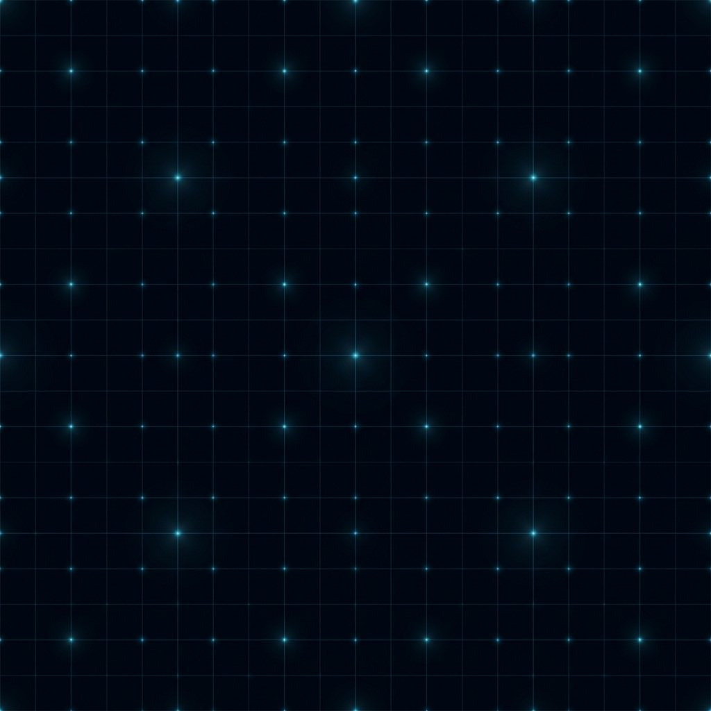

# Dark Lattice

> "In the lattice of dots, truth hides in the darkness."
> 在点的格阵中，真相潜藏于黑暗。

**Dark Lattice** 是一个专门面向研究者与开发者的极客风格博客。它不仅是一个内容展示平台，更是个人技术品味与研究深度的视觉延伸。



## 🌌 项目愿景 (Vision)

本项目基于 **Nightfield (夜场)** 主题构建，旨在打造一个兼具沉浸感与专业性的数字花园。
- **核心关键词**：克制、专业、未来感、3D 沉浸交互。
- **视觉风格**：深邃的背景对比科技蓝与神秘紫，通过 3D 空间感的列表交互实现视觉深度的跃迁。

---

## ✨ 核心特性 (Features)

- **📚 学术级渲染支持**：
  - 集成 **KaTeX**，支持高速、精美的数学公式渲染。
  - 内置 BibTeX 引用支持，提供学术论文级别的阅读体验。
- **🌍 国际化 (I18N)**：
  - 完美支持 **中文**、**英文** 及 **日文** 三种语言。
  - 基于后缀的文件关联模式，轻松切换不同语言版本。
- **🧊 3D 沉浸式交互**：
  - 基于 **Three.js** 构建的 Hero 区域动态场景。
  - 支持鼠标随动视差、平滑转场及粒子的格阵效果。
- **🔍 全文检索**：
  - 使用 **Fuse.js** 实现轻量化的客户端侧实时搜索。
- **🚀 自动化部署**：
  - 集成 GitHub Actions，实现推送即部署至 GitHub Pages。

---

## 🛠️ 技术栈 (Tech Stack)

- **框架**: [Hugo (Extended)](https://gohugo.io/)
- **样式**: Vanilla SCSS (BEM 规范)
- **交互**: Vanilla JS + Three.js + GSAP
- **搜索**: Fuse.js
- **数学**: KaTeX

---

## 🚀 快速开始 (Quick Start)

### 环境要求
- [Hugo Extended](https://gohugo.io/installation/) (建议版本 >= 0.128.0)
- Git

### 本地开发
1. 克隆仓库：
   ```bash
   git clone https://github.com/QQDDTT/Dark-Lattice.git
   cd Dark-Lattice
   ```
2. 启动 Hugo 开发服务器：
   ```bash
   hugo server -D
   ```
3. 访问 `http://localhost:1313` 查看效果。

### 编译生成
```bash
hugo --gc --minify
```

---

## 📂 目录结构 (Project Structure)

```text
├── assets/         # 源码资源 (SCSS, JS, Images)
├── content/        # Markdown 文章内容
│   ├── posts/      # 个人博客
│   └── research/   # 专题研究报告
├── docs/           # 项目设计文档 (VIS, Spec, Roadmap)
├── layouts/        # 页面模板
├── static/         # 静态资源 (Models, Favicon, Images)
└── hugo.toml       # 全局配置文件
```

---

## 🗺️ 线路图 (Roadmap)

- [x] 多语言框架搭建 (ZH/EN/JA)
- [x] 3D Hero 场景集成
- [ ] Giscus 评论系统集成
- [ ] `pangu.js` 中英文排版自动优化
- [ ] OffscreenCanvas 渲染性能增强

---

## 🛡️ 许可 (License)

Copyright © 2024 Dark Lattice. 
内容遵循 [CC BY-NC-SA 4.0](https://creativecommons.org/licenses/by-nc-sa/4.0/) 协议。

---
*Created with ❤️ by Dark Lattice Team*
