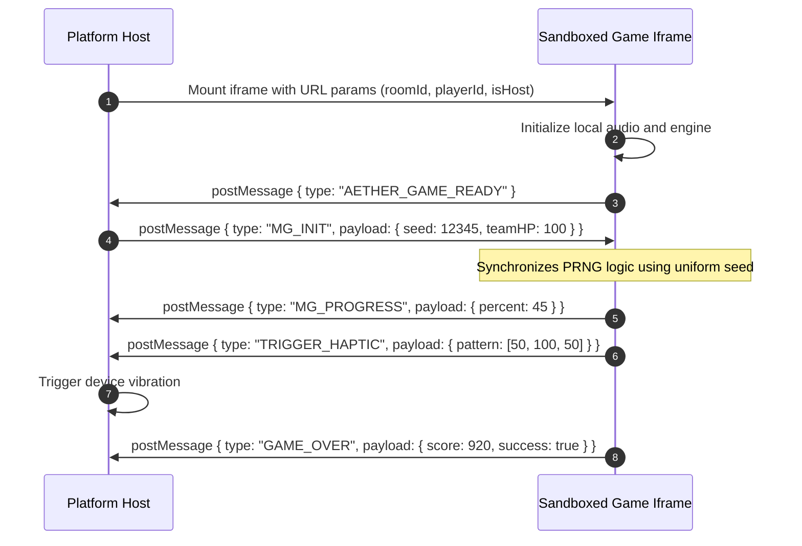

# Orthogonal Decoupling: Three-Domain Communication Contracts and No-DB Atomic Storage

In a complex gaming ecosystem that amalgamates an online web IDE, multiple HTML5 game runtimes, and multi-user room matchmaking, architectural complexity tends to grow exponentially. Without rigorous domain separation, platform services, code editor logic, and runtime game states inevitably collapse into an unmaintainable tangle.

**Aether-Play** tackled this challenge from first principles by implementing an **"Orthogonally Decoupled Three-Domain Architecture"**, coupled with **lightweight iframe sandbox contracts**, **No-DB atomic file persistence**, and **mobile anti-overflow viewport standards**.

---

## 1. Orthogonal Boundaries Across Three Domains

To allow each subsystem to evolve autonomously without cross-contamination, Aether-Play enforces strict separation across three core domains:

```
┌────────────────────────────────────────────────────────────────────────┐
│                        1. Platform Domain                              │
│  - Responsibilities: User auth, game registry, session rooms, proxy    │
│  - Privileges: Global state authority, managing WebSocket state machines│
└──────────────────┬──────────────────────────────────┬──────────────────┘
                   │ REST API / Scoped Mounts         │ Iframe Host / postMessage
                   ▼                                  ▼
┌────────────────────────────────────┐ ┌─────────────────────────────────┐
│     2. IDE Domain                  │ │     3. Game Domain              │
│ - Scoped code editing & asset view │ │ - Self-contained client logic   │
│ - Restricted filesystem boundaries │ │ - Sandboxed inside Iframe       │
│ - Twin simulator & inspector tools │ │ - Emits lifecycle events only   │
└────────────────────────────────────┘ └─────────────────────────────────┘
```

1. **Platform Domain**: The system's source of truth. Handles authentication, scans `game.json` manifests to dynamically register games, schedules party rooms, and synchronizes match state;
2. **IDE Domain**: The restricted development sandbox. Reads and writes only the author's game directory via atomic APIs. Platform core code and credential configurations remain physically invisible;
3. **Game Domain**: Self-contained client-side web apps (HTML5/JS/CSS) hosted inside an iframe sandbox with zero network privilege assumptions, interacting solely via declarative contracts.

---

## 2. Runtime Iframe Sandbox & postMessage Contracts

Games communicate with the platform host via native `window.postMessage`, avoiding direct DOM penetration and global namespace collisions:



- **Uniform Seed Injection (`seed`)**: During session initialization, the platform broadcasts identical pseudo-random seeds to all clients, guaranteeing that procedural mazes, clues, and cards generate identically across the TV and handsets;
- **Decoupled Progression**: Games report step milestones via `MG_PROGRESS`, command tactile vibrations via `TRIGGER_HAPTIC`, and conclude with `GAME_OVER`, leaving shared HP adjustments to the host engine.

---

## 3. No-DB Single-File Atomic Persistence

For small party sessions (up to 12 participants) and self-hosted instances, spinning up MongoDB or PostgreSQL adds unnecessary memory usage and administrative friction. Aether-Play uses an **Atomic File Persistence** pattern:

```
 [In-Memory State] ──Serialize──> [Temp File .tmp] ──renameSync (Atomic)──> [Official db.json]
```

1. **Single File Data Store (`db.json`)**: User profiles, registered games, and party states persist in a single JSON file that is easily backed up and versioned using Git.
2. **In-Memory Cache & Atomic Writes**:
   - All read queries hit the in-memory JavaScript cache directly, responding in **under 0.1ms**;
   - On write operations, the dataset is first serialized to a temporary file (`db.json.tmp`);
   - The OS-level atomic `renameSync` replaces the primary file instantly. Even in the event of an abrupt power outage, data files remain uncorrupted.

---

## 4. Mobile Viewport & Touch Resilience

When players join party rooms using various smartphones, browser chrome and default gesture behaviors often interfere with gameplay. Aether-Play applies rigid anti-overflow rules:

- **Dynamic Viewport Height**: Replaces buggy `100vh` with modern CSS `100dvh`, listening to `window.innerHeight` to dynamically adjust for expanding mobile address bars;
- **Notch & Dynamic Island Inset**: Adopts `env(safe-area-inset-top)` and `env(safe-area-inset-bottom)` to protect UI controls from home indicators and display cutouts;
- **Gesture Conflict Suppression**: Containers set `touch-action: none` and `overscroll-behavior: none` to eradicate pull-to-refresh resets and unwanted text selections.

This cohesive contract-driven design allows Aether-Play to deliver high-performance social gaming with near-zero infrastructure overhead.
