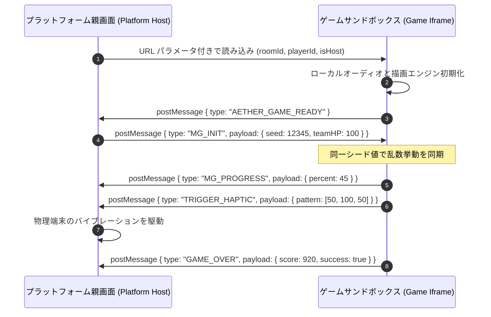

# 直交分離と軽量基盤：3大ドメイン通信プロトコルと No-DB アトミック永続化の実践

Web IDE、複数の HTML5 ゲーム実行基盤、そして多人数ルームマッチングを統合したゲームプラットフォームにおいて、システムの複雑性は指数関数的に増大します。境界定義が曖昧であれば、プラットフォーム業務、コードエディタ、ゲーム本体のランタイムが癒着し、保守不能な泥沼に陥ります。

**Aether-Play** はトップダウンの設計に基づき、**「プラットフォーム・IDE・ゲームの3大ドメイン直交分離」**を確立しました。さらに、**Iframe サンドボックス通信規約**、**No-DB（データベース不要）単一ファイル・アトミック永続化**、**モバイル画面崩れ防止規約**を組み合わせ、極めて堅牢で低コストな実行基盤を構築しています。

---

## 1. 3大ドメインの直交境界設計

各モジュールが互いを汚染することなく自律的に進化するため、システムを3つのドメインに厳格に分離しています：

```
┌────────────────────────────────────────────────────────────────────────┐
│                        1. プラットフォーム領域 (Platform Domain)       │
│  - 責務：ユーザー認証、ゲーム一覧検知、ルーム／セッション制御、IDE中継 │
│  - 権限：グローバルデータの読み書き、WebSocket 状態マシンの統括        │
└──────────────────┬──────────────────────────────────┬──────────────────┘
                   │ REST API / ディレクトリ制限マウント │ Iframe ホスト / postMessage
                   ▼                                  ▼
┌────────────────────────────────────┐ ┌─────────────────────────────────┐
│     2. IDE 領域 (IDE Domain)       │ │     3. ゲーム領域 (Game Domain) │
│ - 責務：コード編集、アセット閲覧   │ │ - 責務：純粋なフロントエンドロジ│
│ - 権限：開発用サンドボックス       │ │ - 権限：Iframe サンドボックス   │
│ - ツインエミュレータと規約検証     │ │ - 規約イベントのみを親へ通知    │
└────────────────────────────────────┘ └─────────────────────────────────┘
```

1. **プラットフォーム領域 (Platform Domain)**：システムの中枢。認証、ディスク上の `game.json` マニフェスト検知によるゲーム登録、ルームセッションの同期を担当；
2. **IDE 領域 (IDE Domain)**：開発者向けサンドボックス。対象ゲームのソースのみを操作可能とし、プラットフォーム本体のコードや認証情報には一切アクセス不可；
3. **ゲーム領域 (Game Domain)**：独立した静的 Web アプリケーション（HTML5/JS/CSS）。Iframe サンドボックス内で実行され、標準イベント契機のみでホストと通信。

---

## 2. 実行時 Iframe サンドボックスと postMessage 通信規約

ゲームと親プラットフォーム間は、ネイティブな `window.postMessage` により疎結合に連携します：



- **統一シード値注入 (`seed`)**：セッション開始時に同一の乱数シードを全端末へ配布し、迷路やカード配置の自動生成を大画面と全スマホで完全に一致させます；
- **状態遷移の分離**：ゲームは `MG_PROGRESS` で進行度、`TRIGGER_HAPTIC` で振動要求、`GAME_OVER` でスコアを通知し、全体 HP の計算は親プラットフォームに委ねます。

---

## 3. No-DB（データベース不要）単一ファイル・アトミック永続化

12人以内のパーティゲーム運用において、重厚な DBMS（PostgreSQL や MongoDB）の運用はコストと保守の増大を招きます。Aether-Play は**アトミックファイル永続化（Atomic File Persistence）**を採用しました：

```
 [メモリキャッシュ] ──シリアライズ──> [一時ファイル .tmp] ──renameSync (不可分置換)──> [確定 db.json]
```

1. **単一 JSON データストア (`db.json`)**：ユーザー情報やゲーム一覧をローカルの単一ファイルに集約し、Git によるバックアップや復元を極めて容易に実現。
2. **インメモリキャッシュとアトミック書き込み**：
   - 読み取りクエリはすべてメモリ上の JavaScript オブジェクトを参照し、**0.1ms 未満** の応答速度を達成；
   - 書き込み時は一時ファイル（`db.json.tmp`）に書き出した上で、OS 標準の `renameSync` により瞬時に置換。停電や突然のクラッシュが発生してもファイルが破損しません。

---

## 4. モバイル表示崩れ防止とタッチ最適化

多種多様なスマートフォンから参加するプレイヤーのため、ブラウザ標準の誤動作を防止するルールを徹底しています：

- **動的ビューポート適応**：崩れやすい `100vh` を廃止し、モダン CSS の `100dvh` を全面採用。ソフトキーボード展開時も `window.innerHeight` で追随；
- **ノッチ・ダイナミックアイランド回避**：`env(safe-area-inset-top)` や `env(safe-area-inset-bottom)` により、ホームバーによるボタン誤操作を防止；
- **ジェスチャー競合の排除**：`touch-action: none` と `overscroll-behavior: none` を指定し、不意のスワイプ更新や文字選択ポップアップを完全抑止。

この洗練された規約体系により、Aether-Play は最小限のインフラ維持費で、極めて堅牢かつ快適なソーシャルゲーム体験を提供しています。
