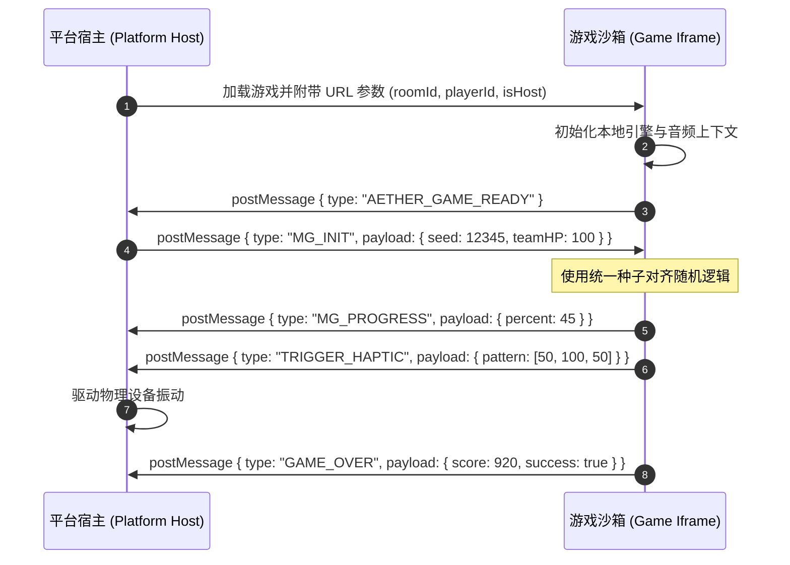

# 正交解耦与轻量底座：三大领域通信契约与 No-DB 原子持久化实践

在一个集成了“在线开发环境”、“多款 HTML5 游戏运行宿主”和“多用户房间调度”的综合游戏系统中，系统的复杂度很容易呈指数级上升。如果边界划分不清晰，平台业务、代码编辑器逻辑与游戏自身的运行态极易交织成难以维护的泥潭。

**Aether-Play** 从顶层设计出发，确立了严格的**“平台、IDE、游戏三大领域正交解耦”**架构，并配套设计了**轻量化 Iframe 沙箱通信契约**、**免数据库 (No-DB) 单文件原子持久化**以及**移动端视口防破版规范**，构建出极致稳健且低成本的运行底座。

---

## 1. 平台、IDE 与游戏的三大正交领域边界

为保证各模块独立演进且互不污染，Aether-Play 将系统严密划分为三大领域（Domain）：

```
┌────────────────────────────────────────────────────────────────────────┐
│                        1. 平台领域 (Platform Domain)                   │
│  - 核心职责：用户鉴权、游戏清单发现、房间/会话调度、IDE网关代理       │
│  - 权限控制：拥有全局数据读写权限，管理 WebSocket 连接与状态机        │
└──────────────────┬──────────────────────────────────┬──────────────────┘
                   │ REST API / 目录受限挂载          │ Iframe 宿主 / postMessage
                   ▼                                  ▼
┌────────────────────────────────────┐ ┌─────────────────────────────────┐
│     2. IDE 领域 (IDE Domain)       │ │     3. 游戏领域 (Game Domain)   │
│ - 核心职责：源码编辑、资产浏览     │ │ - 核心职责：纯前端自包含业务逻辑│
│ - 隔离边界：无平台管理代码访问权   │ │ - 隔离边界：运行于沙盒 Iframe   │
│ - 双屏孪生仿真器与契约自检通道     │ │ - 仅通过标准契约抛出阶段事件    │
└────────────────────────────────────┘ └─────────────────────────────────┘
```

1. **平台领域 (Platform Domain)**：系统的权威中枢。负责账号认证、扫描磁盘上的 `game.json` 清单并注册游戏、分配房间与同步会话状态；
2. **IDE 领域 (IDE Domain)**：面向开发者的受限研发沙盒。仅通过原子化 API 读写所属游戏的源码，共享资源只读挂载，绝不可触碰底层平台源码与数据库文件；
3. **游戏领域 (Game Domain)**：完全自包含的静态 Web 应用（HTML5/JS/CSS）。通过标准的 Iframe 沙箱挂载于平台页面内，零网络权限假设，仅通过契约与平台宿主交互。

---

## 2. 运行态 Iframe 沙箱与 postMessage 事件契约

游戏与宿主平台之间通过原生的 `window.postMessage` 进行同构双向通信，杜绝直接的 DOM 穿透与全局变量污染：



- **统一种子注入 (`seed`)**：游戏初始化阶段，宿主向所有客户端广播相同的随机种子，确保程序化生成的关卡、迷宫或谜题在公屏与各私屏上绝对一致；
- **状态流转解耦**：游戏通过 `MG_PROGRESS` 汇报进度，通过 `TRIGGER_HAPTIC` 触发宿主震动，通过 `GAME_OVER` 提交结果，宿主负责计算团队共享生命（HP）的消耗。

---

## 3. 免数据库 (No-DB) 单文件原子持久化

针对 12 人以内的轻量聚会和自建部署场景，架设 MongoDB 或 PostgreSQL 会显著增加云端开销与运维复杂度。Aether-Play 创新性地采用了**单文件原子持久化设计 (Atomic File Persistence)**：

```
 [内存状态操作 Memory] ──更新内存缓存──> [生成临时文件 .tmp] ──原子重命名 renameSync──> [正式存储 db.json]
```

1. **单文件数据源 (`db.json`)**：用户信息、游戏清单与会话状态全部保存在本地单一 JSON 文件中，支持直接用 Git 进行版本备份与回滚。
2. **内存缓存与原子写入 (Atomic Write)**：
   - 所有的读操作直接命中内存中的 JavaScript 字典，响应时间保持在 **0.1ms 以内**；
   - 触发写操作时，数据先被序列化写入同目录下的临时文件（如 `db.json.tmp`）；
   - 利用操作系统底层的 `renameSync` 进行原子替换。即使在写入瞬间发生断电或崩溃，也不会造成数据文件半损坏，彻底规避并发写坏死问题。

---

## 4. 移动端防破版与触控优化规范

在聚会场景下，玩家使用各色手机进入游戏，极易受到浏览器默认行为的干扰。Aether-Play 制定了一整套严苛的防破版规范：

- **动态视口高度适配**：坚决摒弃 `100vh`，全面采用现代 CSS 动态视口高度 `100dvh`，并利用 `window.innerHeight` 动态监听软键盘弹出与地址栏收起，确保操作按钮始终处于可视区；
- **避让刘海屏与灵动岛**：统一引入 `env(safe-area-inset-top)`、`env(safe-area-inset-bottom)` 等环境变量，消除底部手势横条（Home Bar）遮挡问题；
- **彻底封杀手势冲突**：全屏容器强制设置 `touch-action: none` 并拦截长按文本选区与默认下拉刷新（`overscroll-behavior: none`），确保游戏内的滑动与拖拽平滑如原生原生应用。

通过这套软硬件契约的紧密交织，Aether-Play 在保持极简运维的前提下，打造出了极具韧性的聚会娱乐底座。
