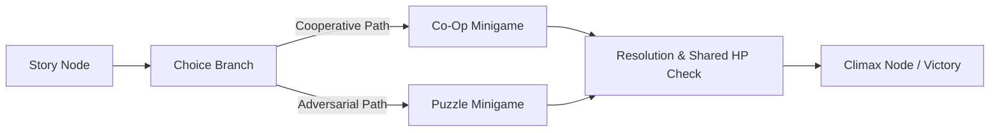

# Redefining Tabletop Fun: Aether-Play Face-to-Face Party Game Paradigm and Dual-Screen Co-Op

In contemporary game development, the industry is largely divided into two extremes: massive open-world titles demanding dozens of isolated hours, and hyper-monetized mobile titles with complex daily grinds. Yet, when friends gather in a living room, at a social party, or around a campfire, existing digital entertainment often prompts everyone to look down at their individual screens, ironically deepening real-world isolation.

**Aether-Play** was conceived to reverse this trend. It explicitly eschews heavy remote networking games to pioneer a focused, social-first niche: **"Face-to-Face Party Games & Digital Tabletop Props"**.

---

## 1. Core Positioning: Physical Gathering over Virtual Isolation

Aether-Play anchors its design on rekindling in-person table dynamics:

- **Digital Tabletop Props**: Rather than replacing board games or spoken conversation, digital games act as dynamic "rich-media props". They serve as synchronized ticking bomb timers, interactive fog-of-war maps, or cipher transmitters.
- **Ultra-Bite-Sized Rounds**: Single matches last strictly between **30 seconds and 3 minutes**. Low cognitive barriers allow anyone to participate instantly without tutorial friction, delivering swift victories, hilarious bluffs, and quick restarts.
- **Instant Browser Access**: Eliminates heavy app downloads. Players join a local party room in seconds simply by scanning a QR code on any mobile browser (supporting up to 12 concurrent players).

---

## 2. Dual-Screen Co-Op Interaction Paradigm

To cultivate authentic information asymmetry and psychological tension, Aether-Play establishes a synchronized **"Public Board + Private Mobile"** dual-screen architecture:

```
                ┌──────────────────────────────────────────────┐
                │          Public Screen (TV / Central Tablet) │
                │   - Master match status, countdown, team HP  │
                │   - Shared puzzle board & event broadcast    │
                └──────────────────────┬───────────────────────┘
                                       │ WebSocket Session Sync
                ┌──────────────────────┴───────────────────────┐
                ▼                                              ▼
   ┌─────────────────────────┐                    ┌─────────────────────────┐
   │ Player A Mobile (Priv)  │                    │ Player B Mobile (Priv)  │
   │ - Secret hand & actions │                    │ - Complementary clues   │
   │ - Haptic feedback pulse │                    │ - Role skill submission │
   └─────────────────────────┘                    └─────────────────────────┘
```

### 2.1 Public Screen
Typically mirrored to a TV or a tablet placed flat in the middle of the table:
- Displays macroscopic game state: shared team HP, master round timers, and stage transitions;
- Renders cinematic effects such as critical failures, alarms, and public announcements;
- Acts as the communal visual anchor for active participants and spectators alike.

### 2.2 Private Mobile Screen
The discrete interface rendered on each player's personal smartphone:
- **Asymmetric Information Carrier**: Displays secret roles, private clues, or pieces of a larger cipher;
- **Anti-Peeking Mechanics**: High-contrast dark styling, press-to-reveal tokens, and viewing-angle protection;
- **Haptic Feedback**: Invokes the Web Haptic API (`TRIGGER_HAPTIC`) to send silent vibrational pulses, alerting players without tipping off table neighbors.

---

## 3. Campaign Orchestration & Minigame Contracts

Beyond standalone games, Aether-Play supports rich narrative experiences via declarative **"Campaigns"**:



### 3.1 Campaign Pipeline (`campaign.json`)
Developers compose branching stories and puzzle checkpoints in JSON. A global "Shared Team HP" pool tracks collective tolerance: one player's mistake depletes the entire team's margin, creating genuine physical collaboration and laughter in the room.

### 3.2 Minigame Contract (`kind: minigame`)
Minigames embedded inside campaigns follow lightweight contracts:
- **No Absolute Victory Determination**: Minigames emit granular lifecycle events (`MG_PROGRESS`, `MG_MISTAKE`, `MG_COMPLETE`), letting the campaign engine decide team outcome;
- **Deterministic Random Seed**: The platform distributes a unified `seed` parameter upon session init, ensuring synchronized procedural generation across all connected devices.

---

## 4. Conclusion

Aether-Play proves that the true magic of digital technology lies not in trapping players in synthetic metaverses, but in rekindling genuine eye contact, laughter, and camaraderie in the physical world.
