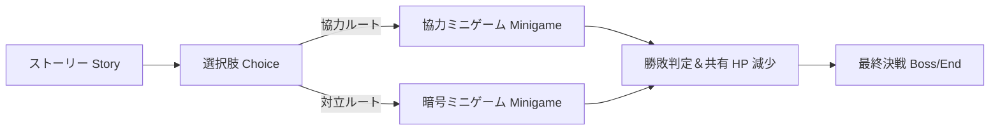

# テーブルトップ体験の再定義：Aether-Play 対面パーティゲームの対話パラダイムと二画面協調設計

現代のゲーム市場は、数十時間を要する重厚なソロ向けオープンワールドか、ガチャやデイリータスクを課すスマートフォンゲームに二分されています。しかし、友人や家族が週末のリビングやキャンプ場に集まったとき、従来のゲーム体験では参加者全員が手元の画面に没頭してしまい、現実空間でのコミュニケーションが分断されがちでした。

**Aether-Play** はこの課題に対するアンサーとして誕生しました。孤独なオンライン通信ゲームを拒否し、**「対面パーティゲーム (Face-to-Face Party Game) とデジタル小道具 (Digital Props)」**という領域に特化しています。

---

## 1. 事業のポジショニング：対面での共鳴を取り戻す

Aether-Play の設計思想は「オフラインのテーブル上の対話を活性化させること」にあります：

- **デジタル小道具としてのゲーム**：ボードゲームや日常の会話を置き換えるのではなく、リッチメディアな「動的小道具」として機能。時限爆弾のタイマー、霧に包まれた動的マップ、暗号解読機などの役割を果たします。
- **超短時間ラウンド（30秒〜3分）**：1ゲームの所要時間を短く設定。複雑なチュートリアルを排除し、誰もが即座にルールを把握して盛り上がれる設計です。
- **ブラウザで即座に参加**：専用アプリの事前ダウンロードは一切不要。手元のスマートフォンで QR コードを読み取るだけで、最大12人のローカル対戦ルームへ瞬時に参加可能です。

---

## 2. 二画面協調インタラクション (Dual-Screen Co-Op)

情報の非対称性と対面ならではの駆け引きを生み出すため、Aether-Play は**「共有大画面（パブリックスクリーン）＋ 個人スマホ（プライベートスクリーン）」**の二画面連動モデルを採用しています：

```
                ┌──────────────────────────────────────────────┐
                │          共有大画面 Public Screen (TV/Pad)   │
                │   - 全体の戦況、共有タイマー、チーム HP      │
                │   - 共有パズル盤面とイベントアナウンス       │
                └──────────────────────┬───────────────────────┘
                                       │ WebSocket セッション同期
                ┌──────────────────────┴───────────────────────┐
                ▼                                              ▼
   ┌─────────────────────────┐                    ┌─────────────────────────┐
   │ プレイヤー A スマホ     │                    │ プレイヤー B スマホ     │
   │ - 個別手札と操作パネル  │                    │ - 補完的な秘密の手がかり│
   │ - 触覚フィードバック    │                    │ - 固有スキルや投票入力  │
   └─────────────────────────┘                    └─────────────────────────┘
```

### 2.1 共有大画面 (Public Screen)
テレビ画面やテーブル中央のタブレットに表示：
- 全体のステータス：チーム共有ライフ（HP）、全体タイマー、フェーズ進行；
- 爆発演出や危機警報など、その場の全員が同時に視認するドラマチックな演出；
- 観客とプレイヤー全員の視線を集める感情のアンカーポイントとして機能。

### 2.2 個人スマホ画面 (Private Screen)
プレイヤー各自が手元で操作する画面：
- **非対称情報の提示**：各自に異なる役職、ヒント、暗号の一部を個別に配分；
- **覗き見防止（Anti-Peeking）**：ダークトーンの配色、長押し時のみ開示される手札表示、傾きによる視野角保護；
- **触覚フィードバック (Haptic)**：Web Haptic API (`TRIGGER_HAPTIC`) を通じて、音を出さずに振動で重要な合図や警報を伝達。

---

## 3. キャンペーン編排とミニゲーム規約

単発プレイだけでなく、Aether-Play はストーリー仕立ての**「キャンペーン (Campaign)」**を宣言的な JSON でサポートします：



### 3.1 キャンペーン編排 (`campaign.json`)
物語の分岐と挑戦するミニゲームを JSON で定義。チーム全体の「共有 HP」を追跡し、一人のプレイヤーのミスがチーム全体の猶予を削るスリルが、現実空間での団結と笑いを生み出します。

### 3.2 ミニゲーム規約 (`kind: minigame`)
各ミニゲームは軽量なプロトコルに従います：
- **ゲーム単体での勝敗決定を避ける**：ミニゲームは進行状況（`MG_PROGRESS`、`MG_MISTAKE`、`MG_COMPLETE`）をイベントとして親プラットフォームへ通知する責務に専念；
- **シード値の共通化**：プラットフォームが同一の乱数シード（`seed`）を各端末に注入し、すべての画面で完全に同期した乱数挙動を保証。

---

## 4. 総括

デジタル技術の真の価値は、人を仮想空間に閉じ込めることではなく、**現実のテーブルを囲む人々の笑顔と視線を再び輝かせることにある**――Aether-Play はその信念を体現しています。
