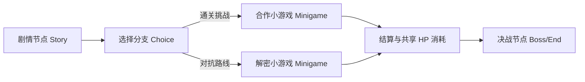

# 重新定义桌面娱乐：Aether-Play 面对面聚会交互范式与双屏协同设计

在当今的游戏开发领域，产业重心几乎被两股浪潮所席卷：一侧是追求数十小时沉浸体验的重型单机或开放世界游戏，另一侧则是充满复杂日常任务与抽卡机制的强联网手游。然而，当三五好友在周末客厅、聚会派对或露营桌旁面对面围坐时，现有的数字娱乐形式往往导致每个人低头陷入自己的手机屏幕中，反而加剧了现实空间的孤立感。

**Aether-Play** 游戏开发平台由此诞生。它明确拒绝沉重复杂的远程网络游戏，而是开辟了一个高度垂直、注重现场共鸣的赛道——**“面对面聚会游戏 (Face-to-Face Party Game) 与桌面数字道具 (Digital Props)”**。

---

## 1. 业务定位：从网络互联到现实共鸣

Aether-Play 平台将核心目标锚定在**“激活线下桌旁互动”**：

- **聚焦桌面数字道具**：数字游戏不再试图取代实体桌游或现实对话，而是作为一种富媒体“动态道具”融入线下聚会。它可以是随时计时的炸弹引信、带迷雾的动态寻宝图，或是团队共谋的密码发报机。
- **极短单局与即时反馈**：单局时长严格控制在 **30 秒至 3 分钟** 之间。极低的心智门槛使任何人无需冗长的新手教程即可迅速上手，输赢瞬间决出，充满欢声笑语。
- **轻量即开即玩**：无需安装数百兆的应用包，通过手机浏览器扫描二维码即可秒级加入房间，支持最多 12 人的本地聚会网络。

---

## 2. 孪生双屏协同交互范式 (Dual-Screen Co-Op)

为了在现场建立真正的信息不对称与博弈张力，Aether-Play 确立了标志性的**“公屏大盘 + 私密手机”**孪生双屏协同模型：

```
                ┌──────────────────────────────────────────────┐
                │          公屏大盘 Public Screen (TV/Pad)     │
                │   - 全局战况大盘、公共倒计时、剩余生命池 HP  │
                │   - 全员共享谜题棋盘与即时事件广播播报       │
                └──────────────────────┬───────────────────────┘
                                       │ WebSocket 会话同步
                ┌──────────────────────┴───────────────────────┐
                ▼                                              ▼
   ┌─────────────────────────┐                    ┌─────────────────────────┐
   │ 玩家 A 手机 (Private)   │                    │ 玩家 B 手机 (Private)   │
   │ - 私密手牌与战术操作盘  │                    │ - 互补盲盒线索与选择器  │
   │ - 触觉振动反馈与防窥遮罩│                    │ - 专属角色技能与暗号提交│
   └─────────────────────────┘                    └─────────────────────────┘
```

### 2.1 公屏大盘 (Public Screen)
通常投射在客厅电视、投影仪或摆放在桌心的大尺寸 iPad 上：
- 展示游戏宏观态势：团队共享生命池（HP）、全局倒计时、关卡阶段进展；
- 渲染全场共享视觉效果，如爆炸特效、危机警报以及全局事件通知；
- 作为围观观众与玩家共同注视的情感焦点，营造现场紧张与欢乐的氛围。

### 2.2 私密手机端 (Private Screen)
每个玩家手持的移动端页面：
- **信息非对称载体**：玩家各自看到专属的隐藏身份、独立线索或拆弹密码的一部分；
- **防偷窥与盲操机制**：界面采用暗色调，关键手牌设计有点按短暂显现或防侧视倾角模糊；
- **微振动增强 (Haptic Feedback)**：通过 Web Haptic API 传递脉冲（`TRIGGER_HAPTIC`），在不暴露声响的前提下通过触觉通知玩家关键暗号或警报。

---

## 3. 剧本战役编排与小游戏契约

Aether-Play 不仅支持独立单局，还通过声明式的配置体系支持富有叙事张力的**“剧本战役 (Campaign)”**：



### 3.1 战役流转编排 (`campaign.json`)
开发者通过轻量 JSON 编排剧情节点、抉择分支与小游戏节点。平台全局跟踪团队的“生命预算池（HP）”，玩家在一个小游戏中的失误会直接扣减全队的容错率，从而在物理房间内催生出真正的信任与协作配合。

### 3.2 小游戏接口契约 (`kind: minigame`)
所有嵌入战役的小游戏必须遵循原子契约：
- **无全局胜负裁决**：小游戏本身不直接决定生死，仅负责抛出阶段事件（`MG_PROGRESS` 进度推进、`MG_MISTAKE` 失误报警、`MG_COMPLETE` 完成通知）；
- **跨端状态对齐**：平台负责通过统一分布式随机种子（`seed`）注入到各个客户端，确保公屏与各个私屏上的随机数生成完全确定且同构。

---

## 4. 结语

Aether-Play 的设计证明：**数字技术的终极温度，不在于把人拉入冰冷的虚拟元宇宙，而在于重新点亮现实中人与人之间真实的眼神交汇与欢笑。**
