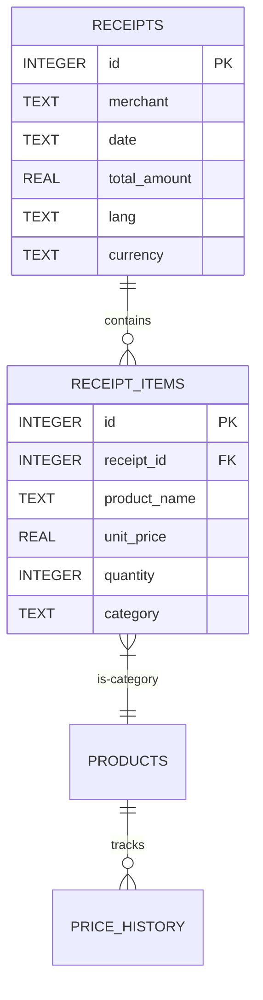

本设计文档针对 AppMatrix 平台下的 **智能小票扫描记账与商品物价分类追踪器 (ReceiptTracker)** 项目。
该项目在移动端采用 **方案A（完全端侧离线优先）** 架构，并全面支持 **中文（简体/繁体）、日本語、English** 的多语言 OCR 识别兼容方案及应用 UI 国际化（i18n）。

---

## 1. 双端独立工程架构

`ReceiptTracker` 项目共享页面核心逻辑和 UI 组件，双端在原生层进行了多语言 OCR 及图片预处理的 SDK 桥接配置：

```text
apps/
└── ReceiptTracker/
    ├── src/
    │   ├── android/             # Android 原生壳工程与 ML Kit 桥接
    │   │   ├── app/src/main/
    │   │   │   ├── java/com/appmatrix/receipttracker/OCRBridgeModule.kt   # 支持中日英动态 OCR 的桥接代码
    │   │   │   └── AndroidManifest.xml   # 声明 Camera 权限与硬件需求
    │   │   └── build.gradle             # 引入 ML Kit 中文与日文识别依赖包
    │   └── ios/                 # iOS 原生壳工程与 Vision.framework 桥接
    │       ├── ReceiptTracker/
    │       │   ├── OCRBridgeModule.swift  # 支持中日英 Vision OCR 桥接代码
    │       │   └── Info.plist            # NSCameraUsageDescription 声明
    │       └── ReceiptTracker.xcodeproj
    └── shared/                  # 双端共享的 React Native (Expo) 业务代码
        ├── src/
        │   ├── components/      # 共享 UI（如 Canvas 趋势图折线组件）
        │   ├── screens/         # 记账历史、扫描核对、物价大盘三大页面
        │   └── utils/
        │       ├── alignLines.ts # Y 轴文本行聚类核心算法
        │       ├── database.ts   # 支持多币种与语言标志的 SQLite 封装
        │       └── i18n.ts       # 轻量级 UI 多语言国际化字典
        └── package.json
```

---

## 2. 端侧图像预处理设计

小票打印字迹浅、纸张褶皱及倾斜对 OCR 的精度有巨大影响。系统在将图片送入 OCR 引擎前，必须进行原生加速预处理：

```text
[拍摄原始大图] ──(Native C++/WebGL)──> [1. 灰度化] ──> [2. 对比度增强 (拉伸)] ──> [3. 二值化/去噪] ──> [生成临时干净图片]
```

### 2.1 预处理流程
1.  **尺寸压缩**：为了防止大图片引发 OOM 并加速识别，先将相机捕获的图片在原生层进行比例缩放，限制最大短边在 1080px 内。
2.  **灰度化 (Grayscale)**：将图像颜色通道降为单通道灰度图，计算公式：
    $$\text{Gray} = 0.299 \times R + 0.587 \times G + 0.114 \times B$$
3.  **对比度拉伸 (Contrast Stretching)**：增强打印油墨与浅色纸张的视觉差，提升字迹边缘锐度。
4.  **临时 PNG 写入**：在沙盒缓存目录（`CacheDirectory`）生成一个临时的轻量 PNG 格式文件提供给原生 OCR 引擎，解析完成后立即删除。

---

## 3. 双端独立原生 OCR 引擎接入

双端不使用庞大的本地 Tesseract 字库包，而是调用系统内置的 OCR 引擎，通过 React Native Bridge 暴露给前端 JS：

### 3.1 iOS 原生端接入：`Vision.framework`
iOS 13+ 提供了强大的离线 `Vision` 图像识别框架。在 Swift 中，通过配置多语系数组，实现对中文、日文、英文的同时兼容识别：

```swift
import Vision
import UIKit

@objc(OCRBridgeModule)
class OCRBridgeModule: NSObject {
    
    @objc
    func recognizeReceiptText(_ imagePath: String, resolver resolve: @escaping RCTPromiseResolveBlock, rejecter reject: @escaping RCTPromiseRejectBlock) {
        guard let image = UIImage(contentsOfFile: imagePath),
              let cgImage = image.cgImage else {
            reject("ERR_IMAGE_LOAD", "无法加载缓存小票图片", nil)
            return
        }
        
        let requestHandler = VNImageRequestHandler(cgImage: cgImage, options: [:])
        
        let request = VNRecognizeTextRequest { (request, error) in
            if let error = error {
                reject("ERR_OCR_FAILED", "iOS Vision OCR 失败: \(error.localizedDescription)", error)
                return
            }
            
            guard let observations = request.results as? [VNRecognizedTextObservation] else {
                resolve([])
                return
            }
            
            var recognizedBlocks: [[String: Any]] = []
            for observation in observations {
                guard let candidate = observation.topCandidates(1).first else { continue }
                
                let boundingBox = observation.boundingBox
                recognizedBlocks.append([
                    "text": candidate.string,
                    "confidence": candidate.confidence * 100,
                    "x": boundingBox.origin.x,
                    "y": 1.0 - boundingBox.origin.y - boundingBox.height, // 翻转 Y 轴对齐常规坐标系
                    "width": boundingBox.width,
                    "height": boundingBox.height
                ])
            }
            resolve(recognizedBlocks)
        }
        
        // 设置 Vision 参数 - 启用中日英兼容识别
        request.recognitionLevel = .accurate
        request.usesLanguageCorrection = true
        // 关键更新：支持 简体中文、繁体中文、日文、英文
        request.recognitionLanguages = ["zh-Hans", "zh-Hant", "ja-JP", "en-US"] 
        
        do {
            try requestHandler.perform([request])
        } catch {
            reject("ERR_OCR_PERFORM", "执行 OCR 失败", error)
        }
    }
}
```

### 3.2 Android 原生端接入：`ML Kit Text Recognition`
在 Android 侧，中、日、英三语的文字识别各由不同的 ML Kit 底层依赖包及识别器提供。为实现三语兼容，桥接模块支持根据客户端当前选择的语言类型，动态初始化对应的语言识别客户端：

*   **依赖配置 (`android/app/build.gradle`)**：
    ```groovy
    dependencies {
        // 引入 ML Kit 中文识别依赖包
        implementation 'com.google.mlkit:text-recognition-chinese:16.0.0'
        // 引入 ML Kit 日文识别依赖包
        implementation 'com.google.mlkit:text-recognition-japanese:16.0.0'
    }
    ```

*   **桥接逻辑 (`OCRBridgeModule.kt`)**：
    ```kotlin
    package com.appmatrix.receipttracker
    
    import android.net.Uri
    import com.facebook.react.bridge.*
    import com.google.mlkit.vision.common.InputImage
    import com.google.mlkit.vision.text.TextRecognition
    import com.google.mlkit.vision.text.TextRecognizer
    import com.google.mlkit.vision.text.chinese.ChineseTextRecognizerOptions
    import com.google.mlkit.vision.text.japanese.JapaneseTextRecognizerOptions
    import com.google.mlkit.vision.text.latin.TextRecognizerOptions
    import java.io.File
    
    class OCRBridgeModule(reactContext: ReactApplicationContext) : ReactContextBaseJavaModule(reactContext) {
    
        override fun getName(): String = "OCRBridgeModule"
    
        @ReactMethod
        fun recognizeReceiptText(imagePath: String, targetLang: String, promise: Promise) {
            try {
                val file = File(imagePath)
                if (!file.exists()) {
                    promise.reject("ERR_FILE_NOT_FOUND", "小票缓存文件不存在")
                    return
                }
                val imageUri = Uri.fromFile(file)
                val image = InputImage.fromFilePath(reactApplicationContext, imageUri)
                
                // 关键更新：根据前端传入的目标语言类型，动态匹配对应的离线文字识别客户端
                val recognizer: TextRecognizer = when (targetLang.lowercase()) {
                    "ja" -> {
                        // 日文离线文字识别客户端
                        TextRecognition.getClient(JapaneseTextRecognizerOptions.Builder().build())
                    }
                    "zh" -> {
                        // 中文离线文字识别客户端
                        TextRecognition.getClient(ChineseTextRecognizerOptions.Builder().build())
                    }
                    else -> {
                        // 默认英文/拉丁文离线文字识别客户端
                        TextRecognition.getClient(TextRecognizerOptions.DEFAULT_OPTIONS)
                    }
                }
    
                recognizer.process(image)
                    .addOnSuccessListener { visionText ->
                        val resultList = Arguments.createArray()
                        for (block in visionText.textBlocks) {
                            for (line in block.lines) {
                                val map = Arguments.createMap()
                                map.putString("text", line.text)
                                map.putDouble("confidence", 99.0)
                                
                                val rect = line.boundingBox
                                if (rect != null) {
                                    map.putDouble("x", rect.left.toDouble())
                                    map.putDouble("y", rect.top.toDouble())
                                    map.putDouble("width", rect.width().toDouble())
                                    map.putDouble("height", rect.height().toDouble())
                                }
                                resultList.pushMap(map)
                            }
                        }
                        promise.resolve(resultList)
                    }
                    .addOnFailureListener { e ->
                        promise.reject("ERR_OCR_FAILED", "Android ML Kit OCR 识别错误: " + e.message, e)
                    }
            } catch (e: Exception) {
                promise.reject("ERR_CRASH", "OCR 模块崩溃: " + e.message, e)
            }
        }
    }
    ```

---

## 4. 小票文本结构化行对齐算法 (Y-Axis Align Clustering)

在离线端侧，OCR 引擎输出的只是一组带有包围框的离散字符串。由于排版原因，左边的商品名 `“特仑苏纯牛奶 250ml”` 与右边的价格 `“59.90”` 在图片中可能处于完全不同的识别块中，需要通过算法还原其横向的“行对齐”关系。

### 4.1 核心行对齐聚类算法伪代码
```typescript
interface OCRBlock {
  text: string;
  x: number;      // 坐标范围 0 ~ 图像宽或归一化 0~1
  y: number;      // 坐标范围 0 ~ 图像高或归一化 0~1
  width: number;
  height: number;
}

/**
 * 基于 Y 轴位置的高斯/区间聚类算法，还原文本物理行
 */
export function alignOCRBlocksToLines(blocks: OCRBlock[]): string[][] {
  if (blocks.length === 0) return [];

  // 1. 按照 Y 轴坐标从上到下排序
  const sortedBlocks = [...blocks].sort((a, b) => a.y - b.y);
  
  const lines: OCRBlock[][] = [];
  
  for (const block of sortedBlocks) {
    let placed = false;
    
    // 2. 遍历已有的行，检查该文本块是否在某一行的 Y 轴高度容差范围内
    for (const line of lines) {
      const avgHeight = line.reduce((sum, b) => sum + b.height, 0) / line.length;
      const avgY = line.reduce((sum, b) => sum + b.y, 0) / line.length;
      
      // Y 轴容差设为行高的 60%
      const tolerance = avgHeight * 0.6;
      
      if (Math.abs(block.y - avgY) <= tolerance) {
        line.push(block);
        placed = true;
        break;
      }
    }
    
    // 3. 如果与所有已有行都对不齐，说明是一行新开始的文本
    if (!placed) {
      lines.push([block]);
    }
  }
  
  // 4. 将每一行内部的文本块按照 X 轴从左到右排序，还原文字顺序并拼接
  return lines.map(line => {
    const sortedLine = line.sort((a, b) => a.x - b.x);
    return sortedLine.map(b => b.text.trim());
  });
}
```

### 4.2 正则匹配与字段提取 (i18n 兼容)
对于拼接得到的每行纯文本（例如日文的 `["特選牛乳 1L", "x1", "248"]` 或英文的 `["Organic Milk", "$6.99"]`），匹配模式有所不同：
*   **价格定位 (多币种兼容)**：
    使用正则 `/(\d+(?:\.\d{2})?)/` 从最后向最前检索。
    -   如果当前语系为日文 (JA)，价格通常为整数，解析为 `parseInt()` 并剔除小数点；
    -   中文及英文下解析为 `parseFloat().toFixed(2)`。
*   **数量定位**：匹配数字或带有 `x`/`*` 等前缀的字符。

---

## 5. 本地 SQLite 数据库多语言/多币种设计

为了支持多语言记账，本地数据库在 `receipts` 账单主表及物价表中，新增了语系标识 (`lang`) 与货币标记 (`currency`) 字段：



### 5.1 数据库 Schema 定义
```sql
-- 1. 小票主表（扩展多语言与币种字段）
CREATE TABLE IF NOT EXISTS receipts (
    id INTEGER PRIMARY KEY AUTOINCREMENT,
    merchant TEXT NOT NULL,
    date TEXT NOT NULL,
    total_amount REAL NOT NULL,
    lang TEXT NOT NULL,         -- 'zh', 'ja', 'en'
    currency TEXT NOT NULL      -- 'CNY', 'JPY', 'USD'
);

-- 2. 小票条目表
CREATE TABLE IF NOT EXISTS receipt_items (
    id INTEGER PRIMARY KEY AUTOINCREMENT,
    receipt_id INTEGER NOT NULL,
    product_name TEXT NOT NULL,
    unit_price REAL NOT NULL,
    quantity INTEGER NOT NULL,
    category TEXT NOT NULL,
    FOREIGN KEY(receipt_id) REFERENCES receipts(id) ON DELETE CASCADE
);

-- 3. 商品统一视图（用于物价分类追踪）
CREATE TABLE IF NOT EXISTS products (
    product_name TEXT PRIMARY KEY,
    category TEXT NOT NULL,
    first_detected_date TEXT NOT NULL,
    lang TEXT NOT NULL          -- 标记该商品隶属于哪个语言类别，防止多语言混杂
);

-- 4. 商品历史价格走势点
CREATE TABLE IF NOT EXISTS price_history (
    id INTEGER PRIMARY KEY AUTOINCREMENT,
    product_name TEXT NOT NULL,
    date TEXT NOT NULL,
    price REAL NOT NULL,
    receipt_id INTEGER NOT NULL,
    FOREIGN KEY(product_name) REFERENCES products(product_name) ON DELETE CASCADE,
    FOREIGN KEY(receipt_id) REFERENCES receipts(id) ON DELETE CASCADE
);
```

---

## 6. 系统权限与安全合规

为了保障 App 在移动应用商店（Apple App Store / Google Play）的顺利过审，需在原生描述文件中配置隐私声明：

### 6.1 iOS `Info.plist`
```xml
<key>NSCameraUsageDescription</key>
<string>ReceiptTracker需要使用您的摄像头来拍摄购物小票以进行记账文本识别。</string>
<key>NSPhotoLibraryUsageDescription</key>
<string>ReceiptTracker需要访问您的相册以导入保存的小票图片进行记账。</string>
```

### 6.2 Android `AndroidManifest.xml`
```xml
<uses-permission android:name="android.permission.CAMERA" />
<uses-permission android:name="android.permission.READ_EXTERNAL_STORAGE" />
<uses-permission android:name="android.permission.WRITE_EXTERNAL_STORAGE" android:maxSdkVersion="28" />
<uses-feature android:name="android.hardware.camera" android:required="false" />
```

---

## 7. 手机系统版本与硬件配置要求

由于方案A采用**全离线端侧 OCR 识别与本地图像处理**，应用对手机有明确的兼容性要求：

### 7.1 iOS 平台要求与适配指南
*   **系统版本**：最低支持 **iOS 13.0**，推荐 **iOS 15.0+**（ Vision OCR 对日文/中文识别精度在 iOS 15 得到极大优化）。
*   **处理器 (CPU/NPU)**：推荐 Apple **A12 Bionic 及以上**（含 NPU 神经引擎，如 iPhone XS 起）。老旧芯片将退回 CPU 纯计算，识别耗时较长。
*   **相机硬件**：500万像素以上，**必须支持自动对焦**。

### 7.2 Android 平台要求与适配指南
*   **系统版本**：最低支持 **Android 8.0 (API 26)** 确保本地 SQLite 沙盒的并发效率。
*   **内存空间 (RAM)**：最低 **3.0 GB**，推荐 6.0 GB 以上，防高像素位图矩阵转换时 OOM。
*   **服务依赖 (GMS)**：
    -   *GMS 设备*：采用 Thin/Shared 模式，安装包体积仅增加约 **1.5MB**。
    -   *非 GMS 设备*：在打包时切换为 Bundled 模式（内置中文+日文 OCR 动态模型），最终 APK 体积增加约 **12MB**。
*   **相机硬件**：800万像素以上，**必须带有后置自动对焦**。

---

## 8. 界面与数据国际化 (i18n) 设计

应用在共享前端逻辑中利用 `react-i18next` 或轻量全局语言管理类，通过读取 `app_lang` 的状态自适应切换中/日/英三语。

### 8.1 三语对照对照资源 Schema
```typescript
export const i18nDictionary = {
  zh: {
    navTitle: "小票扫码记账",
    currencySymbol: "¥",
    lblTotal: "实付总计",
    lblSave: "确认记账",
    categories: ["全部", "食品饮料", "日用百货", "个人护理", "数码配件"]
  },
  ja: {
    navTitle: "レシートスキャン",
    currencySymbol: "¥",
    lblTotal: "合計金額",
    lblSave: "記帳する",
    categories: ["すべて", "食品飲料", "生活雑貨", "パーソナルケア", "デジタル機器"]
  },
  en: {
    navTitle: "RECEIPT SCANNER",
    currencySymbol: "$",
    lblTotal: "Total Amount",
    lblSave: "Confirm Save",
    categories: ["All", "Food & Beverage", "Households", "Personal Care", "Electronics"]
  }
};
```
### 8.2 Canvas 折线趋势图的国际化渲染规格
-   **日元 (JPY)**：Y 轴刻度及点坐标价格标签通过 `Math.round(price)` 转换为无小数位的整数。
-   **人民币 / 美元 (CNY / USD)**：通过 `price.toFixed(2)` 格式化为包含两位小数的金额标签。

---

## 9. 屏幕方向适配矩阵

为保障不同场景下的最佳拍摄、识别与图表查阅体验，`ReceiptTracker` 针对不同页面制定了差异化的屏幕旋转策略及布局重排规范。

| 页面名称 | 默认方向 | 旋转策略 | 核心原因 |
|---|---|---|---|
| **记账历史页 (History)** | 竖屏 (Portrait) | **锁定竖屏 (Portrait Only)** | 纯列表展示与历史卡片流，锁定竖屏方便单手持握进行快速滚动查阅。 |
| **小票扫描页 (Scanner)** | 竖屏 (Portrait) | **双向适配 (Adaptive)** | 宽短小票或较长小票需通过横屏拉近相机拍摄以提升分辨率和 OCR 识别度。横屏下操作栏移至右侧便于持握。 |
| **趋势分析页 (Analytics)** | 竖屏 (Portrait) | **双向适配 (Adaptive)** | Canvas 物价历史趋势折线图在横屏宽幅展示下，横轴时间线拉长，点与点间距拉开，能展示更精确的价格拐点和预测曲线。 |

### 9.1 小票扫描页 (Scanner) 横竖屏适配细节

小票扫描界面在横竖屏下的重排策略如下：

#### A. 竖屏版布局结构 (Portrait Layout)
```text
+------------------------------------------+
|  [ 返回 ]        扫描小票                  | <-- 顶部导航栏 (50px)
+------------------------------------------+
|                                          |
|         +----------------------+         |
|         |                      |         |
|         |                      |         |
|         |    Scan Guide Box    |         | <-- 竖向扫描框 (72%宽 x 58%高)
|         |                      |         |     (指示小票在取景区正中)
|         |                      |         |
|         +----------------------+         |
|                                          |
+------------------------------------------+
|  [ 相册 ]       ( 快门按钮 )      [闪光灯]  | <-- 底部面板栏 (150px高，横排居中)
+------------------------------------------+
```

#### B. 横屏版布局结构 (Landscape Layout)
横屏下，为了把全部空间留给相机镜头并保证拇指易触达快门，布局重排为：

```text
+------------------------------------+-----+
| (返回)                             | [闪]| <-- 顶/底控制小按钮
|                                    | [光]|
|      +-----------------------+     |     |
|      |                       |     |  快 |
|      |    Scan Guide Box     |     |  门 | <-- 右侧控制栏 (100px宽)
|      |    (65%宽 x 78%高)    |     |  按 |     (三按钮竖排，方便右手拇指)
|      |                       |     |  钮 |
|      +-----------------------+     |     |
|                                    | [相]|
|                                    | [册]|
+------------------------------------+-----+
  ^                                     ^
相机取景区 (Flex: 1 撑满)             右侧控制栏
```

**横屏重排与适配逻辑**：
1. **控制栏变轨**：底部操作栏（150px高）折叠。所有相机控制按钮移至屏幕最右侧，变成 `100px` 宽的竖向控制栏。快门按钮尺寸自 `76px` 微缩至 `68px`，使上下摆放其他控制键不显得局促。
2. **取景区拉伸与扫描框重整**：相机渲染 Viewport (Camera Viewport) 撑满左侧剩余 of 100% 空间。扫描引导绿框自 `72% × 58%` 改变比例为 `65% × 78%`，以完美贴合横屏下更宽扁的扫描视野。
3. **返回按钮浮动化**：移除横屏顶部的导航整行，返回按钮改为左上角直径为 `40px` 的圆形磨砂玻璃浮动按钮，仅在左边距累加 `env(safe-area-inset-left)` 以避开左侧刘海。
4. **安全区动态补偿 (Safe Area Insets)**：
   - 右侧控制栏的右侧内边距（`padding-right`）需要加上 `env(safe-area-inset-right)`（约为 47px），保证右手拇指按压快门或闪光灯时不会被屏幕右圆角或右侧刘海（横屏时）遮挡。

### 9.2 趋势分析页 (Analytics) 横竖屏适配细节

Canvas 折线趋势图在横屏下的重排逻辑：
1. **视窗由堆叠改分栏**：竖屏下“折线图在上 (35%)，历史明细在下 (65%)”的纵向排列，在横屏下调整为“折线图占左侧 65%，历史明细占右侧 35%”的横向分栏布局。
2. **Canvas 尺寸重置**：横屏切换成功时，触发监听以重新读取容器容器的 clientWidth/clientHeight，通知底层 Canvas 重新以高分辨率绘制更长的 X 轴时间刻度线，自动展现更详尽的时间区间。
