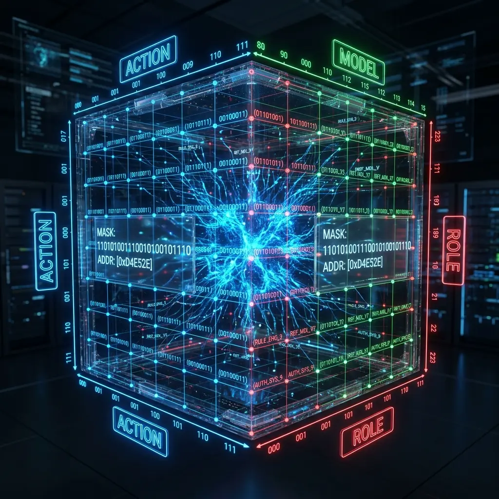

# Aura 3D バイナリアドレッシング：24-bit ビットマスクによる絶対的制御論

ほとんどのエージェントフレームワークがまだ煩雑な JSON 設定や文字列ルーティングを解析している間に、Aura はすでに**バイナリアドレッシング時代**に突入しています。私たちは、インテリジェントエージェントの意思決定空間は、曖昧なセマンティックの集合ではなく、正確に座標化可能な**幾何学的テンソル**であるべきだと考えています。

## 1. 24-bit の三位一体：意思決定次元の幾何学化

私たちは、エージェントの実行時のすべての変数を一つの 24-bit 複合ポインタに収束させます。このポインタは、互いに垂直な 3 つの次元で構成され、1677 万の潜在的ステートを持つ 3D 立方体を定義します。

$$\text{Address} = (\text{Action} \ll 16) \mid (\text{Model} \ll 8) \mid \text{Role}$$

### 1.1 Action (8-bit)：原子アクションの関数セマンティクス
256 種類の「何をなすか」を定義します。`File:Write` から `Web:Search` まで、各アクションは一つの WASM モジュールのメモリ・エントリポイントに対応します。8 ビットのマスクにより、システムは実行ロジックを瞬時にインデックスでき、文字列照合のオーバーヘッドを完全に排除します。

### 1.2 Model (8-bit)：計算階層の動的ルーティング
「誰がなすか」を定義します。これは単なるモデル名ではなく、**性能/コスト評価値**です。0x01 はローカルの超高速モデルを表し、0xFF は最も高価な推論モデルを表すかもしれません。Meta はタスクの「価値係数」に基づいてこのフィールドを動的に埋め、リアルタイムのコストパフォーマンス最適解を実現します。

### 1.3 Role (8-bit)：知識背景と人格バイアス
「どのような立場でなすか」を定義します。これは RAG 検索時のウェイト分布に直接影響します。同じ `Action` でも、`Architect`（アーキテクト）ロールと `Security Auditor`（セキュリティ監査人）ロールでは、ロードされるコンテキスト知識は全く異なります。

## 2. メモリロックによる究極の性能

低レイヤーの実装において、Aura は Rust を使用して **Direct Mapping ハッシュテーブル**を構築しています。
- **衝突ゼロのアドレッシング**：24-bit 空間は現代のメモリでは約 256MB（1 エントリ 16 バイト計算）しか占有しないため、直接配列アドレッシングを行うことができます。
- **mlock 保護**：システムコールを通じてアドレッシングテーブルを物理メモリ内にロックします。これにより、Matrix がジャンプ実行を行う際にディスクアクセスや複雑な動的割り当てを行う必要がなくなり、実行遅延はナノ秒レベルまで抑え込まれます。

## 3. 設計哲学：複雑さをビット演算に収束させる

この設計の本質は、**「決定性のために空間を取引する」**ことです。
複雑なセマンティック決定をあらかじめ計算し、3D 座標空間にマッピングすることで、Aura はエージェント分野でよく見られる「ルーティングのハルシネーション」を回避することに成功しました。Meta から発行される指令には、「コードを書いてください」といった曖昧な言葉は一切なく、`0x0F22A1` のような冷酷で正確、かつ絶対に誤読不可能なバイナリ座標のみが存在します。

## 4. 結論

3D バイナリアドレッシングは、Aura がデジタル生命体として高性能に動作するための物理的基盤です。これにより、インテリジェントエージェントの思考プロセスは単に理解可能であるだけでなく、計算可能で予測可能なものとなります。

---
*Dark Lattice 構造研究所 出品*
