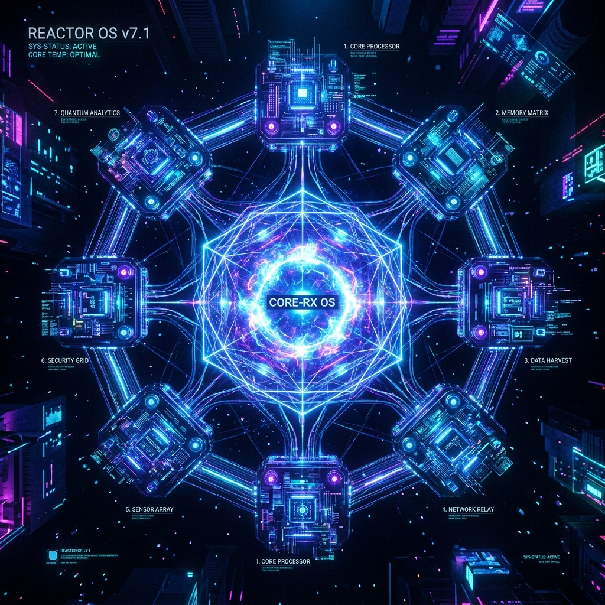

# Aura Architecture Finalized: 7-System Symmetric Architecture and Reactor OS Evolution

After a long period of architectural refactoring and validation, the **Aura v1.0 architecture is finally officially finalized**.

Aura's positioning is no longer just a simple AI tool, but a **high-performance, autonomous AI agent operating system**. To give AI entities a truly deterministic and resilient computing environment, we completely abandoned traditional monolithic architecture design, fully transitioned to the **Reactor OS (Reactor Operating System)** paradigm, and established a strict **7-System Symmetric Architecture**.

## 1. What is the 7-System Symmetric Architecture?

In Aura's code engineering, we carry out a concept of **1:1 core correspondence** full of physical beauty: each independent code Crate not only corresponds to a clear physical/logical function but also strictly corresponds to an exclusive design document.

These seven core components constitute Aura's entire physical topology:

1. **Aura Core (Base)**: The genome (DNA) of the entire system, uniformly defining the ACP v5.0 communication protocol and global fundamental Traits.
2. **Aura Substrate (Storage)**: The underlying physical base, providing an extreme-performance LZF-compressed binary storage engine and the ability to mount local large models.
3. **Aura OS (Kernel)**: Acting as the core Supervisor, responsible for the millisecond-level hot pull-up of subsystems, ACP routing relay, and resource auditing.
4. **Aura Interaction (Perception)**: Responsible for connecting to the outside world, performing intent sampling from massive gateway traffic, and triggering the system's resonance awakening based on values.
5. **Aura Inference (Inference System)**: Aura's logical brain, performing long-range causal deduction based on context and worldview models, and generating deterministic task flows.
6. **Aura Execution (Action Sandbox)**: The physical execution layer, supporting WebHook and Python native secure sandbox execution.
7. **Aura Evolution (Self-Evolution)**: Responsible for reflection and crystallization, evaluating Surprise signals, and triggering knowledge consolidation and algorithm model fine-tuning.

## 2. Reactor OS: From "Monolithic" to "Distributed Self-Healing"

In the older versions of Aura, inference, interaction, and execution were kneaded into one massive process. Once an LLM interface timed out or the execution sandbox OOMed (Out of Memory), the entire system faced the risk of paralysis.

Under the new **Reactor OS paradigm**, Aura thoroughly isolates the four core business logics (interaction, inference, execution, evolution) into completely physically separated **system-level Reactors** processes.

### Core Features Breakdown:

- **Binary ACP Process Bus (Aura Control Protocol)**  
  The price of process separation is high communication costs. Therefore, Aura abandoned inefficient HTTP/gRPC and instead adopted a self-developed binary IPC protocol with a fixed-length header. Combined with UDS (Unix Domain Sockets) and inter-process zero-copy technology, it ensures the kernel bus can squeeze latency down to microseconds when handling high-frequency tensor data exchanges.

- **Tokio-bound Self-Healing Sandbox**  
  Aura abolished the bloated DooD (Docker-out-of-Docker) mode, and instead pulls up the external code execution environment as a direct child process of the physical main process. We strongly bind the sandbox lifecycle with the Tokio asynchronous coroutine in the kernel. Once abnormalities such as causal rollback or compute overload trigger a Future Drop, the underlying layer will instantly issue `SIGKILL` to mercilessly kill the sandbox process, completely eliminating zombie processes.

- **Thermodynamics and Resource Throttling Abstraction**  
  Through the built-in hardware dispatcher (P32 Hardware Dispatcher), Aura achieved unified compute slot management. When encountering compute depletion or high-entropy scenarios, the system will automatically execute compute dimensionality reduction (Graceful Degradation) and dynamic throttling, making the AI's operational state as resilient as a real living organism.

## 3. Next Plan: Towards Deep Multimodal Integration

The finalization of the Aura v1.0 architecture is like installing a sturdy and resilient "physical body" for the AI. Relying on the underlying 7-System symmetric design, we can further expand its capability boundaries without affecting the stability of the current core systems at all.

In the next version iterations, the team will shift focus to deepening the **Cortex Multimodal Mind Cortex**, including the zero-latency streaming integration of the local Whisper voice engine and the dynamic analysis of visual features on the edge side.

The evolutionary journey of Aura OS has just begun.

---
*Produced by Dark Lattice Architecture Lab.*
