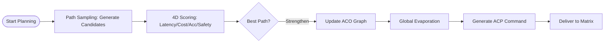

# Ant Colony Optimization in Aura Task Planning: Pheromone-Driven Path Finding

Traditional AI Agent planners (such as ReAct or Plan-and-Execute) are often **greedy**: they focus only on the immediate next step. However, when faced with long-range tasks containing dozens of steps, greedy algorithms easily fall into local optimum solutions.

Aura introduces **Ant Colony Optimization (ACO)**, utilizing the probabilistic feedback model of swarm intelligence to solve the "combinatorial explosion" problem of long-range decision making.

## 1. Core Mathematical Model: State Transition Probability

During the planning stage of the Meta kernel (S1), the system simulates a swarm of "logic ants" roaming in the 3D addressing space. For the transition probability $P_{ij}$ from node $i$ to node $j$, we define it as follows:

$$P_{ij} = \frac{\tau_{ij}^\alpha \cdot \eta_{ij}^\beta}{\sum_{k \in \text{allowed}} \tau_{ik}^\alpha \cdot \eta_{ik}^\beta}$$

### 1.1 $\tau_{ij}$: Pheromone (Thickness of Experience)
Represents the **reward accumulation** on that node transition path in history. If thousands of previous tasks prove that "executing Action=Search followed by Action=Code under Role=Dev" has the highest success rate, the pheromone concentration for this edge will be extremely high.

### 1.2 $\eta_{ij}$: Heuristic Factor (Sensitivity of Intuition)
Based on the vector similarity from KDC (Knowledge Dynamic Injection). It represents the degree of semantic matching between node $j$ and the final user goal. This is equivalent to an ant's perception of "food scent."

## 2. Evaporation and Evolution: Simulating Human "Error Correction"

The most exquisite part of the ACO algorithm is the **Pheromone Evaporation mechanism**:

$$\tau_{ij}(t+1) = (1 - \rho) \cdot \tau_{ij}(t) + \Delta\tau_{ij}$$

where $\rho$ is the evaporation coefficient. If a path was successful but performs poorly or errors frequently in recent tasks, its pheromone will automatically fade over time. This forces the system to try other paths, preventing it from getting stuck in "fixed mindsets" and achieving **dynamic truth-seeking** at the algorithmic level.

## 3. Engineering Implementation: Meta's Pre-play Game

Before Matrix actually starts working, the Meta kernel performs thousands of **Simulated Walks**:

1. **Sampling**: Generates multiple potential execution chains.
2. **Scoring**: Estimates chains based on cost, speed, and safety.
3. **Deposition**: Strengthens pheromones for the best chains, eventually generating a deterministic **ACP Execution Plan**.

## 4. Conclusion: Emergence from Randomness to Order

Ant Colony Optimization grants Aura a kind of "collective memory." Each execution node is no longer an island but is wrapped in a probabilistic network of historical experience and real-time intuition. This design allows the Agent to exhibit surprising "big-picture awareness" when handling extremely complex cross-domain tasks.

---
*Produced by Dark Lattice Architecture Lab.*
