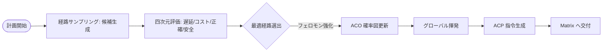

# Aura タスクプランニングにおけるアリ群最適化：フェロモン駆動のパス探索

従来の AI エージェントプランナー（ReAct や Plan-and-Execute など）は、往々にして**強欲（Greedy）**です。つまり、目先の次の一歩だけに集中します。しかし、数十ステップに及ぶ長期的なタスクに直面したとき、強欲アルゴリズムは容易に局所最適解に陥ってしまいます。

Aura は**アリ群最適化（ACO）**を導入しました。これは群知能の確率的フィードバックモデルを利用して、長期意思決定における「組み合わせ爆発」の問題を解決するものです。

## 1. コア数学モデル：状態遷移確率

Meta カーネルの編成段階（S1）では、システムは 3D アドレッシング空間内を徘徊する一群の「論理アリ」をシミュレートします。ノード $i$ からノード $j$ への遷移確率 $P_{ij}$ は、以下のように定義されます。

$$P_{ij} = \frac{\tau_{ij}^\alpha \cdot \eta_{ij}^\beta}{\sum_{k \in \text{allowed}} \tau_{ik}^\alpha \cdot \eta_{ik}^\beta}$$

### 1.1 $\tau_{ij}$：フェロモン（経験の厚み）
歴史的にそのノード遷移パス上で得られた**報酬の蓄積**を表します。過去数千回のタスクで「Role=Dev の下で Action=Search を実行し、その後に Action=Code を続ける」のが最も成功率が高いと証明されれば、このエッジのフェロモン濃度は極めて高くなります。

### 1.2 $\eta_{ij}$：ヒューリスティック因子（直感の鋭さ）
KDC（動的知識注入）によるベクトル類似度に基づきます。これは、ノード $j$ のセマンティックな特徴と最終的なユーザー目標との一致度を表します。これは、アリが「餌の匂い」を感じ取ることに相当します。

## 2. 揮発と進化：人間の「エラー修正」をシミュレートする

ACO アルゴリズムの最も精妙な部分は、**フェロモン揮発メカニズム（Evaporation）**にあります。

$$\tau_{ij}(t+1) = (1 - \rho) \cdot \tau_{ij}(t) + \Delta\tau_{ij}$$

ここで、$\rho$ は揮発係数です。あるパスがかつて成功したとしても、最近のタスクでパフォーマンスが悪かったり頻繁にエラーを出したりすれば、そのフェロモンは時間の経過とともに自動的に薄れていきます。これにより、システムは他のパスを試すことを強制され、「思考の固定化」を防ぎ、アルゴリズムレベルでの**動的な去偽存真**（偽を去り真を存する）を実現します。

## 3. エンジニアリング実装：Meta の予演博弈（プレプレイ・ゲーム）

Matrix が実際に動き出す前に、Meta カーネルは数千回の**シミュレート・ウォーク（Simulated Walks）**を行います。

1. **サンプリング**：複数の潜在的な実行チェーンを生成します。
2. **スコアリング**：コスト、速度、安全性に基づいてチェーンを推定します。
3. **沈殿**：最適なチェーンのフェロモンを強化し、最終的に確定的な **ACP 実行計画**を生成します。

## 4. 結論：ランダムから秩序への創発

アリ群アルゴリズムは、Aura に一種の「集合記憶」を与えました。各実行ノードはもはや孤島ではなく、歴史的な経験とリアルタイムの直感に包まれた確率的なネットワークの中に存在します。この設計により、エージェントは極めて複雑なクロスドメインタスクを処理する際に、驚くべき「大局観」を発揮することができるのです。

---
*Dark Lattice 構造研究所 出品*
