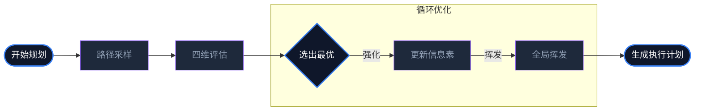

# 蚁群算法在 Aura 任务规划中的应用：信息素驱动的路径寻优

传统的 AI Agent 规划器（如 ReAct 或 Plan-and-Execute）往往是**贪婪**的：它们只关注当下的下一步。然而，在面对包含数十个步骤的长程任务时，贪婪算法极易陷入局部最优解。

Aura 引入了**蚁群优化算法（ACO）**，利用群体智能的概率反馈模型来解决长程决策的“组合爆炸”问题。

## 1. 核心数学模型：状态转移概率

在 Meta 内核的编排阶段（S1），系统会模拟一群“逻辑蚂蚁”在 3D 寻址空间中游走。对于从节点 $i$ 跳转到节点 $j$ 的概率 $P_{ij}$，我们定义如下：

$$P_{ij} = \frac{\tau_{ij}^\alpha \cdot \eta_{ij}^\beta}{\sum_{k \in \text{allowed}} \tau_{ik}^\alpha \cdot \eta_{ik}^\beta}$$

### 1.1 $\tau_{ij}$：信息素（经验的厚度）
代表了历史上在该节点跳转路径上的**奖励累积**。如果以往数千次任务证明“在 Role=Dev 下执行 Action=Search 后紧跟 Action=Code”成功率最高，那么这条边的信息素浓度会极高。

### 1.2 $\eta_{ij}$：启发式因子（直觉的灵敏度）
基于 KDC（动态知识注入）的向量相似度。它代表了节点 $j$ 的语义特征与最终用户目标的匹配程度。这相当于蚂蚁对“食物香味”的感知。

## 2. 挥发与演进：模拟人类的“纠错”

ACO 算法最精妙的地方在于**信息素挥发机制（Evaporation）**：

$$\tau_{ij}(t+1) = (1 - \rho) \cdot \tau_{ij}(t) + \Delta\tau_{ij}$$

其中 $\rho$ 是挥发系数。如果某条路径虽然曾经成功过，但在最近的任务中表现平庸或频繁报错，其信息素会随着时间自动变淡。这强制系统去尝试其他路径，防止系统陷入“思维定式”，实现了算法层面的**动态去伪存真**。

## 3. 工程实现：Meta 的预演博弈

在 Matrix 实际动手前，Meta 内核会进行数千次的模拟游走（Simulated Walks）。

1. **采样**：生成多条潜在的执行链路。
2. **打分**：基于成本、速度和安全性对链路进行预估。
3. **沉淀**：将最优链路的信息素进行强化，最终生成一份确定性的 **ACP 执行计划**。

## 4. 总结：从随机到有序的涌现

蚁群算法让 Aura 具备了一种“集体记忆”。每一个执行节点不再是孤岛，而是处于一个被历史经验和实时直觉共同包裹的概率网络中。这种设计让 Agent 在处理极端复杂的跨域任务时，能够表现出令人惊讶的“大局观”。

---
*本文由 Dark Lattice 架构实验室出品。*
