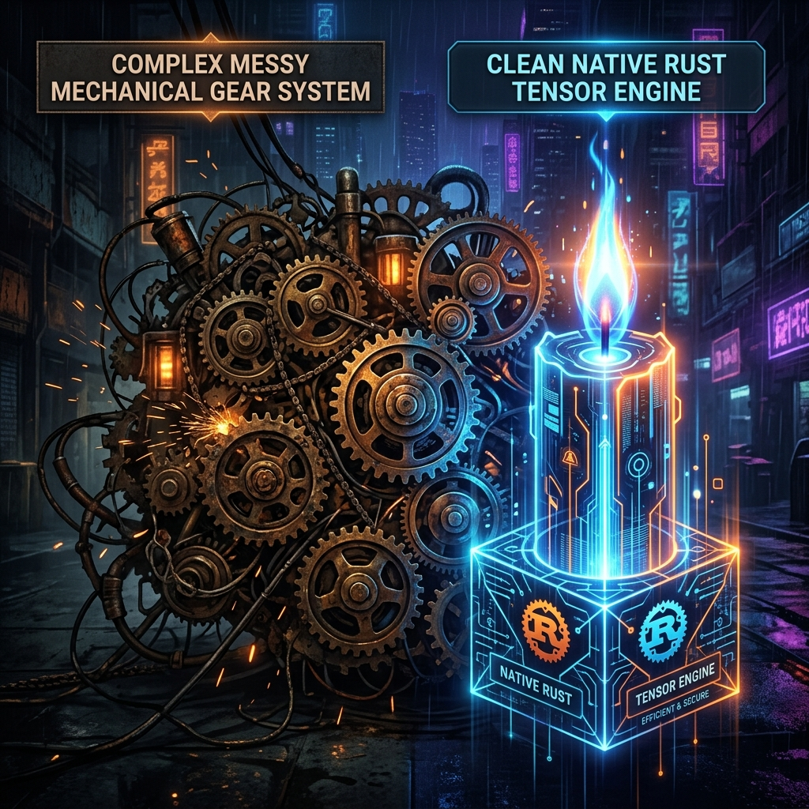

# 純血 Rust への移行：Aura Cortex が llama.cpp を捨てて Candle を採用した理由

究極のパフォーマンスを追求する道のりで、Aura のあらゆる技術選定には苦痛を伴う取捨選択がつきものです。

Aura OS アーキテクチャの初期バージョンでは、外部サンドボックスサブプロセス（`llama-cli` の実行など）や HTTP インターフェースを介して大規模言語モデル（LLM）をマウントしていました。しかし、Aura が求める「マイクロ秒レベルの物理的反応」が高まるにつれて、外部 C++ プロセスに基づくこのアーキテクチャが最大のボトルネックとなりました。

本日、我々は正式に `aura-cortex` リアクターへ **HuggingFace 公式の Candle フレームワーク**を導入し、ネイティブ Rust レベルでの物理テンソルスジューリングを完全に実現しました。

## 1. 外部プロセスアーキテクチャの「3つの大罪」

外部サブプロセスとして `llama.cpp` を使用していた時、我々は克服できない物理的な壁に直面しました：

### 1.1 プロセス間通信 (IPC) の目に見えないコスト
標準入出力（Stdin/Stdout）をパイプで転送するにせよ、HTTP プロトコルでカプセル化・解除するにせよ、これらのオーバーヘッドは超低遅延を目指す Aura にとって重い足かせとなります。特に HTTP のシリアライズとデシリアライズは、高速で生成される Token の濁流の前では非常に鈍重に見えます。

### 1.2 脆弱なライフサイクルとゾンビプロセス
Aura Kernel のスーパーバイザーメカニズムの下では、すべてのサブシステムがミリ秒レベルで制御可能であることを期待しています。しかし、C++ プロセスがセグメンテーションフォールトで突然死したり、メモリオーバーフローでデッドロックしたりすると、Aura は Tokio コルーチンのように `Drop` を通じて直接リソースを回収することが難しくなり、システムの自己修復機能に大きなリスクをもたらします。

### 1.3 クロスプラットフォームコンパイルの悪夢
C++ エンジンを使用するということは、巨大な動的リンクライブラリ（`.so` や `.dll` など）を扱うことを意味します。異なるアクセラレーションプラットフォーム（CUDA、ROCm、macOS Metal）において、分断されたコンパイル環境は開発者を苦しませます。

## 2. なぜ ONNX も正解ではないのか？

「なぜ ONNX Runtime を使わないのか？」と疑問に思う人もいるかもしれません。確かに ONNX は従来のディープラーニングにおける業界標準ですが、LLM の領域においては深刻な「水土不服（環境への不適応）」を抱えています：

- **ステートレスによる KV Cache の惨劇**：生成モデルは自己回帰時に過去の状態（KV Cache）に依存する必要があります。しかし、ONNX の計算グラフはデフォルトでステートレスです。その中で可変長の Cache 状態を維持しようとすると、メモリの受け渡しが苦痛になるだけでなく、コードも極めて難解になります。
- それは依然として巨大な C++ バインディングライブラリであり、最高のメモリ安全性を得るために「純血 Rust」を追求するという Aura の当初の意図に反しています。

## 3. 夜明け：Candle の登場

我々が進退窮まっていた時、HuggingFace が発表した **Candle** が膠着状態を打破する鍵となりました。これは完全に Rust で書かれたミニマリストな機械学習フレームワークであり、Aura のすべての要求に完璧に合致します：

### ミニマリストなビルド体験
Candle は完全に Cargo ベースで構築されています。開発者は `Cargo.toml` で `features = ["cuda"]` または `metal` を有効にするだけでハードウェアアクセラレーションをスムーズに統合でき、複雑な CMake ツールチェーンを設定する必要はもうありません。

### GGUF/Safetensors のネイティブサポート
現在オープンソースコミュニティで最も主流となっている量子化ウェイトファイルを直接解析できます。つまり、HuggingFace からモデルを直接ドラッグ＆ドロップし、ゼロコストでプロセスメモリにロードできるのです。

### メモリ状態における究極のパフォーマンス
Candle の導入により、`aura-cortex` は「外部委託の転送機」から「真のテンソルリアクター」へと変貌を遂げました。モデルの重みはプロセスの自身のメモリ空間に直接デシリアライズされ、`Arc<Mutex>` によって厳密に保護されます。ACP (Aura Control Protocol) が推論コマンドを受信すると、Tokio の非同期ランタイムはスレッドプールを使用して VRAM と直接会話し、その間に余計な IPC オーバーヘッドは**一切**生じません。

## 4. 究極の体験：ACP ストリーミングテンソル生成

Candle の導入後、我々は基盤となるサンプリングアルゴリズム（Temperature / Top-P）を深く書き直し、ストリーミング Chunk プロトコルをネイティブに実装しました。

すべての `for` ループ内で：Candle が Token ID を計算する -> Tokenizer が瞬時にデコードする -> バイナリの `InferenceStreamChunk` パケットにカプセル化する -> Unix Domain Sockets を介してインタラクション層へ稲妻のように flush する。

この純血 Rust で書かれた基盤パイプラインこそが、Aura にまるで人間がキーボードを叩いているかのような、シルクのように滑らかなマルチモーダル認知反応速度を与えているのです。

---
*Dark Lattice アーキテクチャラボラトリー 制作*
