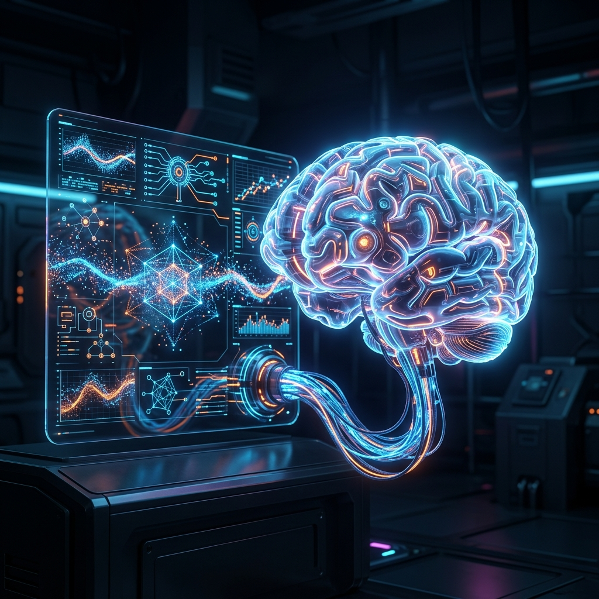

# Aura：Cortex マルチモーダル推論と Dashboard 設計

Aura v11.0.0 の体系的アーキテクチャでは、AI OS の知覚の深さと人間の開発者の可観測性を高めるために、2つのまったく新しい独立したコアコンポーネント、**Aura Cortex (大脳皮質)** と **Aura Dashboard (インタラクティブパネル)** を導入しました。

## 1. Aura Cortex：大脳皮質モデルサンドボックス

初期のアーキテクチャは通常、単一のクラウド LLM に依存するか、モデル推論をロジックにハードコードしていました。Aura Cortex の誕生は、システムが**ローカルのマルチモーダル計算ストリーム**を全面的に採用したことを宣言するものです。

### 1.1 専用のローカル推論コンテナ
`aura-cortex` は、専用のローカルマルチモーダル推論サンドボックスとして設計されています。ルートの `models/` ディレクトリに保存されているローカルモデルアセット（GGUF、Safetensors の重みなど）と直接インターフェースします。

### 1.2 機能と役割
- **超高速レスポンス**：Interaction システムの意図のサンプリングとフィードバックのレンダリングにサブ秒レベルのローカル推論を提供します。
- **プライバシーシールド**：プライバシーに関わる物理データやユーザーの意図について、システムはクラウド API を呼び出すことなく、Cortex 内で完全にローカルで消化できます。
- **マルチモーダルサポート**：テキスト（LLM）だけでなく、システムの視覚（Vision）および音声（STT/TTS）機能の計算ハブとしても機能し、システムの真の「感覚皮質」として機能します。

## 2. Aura Dashboard：システムの視覚的観測所

強力な AI-Native OS は複雑なブラックボックスのようなものです。開発者に内部の「歯車」が回っているのを見せるにはどうすればよいでしょうか？これが `aura-dashboard` の役割です。

### 2.1 最新の Web 技術に基づくインタラクティブパネル
Rust で大量に記述されている Aura の基礎となるロジックとは異なり、`aura-dashboard` は HTML/JS/CSS で構築された独立した監視および管理パネルリソースです。システムカーネルが提供する安全な WebSocket API を介して接続し、システムの内部状態を包括的に表示します。

### 2.2 コア表示次元
- **プロセス監視グラフ**：4つの自律システムのマイクロサービスステータスと健全性をリアルタイムで視覚化します。
- **因果クロックパイプライン**：`trace_id` のルーティングパスをグラフィカルにレンダリングします。開発者は、リクエストが Interaction からどのようにトリガーされ、Inference を通じて計画され、最終的に Execution に着地するかを明確に確認できます。
- **価値と進化の曲線**：システムの変分自由エネルギー (VFE) の状態と、Evolution システム内のパラメータ調整の軌跡を直感的に表示します。

## 3. 結論

Cortex は Aura に深いローカル知覚能力を与え、Dashboard はシステムの複雑な操作の青写真を人間に展開します。これら2つの組み合わせにより、Aura は単なる強力な実行マシンではなく、透明性が高く、観察可能で「知覚力のある」生命体になります。

---
*Dark Lattice アーキテクチャラボ制作*
