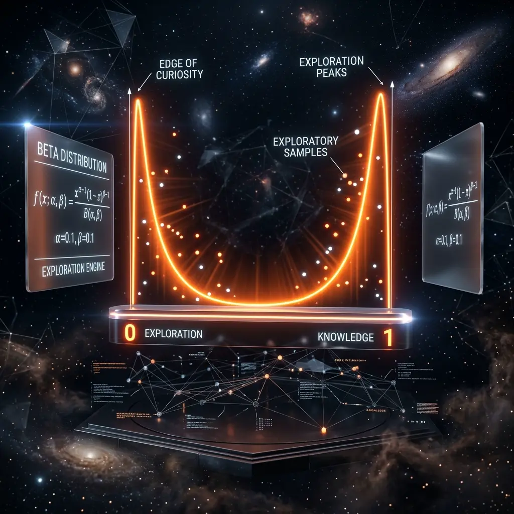

# Aura 好奇心エンジン：Beta 分布による境界探索サンプリングアルゴリズム

完璧な AI エージェントは、単に「従順」であるだけではいけません。既知のパスを繰り返すだけでは、変化する環境の中で進化することは決してできません。Aura の**好奇心エンジン（Curiosity Engine）**は、まさに「経験主義」の枷を打ち破るために設計されました。

## 1. 経験の罠とフィードバック崩壊

強化学習において、システムは「正のフィードバック・バイアス」に陥りやすい傾向があります。パス A が成功したために、無限にパス A を試行してしまうのです。長期的に見ると、システムはパス A に深刻な過学習（オーバーフィット）を起こし、より優れた解 B を認識する能力を失ってしまいます。これを**フィードバック崩壊（Feedback Collapse）**と呼びます。

## 2. Beta 分布サンプリング：数学化された「知的好奇心」

「好奇心」を定量化するために、Aura は統計学における **Beta 分布 $B(\alpha, \beta)$** を導入しました。

### 2.1 サンプリングレギュレーター
Beta 分布は $[0, 1]$ 区間で定義されます。パラメータ $\alpha$ と $\beta$ を動的に調整することで、システムの「性格」を制御できます。
- **保守モード ($\alpha, \beta > 1$)**：確率密度が中央に集中し、システムは信頼性の高い伝統的なパスを選択する傾向があります。
- **好奇心モード ($\alpha, \beta < 1$)**：分布は **U 型**を呈し、システムは極めて高い確率で境界（0 または 1）でサンプリングを行います。これは、システムが意図的に「極めて未知」または「一度も試したことのない」極端なノードを選択することを意味します。

### 2.2 エントロピー駆動型アクティベーション
タスクの成功率が長時間停滞し、知識ベース内のエントロピー（Entropy）が低下したことを Meta が検知すると、システムは自動的に $\alpha, \beta$ を下げます。この「人工的な焦燥感」が、アリたちにコンフォートゾーン（快適圏）を抜け出し、3D マトリックス内のマイナーな座標を探索することを強制します。

## 3. MMR アルゴリズム：関連性と多様性の博弈（ゲーム）

好奇心に駆動されたサンプリングは、盲目的なランダムではありません。私たちは **MMR（最大境界関連性）** アルゴリズムを併用しています。

$$\text{MMR} = \arg\max_{D_i \in R\setminus S} [\lambda \cdot \text{Sim}(D_i, Q) - (1-\lambda) \cdot \max_{D_j \in S} \text{Sim}(D_i, D_j)]$$

これは、「斬新な知識」を探求しつつ、現在のタスク目標（$Q$）とのセマンティックな最低ラインを維持することを保証します。これにより、エージェントは「インスピレーションを働かせ」ながらも、本筋から外れることはありません。

## 4. 結論：進化の動力
好奇心エンジンは、Aura に「能動的に失敗する」能力を与えました。これらの制御された、小規模な探索の失敗こそが、最終的にシステムの飛躍的な進化へと収束していくのです。それはエージェントを、受動的な実行ツールから、「探求精神」を備えたデジタル生命体へと変貌させます。

---
*Dark Lattice 構造研究所 出品*
