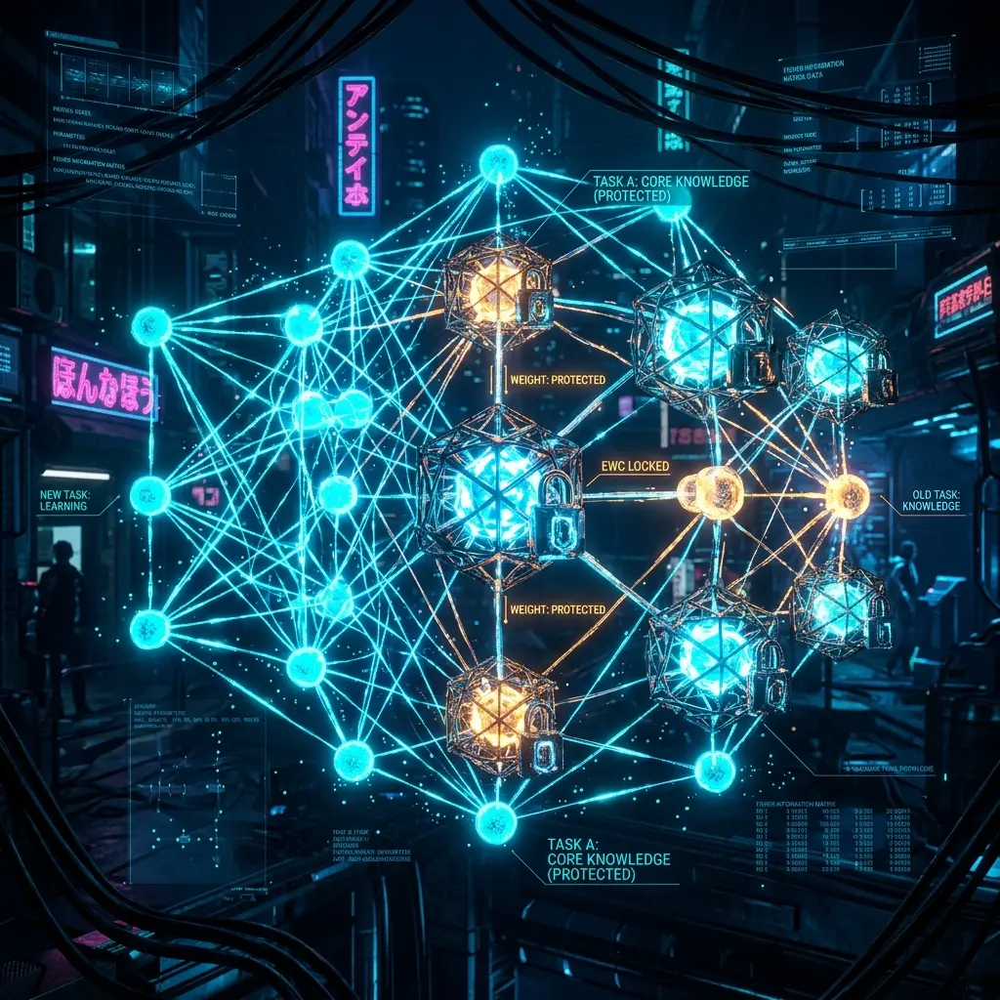

# Aura EWC 知识保护：破滅的忘却を防ぐコアアルゴリズム

継続学習（Continual Learning）は AI 進化の究極の目標ですが、そこには致命的な挑戦が待ち受けています。それが**破滅的忘却（Catastrophic Forgetting）**です。エージェントが Python コードを書く新しいテクニックを学んだとき、以前に記憶していたセキュリティ防御の原則をうっかり「忘れて」しまうかもしれません。

Aura は、神経科学にインスパイアされた **EWC（Elastic Weight Consolidation：弾性的重み統合）**アルゴリズムを導入し、システムの知識の魂を守ります。

## 1. フィッシャー情報行列： 「知識の魂」を識別する

すべてのウェイトパラメータが等しく重要というわけではありません。EWC の第一歩は、3D マトリックスの各ノードについて**フィッシャー情報行列 $F$** を計算することです。

$$F_i = E \left[ \left( \frac{\partial \log p(y|x, \theta)}{\partial \theta_i} \right)^2 \right]$$

- **高いフィッシャー分数値**：そのパラメータがコアタスク（論理判断、セキュリティコンプライアンスなど）にとって不可欠であることを表します。
- **低いフィッシャー分数値**：そのパラメータが高い冗長性を持っていることを表します。

## 2. 弾性的重み損失関数： 抵抗を伴う進化

S3 段階のウェイト更新において、私たちは特殊な正則化項を導入します。

$$\mathcal{L}(\theta) = \mathcal{L}_{new}(\theta) + \sum_i \frac{\lambda}{2} F_i (\theta_i - \theta_{A,i})^2$$

この数式のエンジニアリング上の意義は、**「重要な知識に弾性ロック（バネのような鍵）をかける」**ことにあります。
- 新しいタスクが重要でないパラメータを微調整しようとしても、抵抗はほぼゼロです。
- 新しいタスクが、高いフィッシャー分数値を持つコアロジックの骨格を揺るがそうとすると、損失関数が急激に上昇します。

## 3. 結果： 安定した魂、柔軟なスキル

EWC アルゴリズムを通じて、Aura は一種の**「非対称な進化」**を実現しました。
- **底層の骨格**：不可逆原則、セキュリティの底線などは、何度タスクを繰り返しても泰然自若として揺らぎません。
- **表層のスキル**：コーディング技術、コミュニケーションスタイルなどは、ユーザーのフィードバックに応じて積極的にイテレーション（反復）できます。

## 4. 結論： 信頼できる進化体の構築

EWC は Aura の「長期記憶保護器」です。それは、進化を追求する道において、インテリジェントエージェントが「Aura」を Aura たらしめている核心的な本質を決して失わないことを保証します。

---
*Dark Lattice 構造研究所 出品*
