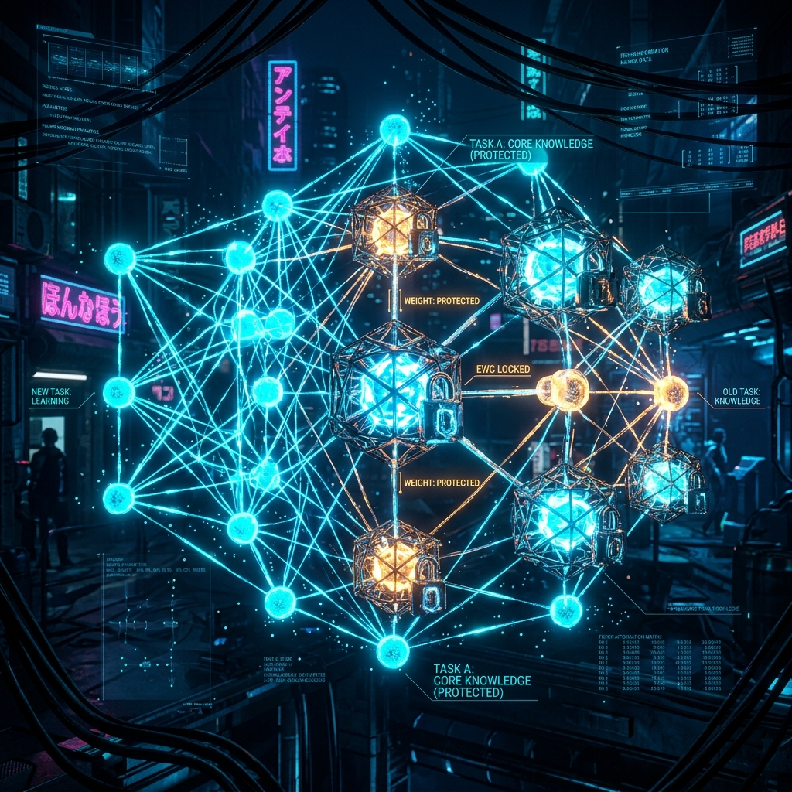
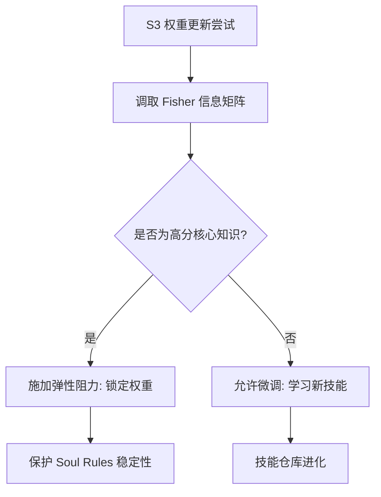

# Aura EWC 知识保护：防止灾难性遗忘的核心算法

持续学习（Continual Learning）是 AI 进化的终极目标，但它面临着一个致命挑战：**灾难性遗忘（Catastrophic Forgetting）**。当 Agent 学会了编写 Python 代码的新技巧时，它可能会不小心“忘记”了之前牢记的安全防御原则。

Aura 引入了神经科学启发的 **EWC (Elastic Weight Consolidation)** 算法来守护系统的知识灵魂。

## 1. Fisher 信息矩阵：识别“知识灵魂”

并非所有的权重参数都同等重要。EWC 的第一步是计算每个 3D 矩阵节点的 **Fisher 信息矩阵 $F$**：

$$F_i = E \left[ \left( \frac{\partial \log p(y|x, \theta)}{\partial \theta_i} \right)^2 \right]$$

- **高 Fisher 分值**：代表该参数对核心任务（如逻辑判断、安全合规）至关重要。
- **低 Fisher 分值**：代表参数具有较高的冗余度。

## 2. 权重弹簧：选择性更新

当更新 3D 矩阵权重在 S3 阶段时，EWC 会对那些具有高 Fisher 分数的参数施加“虚拟弹簧式”的阻力。

### 2.1 弹性权重损失函数：带阻力的进化
在 S3 阶段的权重更新中，我们引入了一个特殊的正则项：

$$\mathcal{L}(\theta) = \mathcal{L}_{new}(\theta) + \sum_i \frac{\lambda}{2} F_i (\theta_i - \theta_{A,i})^2$$

这个公式的工程意义在于：**为重要的知识加上了一把“弹性锁”**。
- 如果新任务试图微调一个不重要的参数，阻力几乎为零。
- 如果新任务试图动摇那些高 Fisher 分值的核心规则，损失函数会急剧上升。

## 3. 结果：稳定的灵魂，灵活的技能

通过 EWC 算法，Aura 成功实现了一种**“非对称进化”**：
- **底层骨架**：包括不可逆原则、安全底线等，稳如泰山，无论经过多少次任务都不会发生偏离。
- **表层技能**：包括代码技巧、沟通风格等，可以根据用户反馈进行激进的迭代。

## 学术与设计洞察 (Academic & Design Insights)

- **设计哲学**：EWC 体现了“非对称进化”的思想——保护灵魂的稳定性，同时释放技能的灵活性。这在本质上是模拟生物演化中的基因保护机制。
- **技术突破**：巧妙利用 Fisher 信息矩阵为核心知识施加“弹性锁”，在不牺牲新技能学习效率的前提下，守住了 AI 代理的逻辑底线。
- **受众启迪**：构建持续学习系统时，识别并量化“什么是不容改变的核心知识”，比盲目追求全量参数微调更为关键。

## 4. 总结：构建可信赖的进化体

EWC 是 Aura 的“长效记忆保护器”。它确保了智能体在追求进化的道路上，绝不会丢掉那些让它之所以成为“Aura”的核心本质。

---
*本文由 Dark Lattice 架构实验室出品。*
