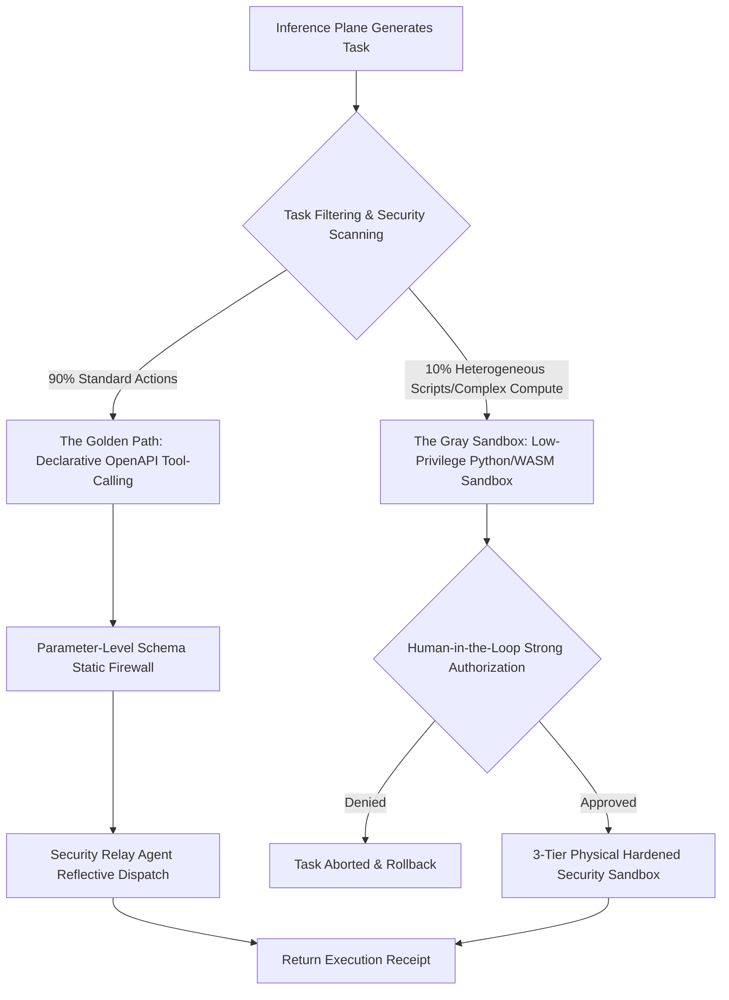

# Aura Hybrid Execution Architecture: Balancing AI Self-Evolution and Absolute System Security


Giving AI Agents the ability to manipulate the physical world and call operating system-level APIs is the cornerstone of empowering them with infinite evolutionary potential. However, without robust execution isolation, an Agent may go out of control due to hallucinations or malicious prompt injections, resulting in devastating security breaches such as Fork Bomb attacks, intranet reconnaissance (SSRF), or data exfiltration. For an OS-level resident daemon, this is completely unacceptable.

To break the dilemma between **"AI Autonomy"** and **"Host Security"**, Aura has pioneered the **"Golden-Gray" Hybrid Execution Architecture** at the physical execution layer (L3/L4). This post explores the rigorous engineering aesthetics behind this dual-path design.

---

## 1. Evolution Background and Core Pain Points

In its initial versions, Aura adopted a strong-typed DSL-driven execution model where tasks generated by the inference engine had to match a predefined `WebHook` or `PythonHook` struct exactly. Although highly deterministic, this approach suffered from two significant industrial bottlenecks:

1. **Contract Library Compilation Bloat**: Every time we introduced a new physical skill (e.g., a specific hardware control API or heterogeneous protocol), we had to modify the core `aura-core` contract definitions. This triggered a workspace-wide recompilation, severely hindering the hot-plugging flexibility of physical capabilities.
2. **Constrained AI Self-Evolution**: Large Language Models could not leverage their robust code generation abilities to write ad-hoc scripts for data sanitization, system self-healing, or routine monitoring, throttling the self-evolution loop of the Agent.

Conversely, shifting to the opposite extreme—running raw code-as-data sandboxes directly on the host—would expose an enormous physical attack surface (e.g., DNS Rebinding, intranet SSRF, OOM lockups). Therefore, designing a hybrid execution framework with nanosecond-level response and strict isolation was imperative.

---

## 2. Defining the Golden-Gray Hybrid System

To achieve the ultimate equilibrium between performance and safety, Aura splits all physical interactions into two execution paths and processes them with distinct security strategies:



### 2.1 The Golden Path

Approximately 90% of standard physical interactions (such as sending messages, retrieving system metrics, or querying substrate storage) go through the Golden Path.
* **Physical Mechanism**: Declarative tool-calling is strictly enforced. The AI agent does not generate code; instead, it outputs a standard structured representation: `call_tool(tool_name, arguments)`.
* **Security Strategy**: Aura validates arguments against a static OpenAPI Schema. This **parameter-level schema static firewall** ensures that the execution path remains static and immune to code injection, reducing risks to near zero.
* **Performance Optimization**: The execution plane maintains an in-memory, thread-safe dynamic tool registry `Arc<RwLock<BTreeMap<String, Box<dyn PhysicalTool>>>>`. Each `call_tool` request is dispatched via reflection in microseconds, achieving **zero disk I/O overhead** and ultra-high concurrency.

### 2.2 The Gray Sandbox

For the remaining 10% of tasks, such as complex heterogeneous data pipelines, custom scripts, or math modeling that require raw execution, Aura diverts them into the Gray Sandbox.
* **Physical Mechanism**: The AI engine is allowed to output raw Python or WebAssembly (WASM) bytecode.
* **Security Strategy**: Backed by **Human-in-the-Loop Strong Authorization**. Before the user explicitly authorizes the task in the interaction layer, the gray script remains completely silent in a `pending_feedback` state. Once signed and activated, it is spawned inside a hardened 3-tier physical sandbox.

---

## 3. The 3-Tier Hardened Physical Sandbox

To ensure that untrusted or flawed code cannot breach the Gray Sandbox and compromise the host, Aura enforces a 3-tier progressive security defense:

### 3.1 Layer 1: DNS Rebinding and Intranet SSRF Physical Interception

* **Security Threat**: The WebHook URLs generated by an LLM could point to malicious domains. During the TCP handshake, these domains can exploit **DNS Rebinding** to resolve immediately to private IP addresses (e.g., `192.168.1.1`), bypassing static domain blocklists to perform SSRF probes against intranet infrastructure.
* **Defense Logic**:
  Aura overrides `reqwest`'s default DNS resolution by plugging in a customized Secure Resolver. One microsecond before initiating any TCP connection, it evaluates all resolved IP addresses against `is_private_ip` (complying with RFC 1918 and RFC 4193). Any attempt to access private address ranges is physically blocked, intercepting intranet SSRF threats at the network layer.

### 3.2 Layer 2: OS-Level Resource Quota and Privilege Demotion

* **Security Threat**: Malicious or runaway code executing infinite loops to saturate the CPU, triggering Fork Bombs to crash the host kernel, or attempting to write system configurations.
* **Defense Logic**:
  1. **Privilege Demotion**: Before spawning the child process, the runner uses Rust foreign links to invoke `setuid/setgid`, stripping all superuser rights and demoting the process execution context to the low-privileged `nobody` user (UID 65534).
  2. **Resource Quotas (prlimit)**: Utilizing Linux `prlimit` system calls, Aura hard-caps the process's maximum resident set size (RSS) virtual memory to **256MB** and restricts the maximum process/thread limit `RLIMIT_NPROC` to **10**, neutralizing Fork Bomb attacks at the kernel level.
  3. **Tokio kill_on_drop Self-Healing**: Leverages the `kill_on_drop(true)` configuration in Tokio's asynchronous runner. Combined with microsecond-level execution timeouts, any hung process is instantly terminated with a physical `SIGKILL` signal.

### 3.3 Layer 3: Air-Gapped Network Namespace Isolation

* **Security Threat**: Even if local resources are protected, a rogue Python script can bypass standard hooks, opening raw socket connections to transmit sensitive system details to external command-and-control servers (Data Exfiltration).
* **Defense Logic**:
  Under Linux, when spawning the sandbox, Aura invokes the `unshare(CLONE_NEWNET)` syscall. This system operation completely detaches the child process from the host's physical and virtual network adapters, leaving only an empty loopback interface. This creates a **100% air-gapped run-time island**. The sandbox can only exchange computed results with the parent process through highly restricted standard I/O pipes.

### 3.4 WebAssembly (WASM) WASI Sandbox Design

While process-level Python sandboxing provides flawless isolation, its **30-50ms cold-start latency** struggles with microsecond-level L4 physical loops, and it incurs heavy dependencies on local environments. Thus, Aura integrates a WebAssembly sandbox powered by **Wasmtime** as the secondary engine of the Gray Sandbox.

Adhering to standard **WASI (WebAssembly System Interface)** specifications, Aura enforces further micro-isolation:
1. **Hard Memory Quota**: Instantiates WASM Stores with a custom `ResourceLimiter`, hard-capping maximum virtual memory pages to **128MB**. Exceeding this triggers an immediate host interrupt.
2. **Zero Disk Intrusion**: The WASI virtual file system is initialized without pre-mounting any physical directories of the host. It only captures standard `stdout` and `stderr` pipes, preventing any read/write leaks or disk pollution.
3. **Instruction-Level Networking Strip**: The WASI Socket extension protocol is disabled. Consequently, compiled WASM bytes do not possess any socket descriptor instructions at the hardware translation layer, providing immutable network isolation.

---

## 4. Lifecycle and Causal Graph

The dual-path execution engine integrates seamlessly with Aura's inference, storage, and interaction layers to form a closed causal loop:

```
[Inference Plane]           [Substrate Substrate]          [Execution Plane]          [Interaction Plane]
      |                              |                             |                            |
      |-- 1. Reasoning & Planning -->|                             |                            |
      |   (InferenceTaskRecord)      |                             |                            |
      |   (status: pending_feedback) |                             |                            |
      |                              |<-- 2. Query Pending Tasks -------------------------------|
      |                              |                                                          |-- 3. Push Authorization Card
      |                              |<-- 4. User Approves Task (RECORD_LIFE, authorized) ------|
      |                              |    (status: pending_execution)
      |                              |                             |                            |
      |                              |<-- 5. Poll Approved Tasks --|                            |
      |                              |                             |-- 6. Evaluate Dual Path ---|
      |                              |                             |   - Golden: Reflective     |
      |                              |                             |   - Gray: 3-Tier Sandbox   |
      |                              |<-- 7. Return Result (RECORD_LIFE, executed) -------------|
      |                              |   (status: pending_feedback)|                            |
      |                              |<-- 8. Poll Executed Feedback ----------------------------|
      |                              |                                                          |-- 9. Render Exec Result
```

1. **Plan Generation**: The inference plane spawns a physical execution plan (flagged as `pending_feedback` inside Substrate).
2. **Human-in-the-Loop Approval**: The interaction layer polls the task and displays a one-click authorization card to the user.
3. **State Transition**: The task transitions to the `pending_execution` state upon signature.
4. **Dual-Path Resolution**: The execution engine polls the task and determines whether it falls under standard tool calls (Golden Path) or custom runtimes (Gray Sandbox).
5. **Air-Gapped Execution**: Standard tools are dispatched reflectively in microseconds, while custom scripts are executed inside the 3-tier air-gapped sandboxes.
6. **Self-Evolution Feedback**: The execution receipt is written back to the substrate. The inference engine polls the execution results, adapting its cognitive model for subsequent planning steps, closing the "Perception-Reasoning-Execution-Learning" loop.

---

## 5. Conclusion

Aura's hybrid execution architecture provides an industry-standard blueprint for designing robust AI Agent platforms. It proves that safety and extensibility are not mutually exclusive. By establishing rock-solid physical boundaries at the engineering layer, we can foster unlimited AI self-evolution while preserving absolute security for the underlying operating system.

---
*Produced by Dark Lattice Architecture Lab.*
