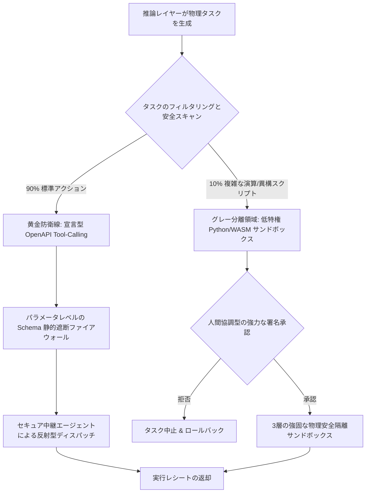

# Aura ハイブリッド実行アーキテクチャ：AI の自己進化とシステム絶対安全を両立するエンジニアリング実践


AI エージェント（Agent）に物理世界を操作し、オペレーティングシステムレベルの API を呼び出す能力を与えることは、無限の進化の可能性をもたらす鍵となります。しかし、強力な安全隔離が欠如している場合、エージェントはハルシネーション（幻覚）や悪意のあるプロンプトインジェクションによって暴走し、ホストマシンに対して Fork Bomb（派生爆弾）によるシステムハング、イントラネット探索（SSRF）、またはデータ漏洩などを引き起こすリスクがあります。OS レベルの常駐サービスにとって、これは絶対に許容できません。

**「AI の進化における自主性」** と **「ホストマシンの安全防御」** の両立というジレンマを打破するため、Aura は物理実行レイヤー（L3/L4）に **「黄金・グレー双軌（ハイブリッド）隔離実行メカニズム（Hybrid Architecture）」** を全面的に導入しました。本記事では、この設計の背後にある硬派なエンジニアリング美学を深く掘り下げます。

---

## 1. アーキテクチャ進化の背景と核心的な課題

初期の設計において、Aura は静的な DSL 駆動型の実行モデルを採用していました。推論エンジンによって生成されたタスクは、事前定義された `WebHook` または `PythonHook` 構造体に正確に一致する必要がありました。この手法は極めて高い確定性を持っていましたが、工業レベルにおいて以下の2つの深刻なボトルネックに直面しました：

1. **コントラクトライブラリのコンパイル膨張**：新しい物理スキル（特定の異構 API やハードウェア制御インターフェースなど）を追加または変更するたびに、コアの `aura-core` コントラクト定義を修正しなければなりませんでした。これにより、ワークスペース全体の再コンパイルが発生し、システムのホットプラグ（動的挿抜）能力が著しく制限されました。
2. **AI 自己進化の制限**：大規模言語モデル（LLM）が、その強力なコード生成能力（Code Generation）を活かして、臨時のデータクレンジング、システム監視、または障害自己修復スクリプトを自由に記述することができず、エージェントの自己進化ループが制限されていました。

一方で、別の極端なアプローチ――AI コードをホストマシン上で制限なく直接実行するサンドボックスモデル――を採用すると、**DNS リバインディング（DNS Rebinding）**、**イントラネット SSRF 侵入**、および **ホスト CPU のリソース枯渇** といった深刻な攻撃面に直面します。そのため、安全隔離と高速応答を両立したハイブリッド実行アーキテクチャの構築が不可避でした。

---

## 2. 黄金・グレー双軌隔離システムの定義

効率性と安全性の究極のバランスを実現するため、Aura は物理的なインタラクションシナリオを二分し、精緻なコントロールフローの分流を実施しています：



### 2.1 黄金防衛線 (The Golden Path)

Aura システムにおいて、標準化された物理インタラクション（メッセージの送信、システムメトリクスの取得、知識ベースの検索など）の約 90% が黄金防衛線に割り当てられます。
* **物理メカニズム**：制限された宣言型ツール呼び出しを厳格に強制します。AI エージェントはコードを生成せず、標準的な構造表現 `call_tool(tool_name, arguments)` を出力します。
* **セキュリティ**：静的な OpenAPI Schema に基づき、**パラメータレベルの Schema 静的遮断ファイアウォール** を実行します。定義に一致しないパラメータは瞬時に拒絶されるため、コードインジェクションのリスクはほぼゼロです。
* **パフォーマンスの最適化**：実行プレーンは、メモリ内にスレッドセーフな動的ツールレジストリ `Arc<RwLock<BTreeMap<String, Box<dyn PhysicalTool>>>>` を常駐させています。各 `call_tool` リクエストはマイクロ秒単位で反射的に処理され、**ディスク I/O のオーバーヘッドゼロ** と極めて高い並行性を実現します。

### 2.2 グレー分離領域 (The Gray Sandbox)

残りの 10% のタスク（複雑なデータクレンジング、カスタムスクリプト、数学的モデリングなど、生のコード実行を必要とするタスク）は、グレー分離領域へ分流されます。
* **物理メカニズム**：AI エージェントが直接 Python や WebAssembly（WASM）のバイトコードを出力することを許可します。
* **セキュリティ**：**「人間協調型の強力な署名承認（Human-in-the-Loop）」** によって保護されます。ユーザーがインタラクション層で明示的に署名して承認するまで、グレースクリプトは `pending_feedback` 状態として Substrate 内で完全に沈黙します。署名が完了すると、直ちに3層の強固な物理安全隔離サンドボックス内に投入されて実行されます。

---

## 3. 3層の強固な物理安全隔離サンドボックス設計

悪意のある、またはバグを含んだコードがグレー分離領域を突破してホストマシンやネットワークを侵害することを防ぐため、Aura は段階的な3層の物理安全境界を構築しています：

### 3.1 第1層：DNS リバインディングとイントラネット SSRF の物理的遮断

* **セキュリティ脅威**：LLM が生成した WebHook URL が、攻撃者によって操作された悪意あるドメインを指している可能性があります。このドメインは **DNS リバインディング（DNS Rebinding）** を利用し、TCP ハンドシェイクの瞬間に解決先をイントラネットの IP アドレス（例：`192.168.1.1`）に変更することで、通常のドメインブロックをバイパスし、イントラネット機器に対して SSRF 攻撃を仕掛けることができます。
* **防御ロジック**：
  Aura は `reqwest` のデフォルトの DNS 解決コンポーネントをオーバーライドし、独自の「セキュア解決器（Secure Resolver）」をバインドしています。TCP 接続を確立する1マイクロ秒前に、解決されたすべての IP アドレスに対して `is_private_ip`（RFC 1918 および RFC 4193）の双方向判定を強制します。プライベート IP の範囲へのアクセスは物理的に遮断され、イントラネットへの SSRF 攻撃をネットワーク層で根絶します。

### 3.2 第2層：OS レベルのリソース制限と特権降格

* **セキュリティ脅威**：AI が無限ループを実行して CPU を飽占させる、Fork 爆弾を発生させてホストカーネルをハングアップさせる、あるいはスーパーユーザー権限を利用してホストの設定を書き換えようとする脅威。
* **防御ロジック**：
  1. **特権降格**：子プロセスを `spawn` する前に、Rust のシステムコールインターフェースを介して `setuid/setgid` を呼び出し、スーパーユーザーの権限を完全に剥奪し、実行コンテキストを低特権ユーザーである `nobody`（UID 65534）に強制降格します。
  2. **物理的制限 (prlimit)**：Linux の `prlimit` システムコールを利用し、サンドボックスプロセスの最大 RSS 仮想メモリを **256MB** に、最大プロセス/スレッド制限数 `RLIMIT_NPROC` を **10** に制限します。これにより、Fork 爆弾によるシステム攻撃をカーネルレベルで完全に無力化します。
  3. **Tokio kill_on_drop による自己修復**：Tokio 非同期ランタイムの `kill_on_drop(true)` 設定を活用し、マイクロ秒レベルの実行タイムアウトを構成します。プロセスがハングまたはタイムアウトした場合、直ちに子プロセスに対して物理的な `SIGKILL` シグナルを送信し、強制終了させます。

### 3.3 第3層：Air-Gapped ネットワーク名前空間隔離

* **セキュリティ脅威**：ローカルリソースが保護されていても、悪意のある Python スクリプトが標準のフックをバイパスして直接 Socket 接続を開き、外部のコマンド＆コントロール（C2）サーバーにホストの機密データを送信する（データエクスフィルトレーション）リスク。
* **防御ロジック**：
  Linux 環境下において、サンドボックスプロセスを spawn する際、Aura は `unshare(CLONE_NEWNET)` システムコールを呼び出します。この操作により、ホストの物理および仮想ネットワークアダプタが子プロセスから完全に剥奪され、空のループバックインターフェースのみが残されます。これにより、**100% 物理的に去ネットワーク化された（Air-gapped）孤島のような実行環境** が形成されます。サンドボックスは、極めて制限された標準入出力パイプ（Pipe）を介してのみ親プロセスと結果をやり取りでき、ネットワークを通じたデータ漏洩を完全に防ぎます。

### 3.4 WebAssembly (WASM) WASI サンドボックス設計

プロセスレベルの Python サンドボックスは完璧な隔離性を提供しますが、**30〜50ms のコールドスタート遅延** はミリ秒単位の高速な応答制御を必要とする L4 物理ループにおいて足かせとなり、またホストのローカル環境依存性も高くなります。そのため、Aura は **Wasmtime** ランタイムを搭載した WASM 超軽量サンドボックスを、グレー分離領域の第2のエンジンとして統合しています。

標準的な **WASI (WebAssembly System Interface)** 仕様に従い、Aura はより深いマイクロ隔離を実現しています：
1. **メモリ上限の厳格化**：WASM Store のインスタンス化の際、カスタムの `ResourceLimiter` をフックし、最大仮想メモリページ数を **128MB** に制限します。これを超えると、即座にホスト割り込みがトリガーされます。
2. **ディスクアクセスの完全な排除**：WASI の仮想ファイルシステムは、ホストのいかなる物理ディレクトリもプレマウントせずに初期化されます。標準の `stdout` および `stderr` パイプのみをキャプチャし、サンドボックス外部からのファイル書き込みやディスク汚染を防止します。
3. **命令レベルのネットワーク機能剥奪**：WASI の Socket 拡張プロトコルを無効化します。これにより、コンパイルされた WASM バイトコードはハードウェア変換レイヤーにおいてソケット記述子命令を物理的に持たず、不変なネットワーク隔離を提供します。

---

## 4. ライフサイクルと因果チェーン

双軌実行エンジンは、Aura の推論レイヤー、記憶（Substrate）レイヤー、インタラクションレイヤーとシームレスに結合し、厳密なクローズドループを構築しています：

```
[Inference Plane]           [Substrate Substrate]          [Execution Plane]          [Interaction Plane]
      |                              |                             |                            |
      |-- 1. 思考推論と計画生成 ---->|                             |                            |
      |   (InferenceTaskRecord)      |                             |                            |
      |   (status: pending_feedback) |                             |                            |
      |                              |<-- 2. 承認待ちタスクの照会 -------------------------------|
      |                              |                                                          |-- 3. ユーザーへ承認カード提示
      |                              |<-- 4. ユーザーが承認 (RECORD_LIFE, is_authorized=true) --|
      |                              |    (status: pending_execution)
      |                              |                             |                            |
      |                              |<-- 5. 承認済みタスクの監視 -|                            |
      |                              |                             |-- 6. 双軌属性の評価 -------|
      |                              |                             |   - 黄金: 反射型動的実行   |
      |                              |                             |   - グレー: 3層サンドボックス|
      |                              |<-- 7. 実行結果の返却 (RECORD_LIFE, is_executed=true) ----|
      |                              |   (status: pending_feedback)|                            |
      |                              |<-- 8. 実行フィードバックの監視 ----------------------------|
      |                              |                                                          |-- 9. 実行結果の描画
```

1. **計画生成**：推論プレーンが物理実行意図を含む計画を生成し、Substrate 内で `pending_feedback` 状態として保存されます。
2. **人間協調型承認**：インタラクションレイヤーがタスクを監視し、フロントエンド上でユーザーにワンクリック承認カードを提示します。
3. **状態遷移**：ユーザーが承認すると、タスクの状態は `pending_execution` に遷移します。
4. **双軌の判定**：実行エンジンがタスクを取得し、それが標準ツール呼び出し（黄金防衛線）かカスタムスクリプト（グレー分離領域）かを自動判別します。
5. **強固な隔離実行**：標準ツールはマイクロ秒単位で反射的に処理され、カスタムスクリプトは3層の去ネットワーク化物理サンドボックスで実行されます。
6. **自己進化フィードバック**：実行レシートが Substrate に書き戻されます。推論エンジンがこの結果を読み取り、認識モデルを次の計画フェーズに適応させ、「知覚-推論-実行-学習」の自律進化ループを完成させます。

---

## 5. 結論

Aura の「黄金・グレー双軌隔離実行メカ名ズム」は、堅牢な AI エージェントプラットフォームの設計において、非常に優れた工業的模範を示しています。安全性と拡張性は決して排他的なものではありません。物理層およびオペレーティングシステムレベルでの硬派な境界設計を行うことで、私たちはホストマシンの絶対的な安全を守りつつ、AI に無限の自己進化の翼を与えることができるのです。

---
*Dark Lattice 構造研究所 出品*
