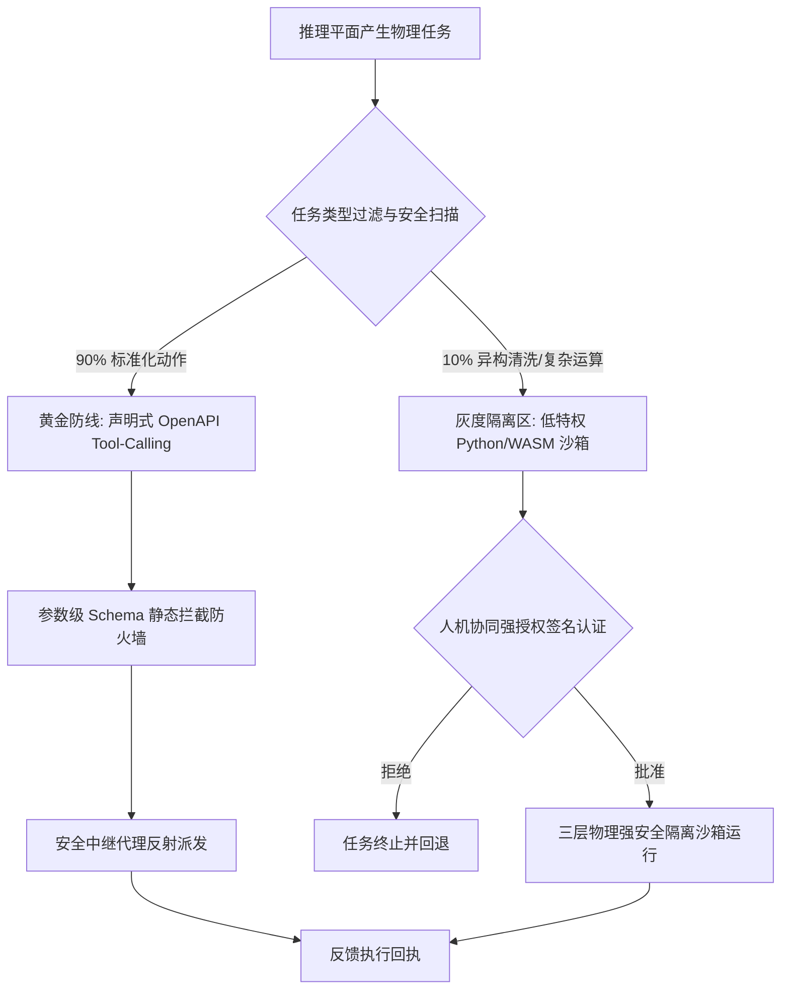

# Aura 双轨隔离执行架构：兼顾 AI 自演化与系统绝对安全的工程实践


让 AI 代理（Agent）拥有操纵物理世界与操作系统级 API 的能力，是赋予其无限进化可能的关键。然而，若缺乏强有力的安全隔离，Agent 在代码执行中可能因为幻觉或恶意注入而失控，从而对宿主机发起 Fork Bomb（派生炸弹）挂死系统、内网探测（SSRF）或数据外泄。这对于操作系统级的常驻服务来说是绝对不能接受的。

为了打破 **“AI 演化自主度”** 与 **“宿主机安全防御”** 的两难困境，Aura 在物理执行平面（L3/L4）全面引入了 **「黄金-灰度双轨隔离执行机制（Hybrid Architecture）」**。本文将深入剖析这套设计背后的工程美学。

---

## 1. 架构演进背景与核心痛点

在早期的设计中，Aura 采用强类型 DSL 驱动模型。AI 生成的任务必须精确适配预定义的 `WebHook` 或 `PythonHook` 结构体。这种范式虽然具备极强的确定性，但却伴随着两个致命缺陷：

1. **契约库编译膨胀**：每当我们需要引入一个新的物理技能（如特定异构 API 或硬件控制接口），都不得不修改核心的 `aura-core` 契约定义。这导致整个工作空间需要重新编译，极大地限制了系统的热插拔能力。
2. **AI 自演化自由度受限**：大模型无法直接利用其强大的代码生成能力（Code Generation）来编写临时的数据清洗、系统监测或故障自愈脚本，锁死了代理框架自我进化的潜力。

如果直接走入另一个极端——允许 AI 代码在宿主机上毫无节制地裸奔，那么诸如 **DNS 重绑定（DNS Rebinding）**、**内网 SSRF 渗透** 以及 **宿主机 CPU 耗尽** 等安全漏洞将接踵而至。因此，构建一个强隔离且极速响应的混合执行架构势在必行。

---

## 2. 黄金-灰度双轨系统定义

为了兼顾效率与安全，Aura 将物理交互场景一分为二，实施精细的双轨控制流分流：



### 2.1 黄金防线 (The Golden Path)

在 Aura 体系中，约有 90% 的标准化物理交互（例如发送即时消息、获取公开网络指标、从 Substrate 中检索固化知识等）都归属于黄金防线。
* **物理机制**：强制采用受限的声明式工具调用。大模型无需编写代码，只需输出 `call_tool(tool_name, arguments)`。
* **安全性**：系统维护一份静态的 OpenAPI Schema，进行**参数级 Schema 静态防火墙拦截**。大模型生成的参数一旦不匹配定义便会被瞬间驳回，风险几近于零。
* **性能优化**：执行平面在内存中常驻一个并发安全的动态工具注册表 `Arc<RwLock<BTreeMap<String, Box<dyn PhysicalTool>>>>`，每次 `call_tool` 请求在微秒级完成内存反射派发，实现 **零磁盘 I/O 损耗** 与超高并发。

### 2.2 灰度隔离区 (The Gray Sandbox)

针对极其复杂的异构临时脚本、非标准数学模型推算或复杂的流式数据清洗等必须依赖原生代码执行的 10% 任务，Aura 会将其归入灰度隔离区。
* **物理机制**：AI 允许直接输出 Python 或 WebAssembly（WASM）原生脚本。
* **安全性**：实施 **“人机协同强安全授权”**。在用户于交互层显式签名批准之前，灰度脚本在 Substrate 中保持绝对的 `pending_feedback` 静默状态。一旦授权通过，立刻被投放至三层物理强安全隔离沙箱中运行。

---

## 3. 三层物理安全隔离沙箱设计

为了防范恶意或故障代码穿透灰度隔离区，危害宿主机及内网，Aura 建立了三层渐进式物理安全边界：

### 3.1 第一层：DNS 重绑定与内网 SSRF 物理拦截

* **安全威胁**：大模型生成的 WebHook URL 可能是被攻击者操纵的恶意域名。当握手发起时，该域名可通过 **DNS 重绑定（DNS Rebinding）** 在瞬间将解析地址更改为内网 IP（如 `192.168.1.1`），从而穿透常规的静态过滤，对内网设备实施 SSRF 探测和渗透。
* **防护逻辑**：
  Aura 自定义了 `reqwest` 的 DNS 解析组件，绑定了独立的安全解析器（Secure Resolver）。在发起 TCP 建立连接的前一微秒，强制对解析出来的所有物理 IP 地址实行 `is_private_ip`（RFC 1918 和 RFC 4193）双向强判定，从网络底层彻底截断针对内网的所有 SSRF 探测。

### 3.2 第二层：操作系统级资源限额与特权降级

* **安全威胁**：AI 执行恶意的死循环代码引发 CPU 耗尽，或者通过 Fork 炸弹派生无限线程挂死宿主机内核，甚至试图通过越权攻击修改宿主机关键配置。
* **防护逻辑**：
  1. **特权剥夺**：在子进程 `spawn` 之前，通过 Rust 的底层外部链接调用 `setuid/setgid`，彻底剥夺超级用户特权，将运行账户强制降级为低特权用户 `nobody`（UID 65534）。
  2. **物理配额限制 (prlimit)**：利用 Linux 的 `prlimit` 系统调用，强制限制沙箱进程的最大 RSS 虚拟内存为 **256MB**，限制最大进程与线程数 `RLIMIT_NPROC` 为 **10**，从内核层彻底瓦解 Fork 炸弹提权的可能。
  3. **超时硬杀 ( Tokio kill_on_drop )**：使用 Tokio 异步运行时的 `kill_on_drop(true)` 特性，并配置微秒级硬超时机制。一旦检测到进程挂起或超时，系统将在纳秒级向子进程发送 `SIGKILL` 物理信号进行硬性自愈。

### 3.3 第三层：Air-gapped 去网络化命名空间隔离

* **安全威胁**：哪怕没有网络提权，恶意的 Python 脚本也可能试图通过 Socket 直接将宿主机的敏感数据向外传输，造成严重的数据外泄。
* **防护逻辑**：
  在 Linux 平台下，当 spawn 执行沙箱子进程时，系统调用 `unshare(CLONE_NEWNET)`。这一系统级操作会强行剥夺该进程的所有物理和虚拟网络适配器（仅保留一个空的 Loopback 环回网卡），从而实现 **100% 物理去网络化（Air-gapped）的孤岛运行环境**。沙箱只能通过高度受限的管道（Pipe）与 Aura 内核交换运算结果，杜绝了任何数据网络外溢的可能。

### 3.4 WebAssembly (WASM) 灰度执行子沙箱设计

虽然进程级的 Python 沙箱提供了无懈可击的安全保障，但其 **30-50ms 的冷启动延迟** 在面对毫秒级极速响应需求时显得力不从心，且极其依赖宿主机的本地解释器环境。因此，Aura 引入了基于 **Wasmtime** 运行时的 WASM 极速轻量化沙箱作为灰度隔离区的第二物理动力引擎。

利用标准 **WASI (WebAssembly System Interface)** 契约，Aura 实现了更深层次的微隔离：
1. **硬限物理内存**：在 WASM Store 实例化时强行挂载自定义的 `ResourceLimiter`，硬性指定最大虚拟内存页数限制为 **128MB**，超出即触发引擎中断。
2. **绝对零文件读写**：WASI 虚拟文件系统初始化时不预挂载宿主机的任何物理文件夹，仅接管标准的 stdout 与 stderr 管道，保证沙箱内部绝对的零磁盘污染与读写泄漏。
3. **物理指令集剥夺**：禁用 WASI 的 Socket 扩展协议，使得编译后的 WASM 字节码在物理指令集层面不具备任何套接字描述符，实现硬件级的去网络化安全防御。

---

## 4. 状态流转时序与因果链

双轨执行并非孤立运行，它与 Aura 的推理平面、存储平面以及交互平面深度绑定，形成了严密的因果流转链：

```
[Inference Plane]           [Substrate Substrate]          [Execution Plane]          [Interaction Plane]
      |                              |                             |                            |
      |-- 1.思维推演与计划 --------->|                             |                            |
      |   (InferenceTaskRecord)      |                             |                            |
      |   (status: pending_feedback) |                             |                            |
      |                              |<-- 2.查询待授权任务 --------------------------------------|
      |                              |                                                          |-- 3.推送一键授权卡片给用户
      |                              |<-- 4.用户点击同意 (RECORD_LIFE, is_authorized=true) -----|
      |                              |    (status: pending_execution)
      |                              |                             |                            |
      |                              |<-- 5.定时轮询授权任务 ------|                            |
      |                              |                             |-- 6.判定双轨属性 ---------|
      |                              |                             |   - 黄金: 动态反射执行     |
      |                              |                             |   - 灰度: 三层沙箱物理隔离 |
      |                              |<-- 7.回传执行结果 (RECORD_LIFE, is_executed=true) -------|
      |                              |   (status: pending_feedback)|                            |
      |                              |<-- 8.轮询抓取已执行反馈 ---------------------------------|
      |                              |                                                          |-- 9.将物理图赏/结果回传用户
```

1. **计划生成**：大模型生成一个包含物理执行意图的计划（处于 `pending_feedback` 状态）。
2. **人机协作**：交互层通过轮询将该待授权任务呈现给用户，用户在前端点击“一键授权”发送签名。
3. **状态跃迁**：任务状态跃迁为 `pending_execution`。
4. **双轨判定**：执行引擎轮询到该任务后，自动剖析其为标准化动作（黄金防线）还是自定义脚本（灰度防线）。
5. **强物理隔离执行**：若是灰度脚本，则将其放入三层强物理沙箱中运行；若是黄金工具，则微秒级反射执行。
6. **结果回传与自演化**：执行结果重新写回 Substrate，更新状态为 `pending_feedback`。大模型轮询捕获执行回执后，进行下一轮的认知推演，完成“感知-推理-执行-学习”的自演化闭环。

---

## 5. 展望

Aura 的双轨隔离执行机制为 AI 代理系统提供了一个极具参考价值的工业级安全范式。它告诉我们，安全与自由并不总是对立的——只要在底层工程设计上进行足够硬核的物理边界加固，我们完全可以在守护系统绝对安全的前提下，让 AI 在属于它的天空中无限进化、展翅翱翔。

---
*本文由 Dark Lattice 架构实验室出品。*
