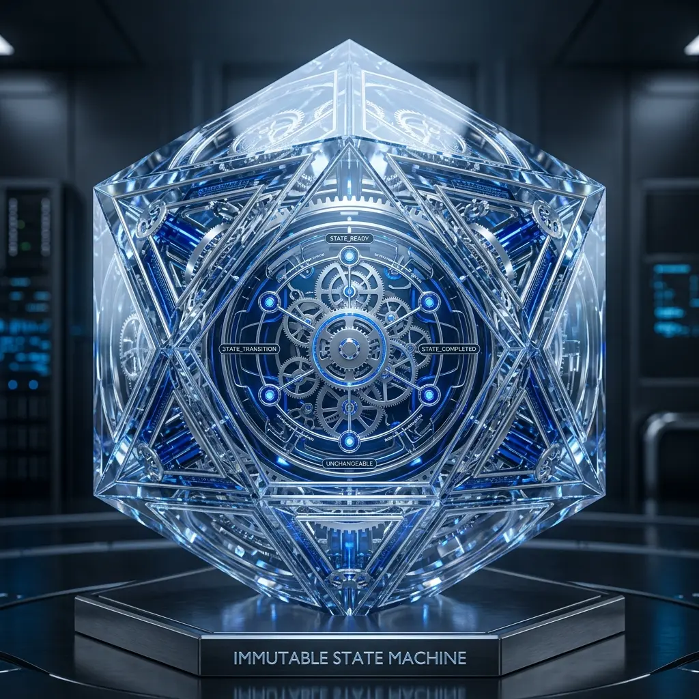

# Aura 不可逆状態マシン：単方向推進原則と Saga 補正モード

古典的なソフトウェア開発において、私たちは `try-catch-rollback` を使うことに慣れています。データベースへの書き込みが失敗すれば、トランザクションをロールバックします。しかし、エージェントが現実世界のタスク（Slack メッセージの送信やサーバー設定の変更など）を実行する場合、**「物理的なロールバック」は真っ赤な嘘です。**

Aura は**不可逆状態マシン（Immutable State Machine）**を導入しました。これは現実世界の実行に伴うサイドエフェクトに対する究極の畏敬の念です。

## 1. 単方向推進：世界は不可逆である

Aura の実行フローにおいて、「戻るボタン」は存在しません。
各 Matrix ノードの実行が完了するたびに、状態マシンは新しい**バージョン管理されたステート（Versioned State）**を生成します。たとえ実行が失敗しても、システムは失敗の痕跡を消し去ろうとはせず、「失敗」そのものを発生した事実（Fact）として記録し、それを基準として前進し続けます。

## 2. サイドエフェクトの具象化 (Reification of Side Effects)

これらの不可逆な振る舞いを管理するために、Matrix はスキルを実行する際に**サイドエフェクト憑証（Side Effect Vouchers）**を生成します。
- **リソースパス**：どのファイルが修正されたか？
- **外部ハンドル**：どの API インターフェースが呼び出されたか？
- **消費コスト**：何トークンが費やされたか？

## 3. Saga 補正モード：前進することで修復する

ロールバックができない以上、Aura はエラー処理のために分散システムで成熟した **Saga パターン**を採用しています。

### 3.1 補正 DAG の生成
Meta が回復不可能なエラーを識別したとき、状態をロールバックするのではなく、サイドエフェクト憑証に基づいてリアルタイムに**補正タスクグラフ（Compensation DAG）**を生成します。
- **操作**：以前にファイル A を誤って削除した場合、補正タスクは「取り消し」ではなく、「バックアップからファイル A を復元する」となります。
- **論理ブランチ**：補正が完了すると、システムは失敗前の元のパスに戻るのではなく、専用の「エラーリカバリパス」へとジャンプします。

## 4. アーキテクチャの意義：状態マシンの混乱を排除する

不可逆状態マシンは、エージェントシステムにおいて最も一般的な「状態マシンのジッター」問題を完全に排除します。ステートは常に確定的かつ単方向であるため、システムのデバッグと監査は極めて単純になります。エージェントがいかにして一歩ずつ躓き、そして補正ロジックを通じていかに立ち直り、最終的にタスクを完了したかを明確に確認することができます。

## 5. 結論

不可逆性を認めることは、より強力な制御力を得るためです。Aura は Saga 補正モードを通じて、予測不能なエージェントの実行プロセスを、厳格で追跡可能なエンジニアリングフローへと変換しました。

---
*Dark Lattice 構造研究所 出品*
