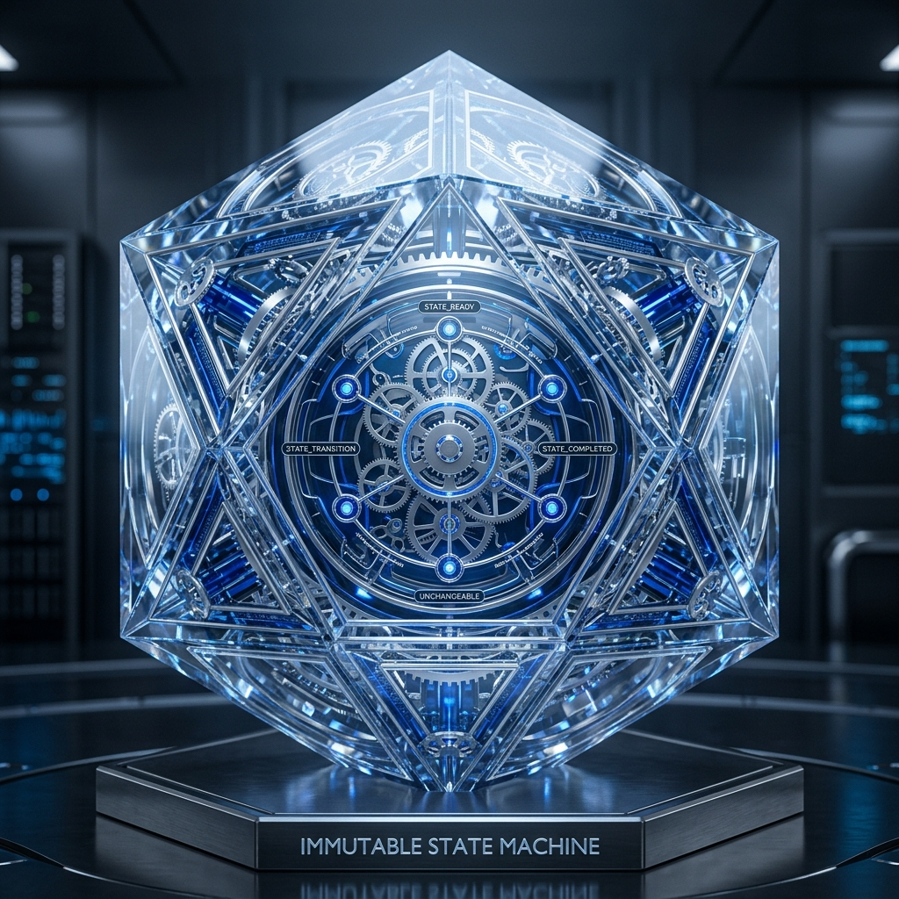
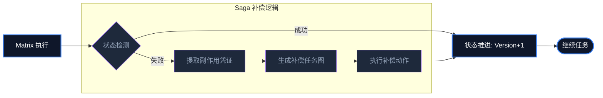

# Aura 不可逆状态机：单向推进原则与 Saga 补偿模式

在经典软件开发中，我们习惯于使用 `try-catch-rollback`。如果数据库写失败了，我们回滚事务。但在 Agent 执行现实世界任务（如发送 Slack 消息、修改服务器配置）时，**“物理回滚”是一个彻头彻尾的谎言。**

Aura 引入了**不可逆状态机（Immutable State Machine）**，这是对现实世界执行副作用的终极敬畏。

## 1. 单向推进：世界不可逆

在 Aura 的执行流中，不存在“后退键”。
每一个 Matrix 节点执行完毕后，状态机会生成一个新的**不可变版本（Versioned State）**。即使执行失败，系统也不会尝试抹除失败的痕迹，而是将“失败”本身作为一个已发生的事实（Fact）记录下来，并以此为基准继续向前。

## 2. 副作用具象化 (Reification of Side Effects)

为了管理这些不可逆的行为，Matrix 在执行技能时会生成**副作用凭证**：
- **资源路径**：修改了哪个文件？
- **外部句柄**：调用了哪个 API 接口？
- **消耗成本**：花了多少 Token？

## 3. Saga 补偿模式：以新补旧

既然不能回滚，Aura 采用分布式系统中成熟的 **Saga 模式** 来处理错误。

### 3.1 补偿 DAG 的生成
当 Meta 识别到一个不可恢复的错误时，它不会回滚状态，而是根据副作用凭证，实时生成一个**补偿任务图（Compensation DAG）**：
- **操作**：如果之前误删了文件 A，补偿任务不是“撤销”，而是“从备份恢复文件 A”。
- **逻辑分支**：补偿完成后，系统会跳转到一个专门的“错误修复路径”，而不是回到失败前的原始路径。

## 4. 架构意义：消除状态机混乱

不可逆状态机彻底消除了 Agent 系统中最常见的“状态机抖动”问题。由于状态永远是确定的、单向的，系统的调试和审计变得极其简单。我们可以清晰地看到 Agent 是如何一步步跌倒，又是如何通过补偿逻辑重新站起来并最终完成任务的。

## 学术与设计洞察 (Academic & Design Insights)

- **设计哲学**：不可逆状态机是对物理现实执行副作用的终极敬畏。我们不追求消除错误，而是追求将错误纳入系统演化的确定性路径。
- **技术突破**：通过副作用凭证（Voucher）与 Saga 补偿 DAG 的实时生成，解决了 Agent 在真实物理世界中操作无法完美回滚的工程难题。
- **受众启迪**：在设计长程任务 Agent 时，承认不可逆性并构建稳健的补偿机制，远比试图构建一个“永不犯错”的系统更具实战价值。

## 5. 总结

承认不可逆性，是为了获得更强大的掌控力。Aura 通过 Saga 补偿模式，将变幻莫测的 Agent 执行过程转化为了严谨的、可追踪的工程流转。

---
*本文由 Dark Lattice 架构实验室出品。*
