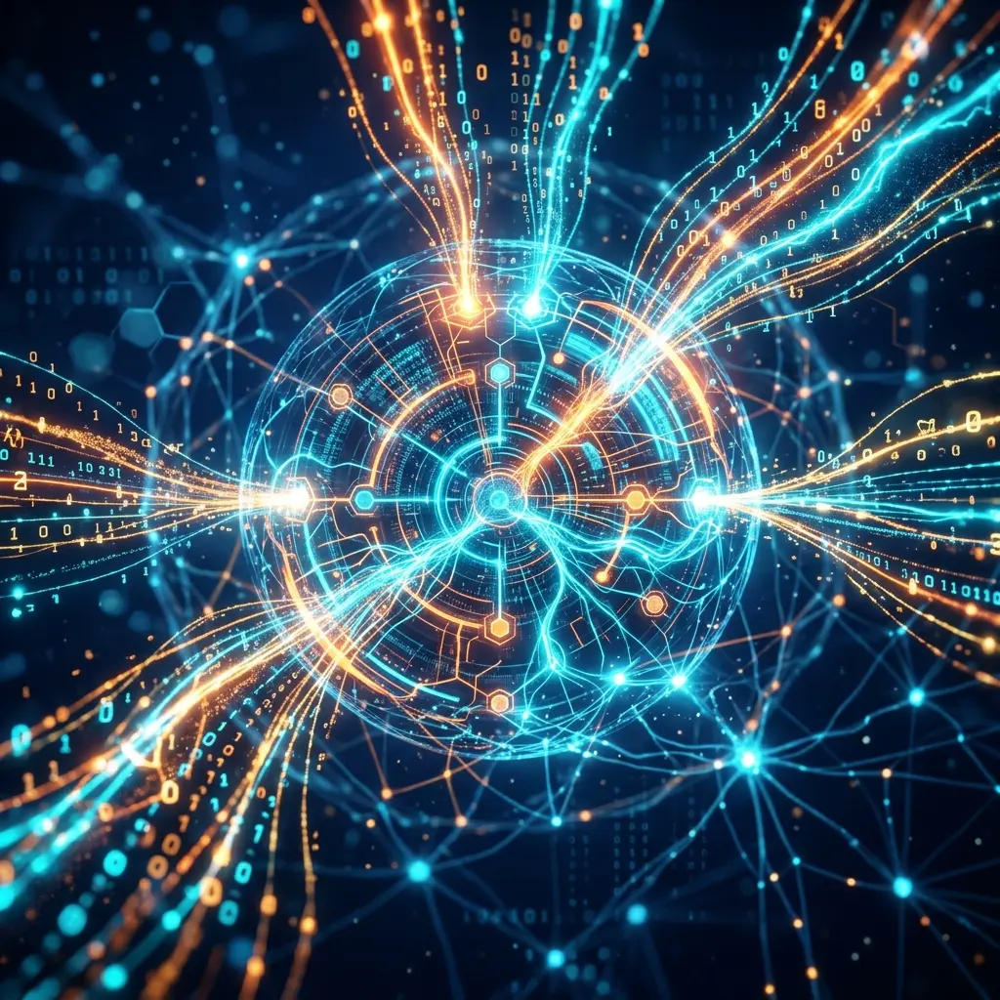

# Aura Knowledge Dynamic Injection (KDC): The Semantic Loading Revolution beyond RAG

Traditional RAG (Retrieval-Augmented Generation) is often global, occurring before a dialogue begins. However, in Aura's long-range execution flow, as task goals constantly evolve, global RAG leads to irrelevant information quickly filling up the context window.

Aura introduces **KDC (Knowledge Dynamic Injection)**, which is a **node-level, on-demand loading** revolution.

## 1. Real-time Extraction of Semantic Features

When Meta issues a 24-bit pointer, the KDC system performs two paths of pre-processing simultaneously:
1. **Coordinate Association**: Anchors specific persona knowledge and operation manuals from the knowledge base according to the `Role` and `Action` in the pointer.
2. **State Awareness**: Captures product keywords from the previous node from the Redis signal stream.

## 2. "Surgical" Clipping of the Context Window

KDC doesn't simply plug in entire documents.

### 2.1 Semantic Cosine Similarity Filtering
The system utilizes a vector database (SurrealDB) to calculate the cosine distance between candidate knowledge fragments and the current execution environment. Only fragments with scores higher than a threshold are allowed into the context.

### 2.2 Fragmented Knowledge Loading
Knowledge is deconstructed into extremely concise "Snippets." In this way, we can provide Matrix with all the background knowledge required for the current node execution while consuming only about 500 tokens, leaving the context space for more important reasoning logic.

## 3. MMR Algorithm: Balancing Diversity

To prevent the Agent from falling into infinite loops, KDC introduces **Maximum Marginal Relevance (MMR)** during retrieval.
It doesn't just look for the "most similar" knowledge; it also forces the introduction of a small portion of differentiated knowledge points. This design, in coordination with the **Curiosity Engine**, allows the Agent to find innovative solutions from marginal knowledge when facing unexpected errors.

## 4. Conclusion: Solving "Amnesia during Execution"

KDC makes every execution step of Aura feel like consulting the latest operation manual. It solves the most headache-inducing "intent drift during long-range tasks" problem in the AI Agent field, ensuring that even if the system runs to the 100th step, its knowledge background remains fresh and absolutely relevant.

---
*Produced by Dark Lattice Architecture Lab.*
