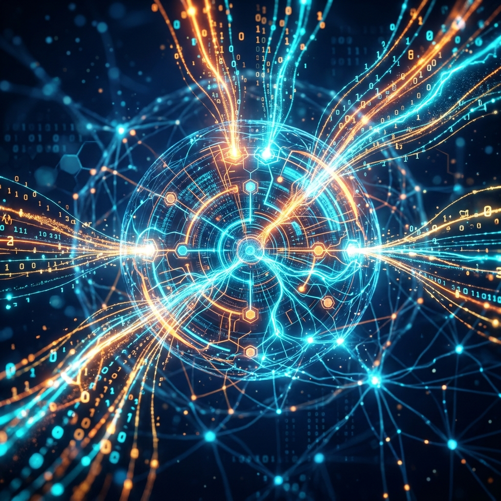

# Aura 動的知识注入（KDC）：RAG を超えるセマンティックローディング革命

従来の RAG（検索拡張生成）は、対話の開始前に全体を検索するグローバルなものであることが一般的です。しかし、Aura の長期的な実行フローにおいては、タスクの目標が絶えず進化するため、グローバルな RAG では無関係な情報がすぐにコンテキストウィンドウを埋め尽くしてしまいます。

Aura は **KDC (Knowledge Dynamic Injection)** を導入しました。これは、**ノードレベルでのオンデマンド・ローディング**という革命です。

## 1. セマンティック特徴のリアルタイム抽出

Meta が 24-bit ポインタを発行すると、KDC システムは 2 つのパスのプリプロセッシング（前処理）を同時に実行します。
1. **座標関連付け**：ポインタ内の `Role` と `Action` に基づいて、知識ベースから特定のペルソナ知識と操作マニュアルをアンカー（固定）します。
2. **ステート認識**：Redis シグナルストリームから、前のノードのプロダクトキーワードをキャプチャします。

## 2. コンテキストウィンドウの「外科手術的」クリッピング

KDC は単にドキュメント全体を挿入するわけではありません。

### 2.1 セマンティック余弦類似度によるフィルタリング
システムはベクトルデータベース（SurrealDB）を利用して、候補となる知識断片と現在の実行環境との間の余弦距離を計算します。閾値より高いスコアを持つ断片のみがコンテキストへの進入を許可されます。

### 2.2 断片化された知識のロード
知識は極めて簡潔な「スニペット（Snippets）」へと解体されます。これにより、わずか 500 トークン程度の消費で、Matrix が現在のノードを実行するために必要なすべての背景知識を提供でき、残りのコンテキスト空間をより重要な推論ロジックに充てることが可能になります。

## 3. MMR アルゴリズム：多様性のバランス

エージェントが無限ループに陥るのを防ぐため、KDC は検索時に **MMR（最大境界関連性）** を導入しました。
これは単に「最も似ている」知識を探すだけではなく、あえて少量の差別化された知識ポイントを導入することを強制します。この設計は**好奇心エンジン**と連動し、予期せぬエラーに直面した際に、エージェントが周辺的な知識から革新的な解決策を見つけ出すことを可能にします。

## 4. 結論：「実行中の健忘症」を解決する

KDC により、Aura のあらゆる実行ステップは最新の操作マニュアルを参照しているかのように感じられます。これは AI エージェント分野で最も頭の痛い「長期タスクにおける意図のドリフト（逸脱）」問題を解決し、たとえシステムが 100 ステップ目に達したとしても、その知識背景が常に新鮮で絶対に関連性の高いものであることを保証します。

---
*Dark Lattice 構造研究所 出品*
