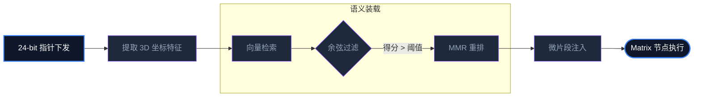

# Aura 动态知识注入（KDC）：RAG 之之上语义装载革命

传统的 RAG（检索增强生成）通常是全局性的，即在对话开始前搜索一遍。但在 Aura 的长程执行流中，由于任务目标在不断演进，全局 RAG 会导致无关信息迅速填满上下文窗口。

Aura 引入了 **KDC (Knowledge Dynamic Injection)**，这是一种**节点级、按需装载**的知识革命。

## 1. 语义特征的实时提取

当 Meta 下发一个 24-bit 指针时，KDC 系统会同步进行两路预处理：
1. **坐标关联**：根据指针中的 `Role` 和 `Action`，从知识库中锚定特定的人格知识和操作手册。
2. **状态感知**：从 Redis 信号流中抓取上一节点的产物关键词。

## 2. 上下文窗口的“外科手术式”裁剪

KDC 不会简单地塞入整篇文档。

### 2.1 语义余弦相似度过滤
系统利用向量数据库（SurrealDB）计算候选知识片段与当前执行环境的余弦距离。只有得分高于阈值的片段才会被允许进入上下文。

### 2.2 知识碎片化装载
知识被解构为极其精简的“微片段（Snippets）”。通过这种方式，我们可以在仅消耗 500 个 Token 的前提下，为 Matrix 提供当前节点执行所需的全部背景知识，从而将上下文空间留给更重要的推理逻辑。

## 3. MMR 算法：多样性的平衡

为了防止 Agent 陷入死循环，KDC 在检索时引入了 **Maximum Marginal Relevance (MMR)**。
它不仅仅寻找最相关的知识，还会强制引入一小部分具有差异化的知识点。这种设计配合**好奇心引擎**，让 Agent 在面对突发错误时，能够从边缘知识中找到创新的解决方案。

## 4. 总结：解决“执行中的失忆”

KDC 让 Aura 的每一个执行步骤都像是在查阅最新的操作手册。它解决了 AI Agent 领域最头疼的“长程任务中意图偏移”问题，确保了系统即便运行到第 100 步，其知识背景依然是新鲜且绝对相关的。

---
*本文由 Dark Lattice 架构实验室出品。*
