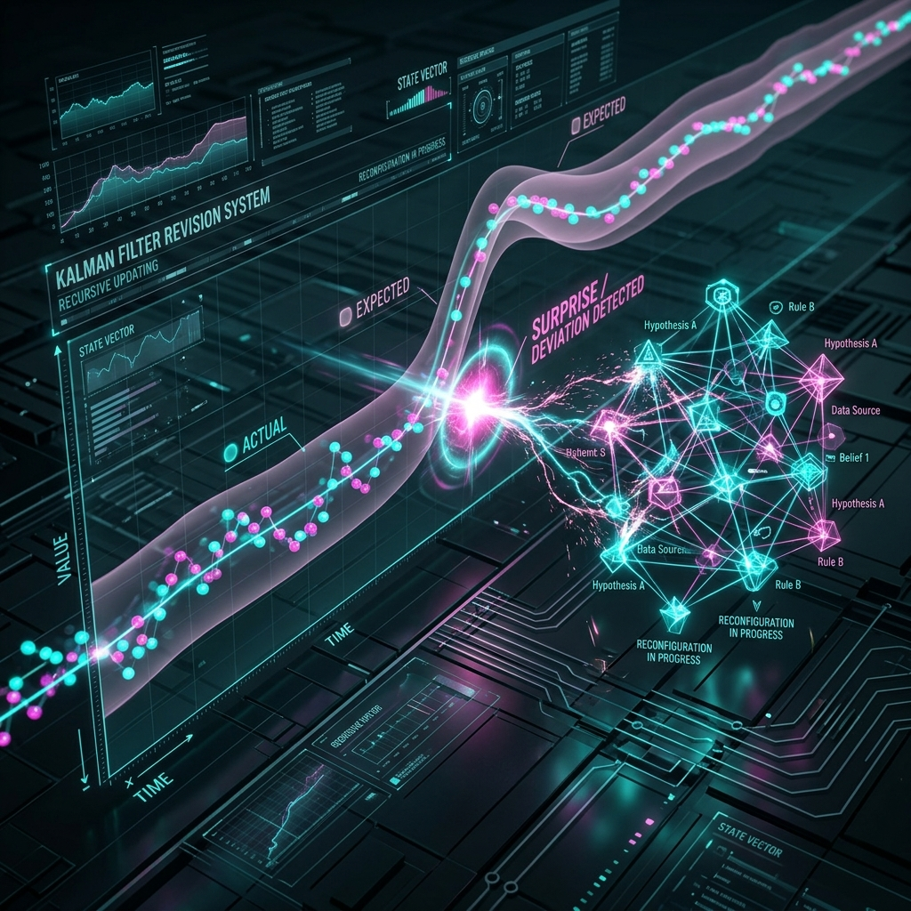

# Aura 知識修正アルゴリズム：カルマンフィルタによる Surprise 駆動型更新

AI エージェントの知識ベース（Knowledge Base）に動的な修正能力が欠けていれば、それはすぐに「ハルシネーション」に満ちた古びたデータの山へと成り下がってしまいます。Aura は、制御理論における古典的な**カルマンフィルタ（Kalman Filter）**の思想を導入し、リアルタイムな知識糾錯メカニズムを構築しました。

## 1. 知識状態の確率推定

Aura において、私たちは知識を絶対的な「正」か「誤」かとしては扱いません。代わりに、それを**ノイズを含む状態推定**として捉えます。
すべての `knowledge_node` は、以下の 2 つの隠れパラメータを保持しています。
- **$\hat{x}$（推定値）**：知識の内容および関連するウェイト。
- **$P$（共分散）**：その知識に対するシステムの「確信度」。

## 2. Surprise：革新のシグナル

Matrix ノードが実行を完了して結果をフィードバックすると、アルゴリズムは**イノベーション値（Innovation/Surprise）**を計算します。

$$\tilde{y}_t = z_t - H \hat{x}_{t|t-1}$$

ここで $z_t$ は実際に観測されたプロダクトの特徴であり、$H \hat{x}$ は既存の知識に基づく予測です。
- **低い Surprise**：実際の結果が予測と一致していることを意味し、システムは「堅牢な状態」にあります。
- **高い Surprise**：現実がシステムに「強烈なビンタ」を食らわせたことを意味します。Aura において、これは極めて貴重な学習の機会として扱われます。

## 3. カルマンゲイン：動的な修正ウェイト

Surprise が発生したとき、システムは**カルマンゲイン $K_t$** を通じて修正の強度を決定します。

$$K_t = \frac{P_{t|t-1} H^T}{H P_{t|t-1} H^T + R}$$

- **システムが非常に自信を持っている場合（$P$ が小さい）**：偏差が生じても、修正は保守的に行われます。
- **システムが探索期にある場合（$P$ が大きい）**：高い Surprise は、知識グラフの劇的な再構成をトリガーします。

## 4. 知識グラフの「外科手術」

計算された $K_t$ に基づき、Aura は SurrealDB に対して非同期的に「知識の手術」を行います。
1. **Grafting（接ぎ木）**：優れたパフォーマンスを示したノードの関連強度を永久に引き上げます。
2. **Excision（切除）**：重大な偏差（高い Surprise かつ結果が失敗）を招いた知識パスに対して「隔離帯」を設置します。

## 5. 結論

このメカニズムにより、Aura は「自省」能力を備えることになります。事前学習済みモデルが提示する初期確率を盲信することなく、現実世界とのあらゆる衝突の中で自らの認知マップを絶えず修正し、最終的に特定のシナリオやビジネスを真に理解するドメインエキスパートへと進化します。

---
*Dark Lattice 構造研究所 出品*
