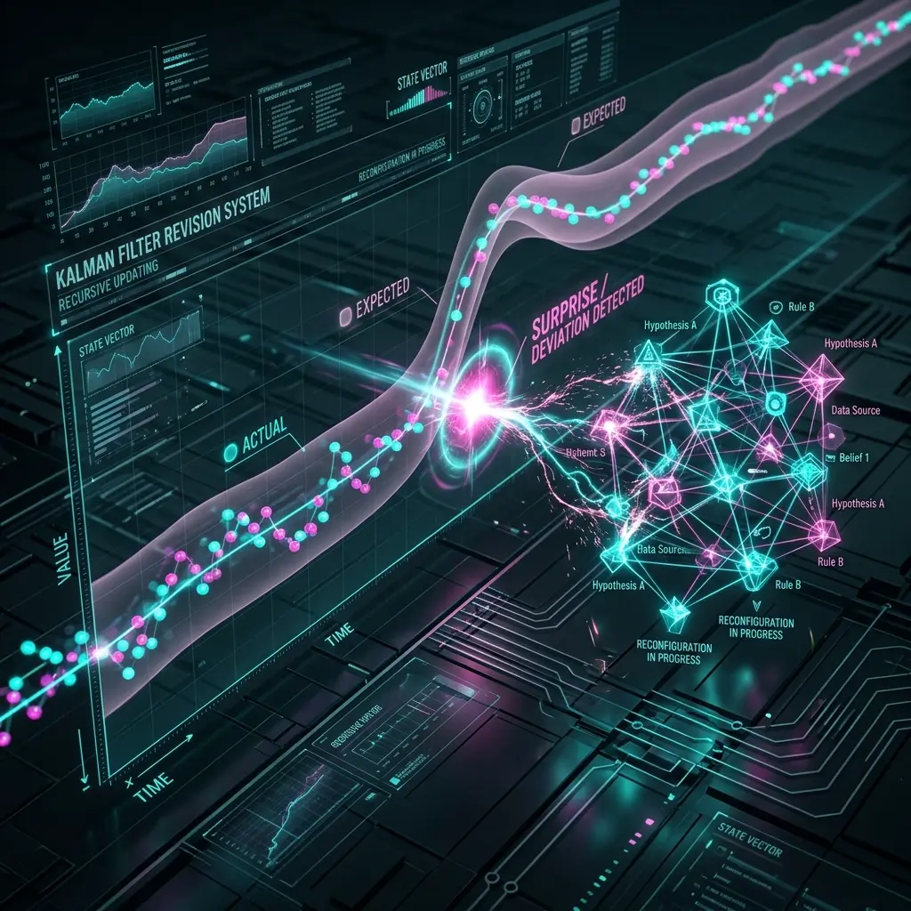
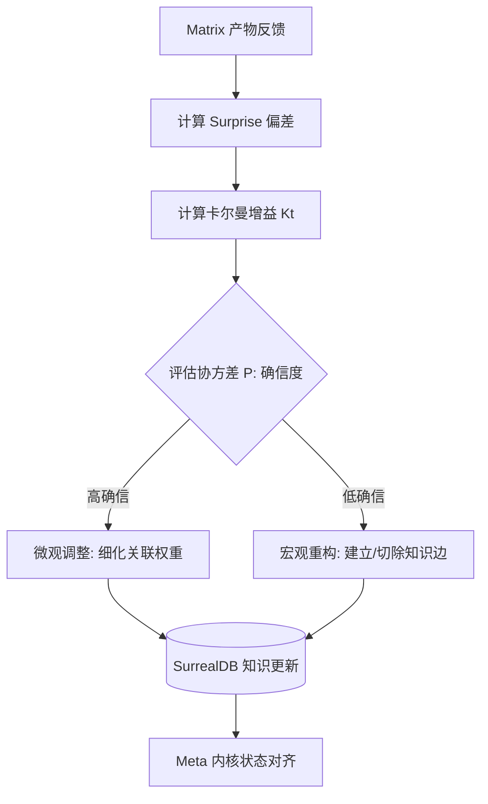

# Aura 知识修正算法：基于卡尔曼滤波的 Surprise 驱动更新

一个智能体的知识库（Knowledge Base）如果不具备动态修正能力，它很快就会沦为一堆充满“幻觉”的陈旧数据。Aura 引入了控制理论中经典的**卡尔曼滤波（Kalman Filter）**思想，建立了一套实时的知识纠错机制。

## 1. 知识状态的概率估计

在 Aura 中，我们不认为知识是绝对的“对”或“错”，而是将其视为一种**带噪声的状态估计**。
每一个 `knowledge_node` 都携带两个隐藏参数：
- **$\hat{x}$ (估计值)**：知识的内容及关联权重。
- **$P$ (协方差)**：系统对该知识的“确信度”。

## 2. Surprise：创新的信号

当 Matrix 节点完成执行并反馈结果时，算法会计算**创新值（Innovation/Surprise）**：

$$\tilde{y}_t = z_t - H \hat{x}_{t|t-1}$$

这里 $z_t$ 是实际观测到的产物特征，而 $H \hat{x}$ 是基于现有知识的预测。
- **低 Surprise**：意味着实际结果符合预期，系统处于“稳健状态”。
- **高 Surprise**：意味着现实给了系统“一记响亮的耳光”。在 Aura 中，这被视为极其宝贵的学习机会。

## 3. 卡尔曼增益：动态修正权重

当 Surprise 发生时，系统通过**卡尔曼增益 $K_t$** 来决定修正的力度：

$$K_t = \frac{P_{t|t-1} H^T}{H P_{t|t-1} H^T + R}$$

- **如果系统非常自信（$P$ 较小）**：即便出现偏差，修正也会很保守。
- **如果系统处于探索期（$P$ 较大）**：高 Surprise 会触发剧烈的知识图谱重构。

## 4. 知识图谱的“外科手术”

基于 $K_t$ 的计算结果，Aura 会在后台对 SurrealDB 进行异步的“知识手术”：
1. **嫁接（Grafting）**：将表现优异的节点关联强度永久提升。
2. **切除（Excision）**：对导致重大偏差（高 Surprise 且结果为失败）的知识路径建立“隔离带”。

## 学术与设计洞察 (Academic & Design Insights)

- **设计哲学**：卡尔曼滤波在 Aura 中的应用，标志着从“静态知识库”向“动态信念系统”的范式转移。Surprise 不再是错误，而是系统升级的信号。
- **技术突破**：通过协方差 P 动态调节卡尔曼增益，实现了知识图谱在稳健期与探索期之间的自适应平衡。
- **受众启迪**：一个伟大的 AI 系统应当具备“自省”能力，学学会与现实的碰撞中不断修正自己的认知地图，而非死守预训练的先验概率。

## 5. 总结

这种机制让 Aura 具备了“自省”能力。它不再盲目相信预训练模型给出的初始概率，而是在每一次与现实世界的碰撞中，不断修正自己的认知地图，最终进化为真正懂业务、懂场景的垂域专家。

---
*本文由 Dark Lattice 架构实验室出品。*
