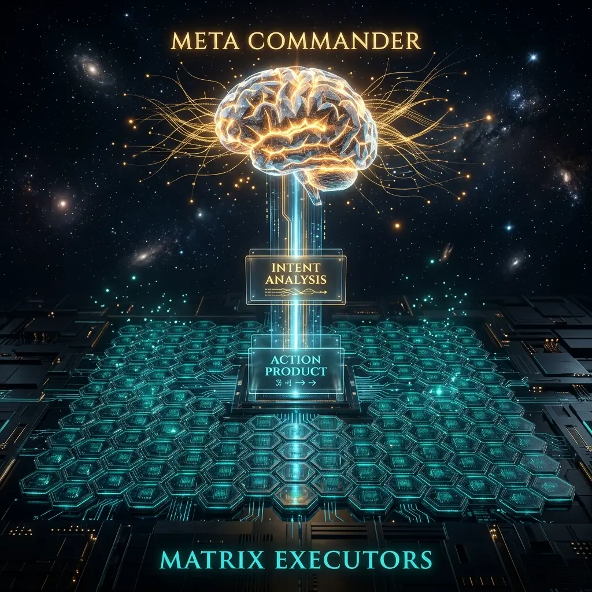

# Aura Dual-Core Architecture: Deep Decoupling of Meta Commander and Matrix Executor

In traditional AI Agent paradigms, we often expect a single Large Language Model (LLM) to act as both the "planner" and the "executor." However, when handling complex engineering tasks, this coupling leads to severe **cognitive overload**: while the model thinks about how to call an API, it often loses track of the original task objective.

**Aura** rewrites these rules with its **Meta/Matrix Dual-Core Architecture**, introducing **Master-Slave Control Logic** from cybernetics to achieve physical-level decoupling of agent thinking and behavior.

## 1. Meta Kernel: Global Orchestration Based on Intent Entropy

The Meta kernel is the system's "higher prefrontal cortex." It holds no specific skills but operates through a set of protected **Soul Rules**.

### 1.1 Intent Deconstruction (S0)
When a user inputs a requirement, Meta's first step is not execution, but **Intent Entropy Analysis**. It deconstructs vague natural language into a topology graph with deterministic boundaries. If the identified intent entropy is too high (semantic ambiguity), Meta triggers user interaction rather than making blind guesses.

### 1.2 Dynamic Planning (S1: Planning)
Meta utilizes **Ant Colony Optimization (ACO)** to search for optimal paths within a pre-defined 3D addressing space. Instead of code, it generates a sequence of **24-bit node pointers**, acting as a precise "battle map" for the underlying Matrix.

## 2. Matrix Kernel: Passive Reaction and Atomic Execution

The Matrix kernel is designed as an absolute "controlled entity," similar to a biological "spinal reflex center," responsible for efficient, unbiased instruction execution.

### 2.1 Zero Autonomous Routing
In Aura, Matrix is stripped of the right to decide "what to do next." It only receives address pointers from Meta and loads corresponding WASM plugins. This **"thought stripping"** design drastically reduces hallucination probability as Matrix no longer predicts the future, focusing solely on the current atomic task.

### 2.2 Product Isolation and Asynchronous Reporting
All Matrix execution products are pushed into an isolated **Redis Stream**. Meta obtains feedback by subscribing to this stream. This asynchronous mechanism allows Matrix to scale horizontally into thousands of independent instances for high-concurrency parallel processing.

## 3. Philosophy of Connection: State Alignment via ACP Protocol

The two kernels synchronize states via the **ACP (Aura Communication Protocol)**:
- **Forward Stimulation**: Meta issues instruction streams.
- **Negative Feedback**: Matrix reports failure deviations, and Meta initiates **Saga Compensation Logic** based on those deviations.

This closed-loop feedback system mimics precision machinery control, ensuring the eventual consistency of complex long-range task execution through continuous "deviation correction."

## 4. Conclusion: Freedom through Determinism

By separating Meta and Matrix, we solved an engineering dilemma: **how to achieve industrial-grade execution stability without losing model flexibility.** Meta looks at the stars (planning and evolution), while Matrix stays grounded (precise execution), together forming Aura's powerful digital organism.

---
*Produced by Dark Lattice Architecture Lab.*
