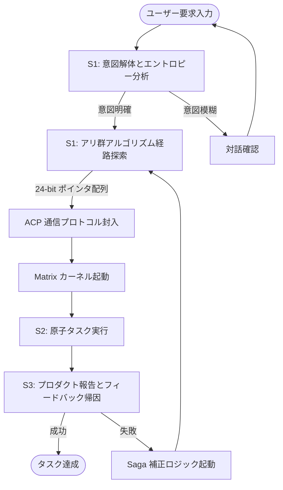

# Aura 双内核アーキテクチャ：Meta 指揮官と Matrix 実行者の深度デカップリング

従来の AI エージェントのパラダイムでは、一つの大規模言語モデル（LLM）に「プランナー」と「実行者」の両方の役割を担わせることが一般的でした。しかし、複雑なエンジニアリングタスクを処理する場合、この結合は深刻な**認知過負荷**を引き起こします。モデルが API の呼び出し方を考えている間に、本来のタスク目標を見失ってしまうのです。

**Aura** は、**Meta/Matrix 双内核アーキテクチャ**によってこのルールを書き換え、サイバネティクスにおける**主従制御ロジック**を導入し、エージェントの思考と行動を物理レベルでデカップリングしました。

## 1. Meta カーネル：意図エントロピーに基づくグローバルオーケストレーション

Meta カーネルは、システムの「高次前頭前皮質」です。具体的なスキルは持ちませんが、保護された一連の**ソウルルール（Soul Rules）**を通じて動作します。

### 1.1 意図解体 (S0: Intent Deconstruction)
ユーザーが要求を入力すると、Meta の最初のステップは実行ではなく、**意図エントロピー分析**です。曖昧な自然言語の要求を、確定した境界を持つトポロジグラフに分解します。識別された意図エントロピーが高すぎる（意味的な曖昧さがある）場合、Meta は盲目的な推測を行うのではなく、ユーザーとの対話を強制的にトリガーします。

### 1.2 動的計画 (S1: Planning)
Meta は、事前定義された 3D アドレッシング空間内で最適なパスを探索するために、**アリ群最適化（ACO）**を利用します。生成されるのはコードではなく、一連の **24-bit ノードポインタ配列**です。これは、下層の Matrix にとって、分秒単位で正確な「作戦地図」となります。

## 2. Matrix カーネル：受動的反応と原子実行

Matrix カーネルは、生物学における「脊髄反射センター」に似た、完全に「制御された実体」として設計されており、効率的かつ偏りのない指示実行を担います。

### 2.1 ゼロ自律ルーティング原則
Aura アーキテクチャにおいて、Matrix は「次になすべきことを決定する」権利を剥奪されています。Meta からアドレスポインタを受け取り、対応する WASM プラグインをロードするだけです。この**「思考の剥奪」**設計は、Matrix が未来を予測する必要をなくし、現在の原子タスクのみに集中させることで、ハルシネーションの発生確率を劇的に低下させます。

### 2.2 プロダクト隔離と非同期報告
Matrix のすべての実行結果（Product）は、隔離された非同期ストリーム（Redis Stream）にプッシュされます。Meta はこのストリームを購読することでフィードバックを得ます。この非同期メカニズムにより、Matrix は数千の独立したインスタンスへと水平スケーリングでき、高並列なタスク処理を実現します。

## 3. 接続の哲学：ACP プロトコルによるステートアライメント

2 つのカーネルは、**ACP (Aura Communication Protocol)** を介してステートを同期します。
- **正方向刺激**：Meta が指示ストリームを発行。
- **負方向フィードバック**：Matrix が失敗の偏差を報告し、Meta はその偏差に基づいて **Saga 補償ロジック**を起動します。

このクローズドループフィードバックシステムは、精密工作機械のクローズドループ制御に似ています。絶え間ない「偏差修正」を通じて、Aura は複雑な長期タスク実行の結果整合性を保証します。

## 4. 結論：決定論がもたらす自由

Meta と Matrix を深度デカップリングすることで、私たちはエンジニアリング上のジレンマを解決しました。**「モデルの柔軟性を失うことなく、いかに工業グレードの実行安定性を実現するか」**です。Meta が星を見上げ（計画と進化）、Matrix が地に足をつけ（精密な実行）、両者が共に Aura という強力なデジタル生命体を構成しています。

---
*Dark Lattice 構造研究所 出品*
