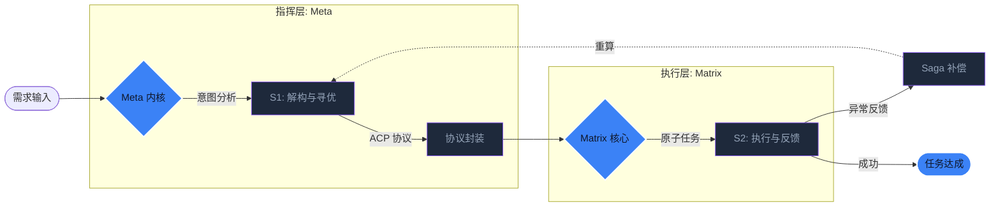

# Aura 双内核架构：Meta 指挥官与 Matrix 执行者的深度解耦

在 AI Agent 的传统范式中，我们习惯于让一个大语言模型（LLM）同时扮演“规划者”和“执行者”。然而，在处理复杂工程任务时，这种耦合会导致严重的“认知过载”：模型在思考如何调用 API 的同时，往往会忘记最初的任务目标。

**Aura** 通过 **Meta/Matrix 双内核架构** 引入了控制论中的**主从控制逻辑**，实现了智能体思考与行为的物理级解耦。

## 1. Meta 内核：基于意图熵的全局编排

Meta 内核是系统的“高阶前额皮层”。它不持有任何具体的技能（Skills），而是通过一组受保护的**灵魂规则（Soul Rules）**来运作。

### 1.1 意图解构 (S0: Intent Deconstruction)
当用户输入需求时，Meta 的第一步不是去执行，而是进行**意图熵增分析**。它将模糊的自然语言需求分解为具有确定性边界的拓扑图。如果识别到的意图熵过高（语义不明确），Meta 会强制触发用户交互，而不是让系统盲目猜测。

### 1.2 动态规划 (S1: Planning)
Meta 利用**蚁群算法（ACO）**在预定义的 3D 寻址空间中搜索最优路径。它生成的不是一段代码，而是一组 **24-bit 节点指针序列**。这相当于为底层的 Matrix 提供了一张精确到分秒的“作战地图”。

## 2. Matrix 内核：被动反应与原子执行

Matrix 内核被设计为绝对的“受控者”。它类似于生物学中的“脊髓反射中心”，负责高效、无偏见地执行指令。

### 2.1 零自主路由原则
在 Aura 架构中，Matrix 被剥夺了“决定下一步做什么”的权利。它仅仅接收来自 Meta 的地址指针，加载对应的 WASM 插件。这种**“思维剥离”**的设计极大地降低了 Matrix 产生幻觉的概率，因为它不再需要预测未来，只需关注当前的原子任务。

### 2.2 产物隔离与异步上报
Matrix 的所有执行产物（Product）都被推送到一个隔离的异步流（Redis Stream）中。Meta 通过订阅这个流来获取反馈。这种异步机制使得 Matrix 可以横向扩展为成千上万个独立实例，实现高并发的并行任务处理。

## 3. 连接哲学：基于 ACP 协议的状态对齐

双内核之间通过 **ACP (Aura Communication Protocol)** 进行状态同步。
- **正向激励**：Meta 下发指令流。
- **负向反馈**：Matrix 上报失败偏差，Meta 根据偏差启动 **Saga 补偿逻辑**。

这种闭环反馈系统类似于精密机床的闭环控制。通过不断的“偏差纠正”，Aura 确保了复杂长程任务执行的最终一致性。

## 4. 总结：确定性带来的自由

通过 Meta 与 Matrix 的深度解耦，我们解决了一个工程难题：**如何在不损失模型灵活性的前提下，获得工业级的执行稳定性。** Meta 负责仰望星空（规划与进化），Matrix 负责脚踏实地（精确执行），两者共同构成了 Aura 强大的数字化生命体。

---
*本文由 Dark Lattice 架构实验室出品。*
