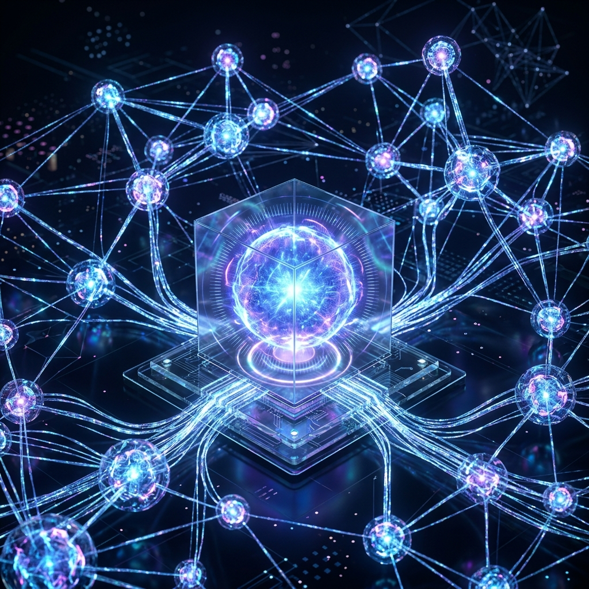

# Aura OS-Level Architecture Upgrade: From Monolithic Kernel to Distributed Reactors

As the complexity of tasks handled by the Aura agent grows exponentially, traditional monolithic process architectures have struggled to balance the vastly different resource requirements of "real-time interaction," "long-range reasoning," and "tool execution." To address this pain point, Aura has recently completed a deep **OS-level architecture upgrade**, formally establishing the **Reactor Supervisor** as its core distributed runtime paradigm.

## 1. Core Philosophy: Reactor as Process

In the upgraded architecture, Aura is no longer a single binary entity. Each core capability module has been decoupled into an independent OS process—which we call a "Reactor."

- **Pulse**: Responsible for high-priority user interaction and gateway distribution, ensuring smooth system feedback under any load.
- **Crucible**: Focused on deep reasoning and logical calculus, with independent GPU and memory quotas.
- **Turbine**: Handles physical action execution (WebHook/PythonHook), running in a restricted sandbox environment.
- **Crystal**: Manages long-range evolution and knowledge consolidation, utilizing Fisher Information Matrices for weight compression.

Through **Process-Level Decoupling**, Aura achieves true fault isolation: even if a reasoning task causes the `Crucible` reactor to crash due to OOM (Out of Memory), the `Pulse` reactor responsible for interaction can still inform the user that "the system is self-healing," rather than the entire program deadlocking.

## 2. ACP Communication: An IPC-Based Signal Bus

The challenge of process decoupling is communication cost. Aura has abandoned all unstable internal channels in favor of a high-performance IPC mechanism based on the **ACP (Aura Control Protocol)**.

### 2.1 Protocol Stack Selection
We have adopted **Unix Domain Sockets (UDS)** combined with the **Postcard** serialization format as the core link. In extreme cases, it can be seamlessly extended to distributed message buses like Zenoh. This design keeps inter-process communication latency in the microsecond range, ensuring nearly zero performance loss in the distributed architecture.

### 2.2 Signal Relay and Self-Healing
The **Aura Kernel** now plays the dual role of "Supervisor" and "Switch." It is not only responsible for the centralized relay and distribution of ACP messages but also perceives the status of each reactor in real-time through PID monitoring and heartbeat mechanisms. Once a reactor anomaly is detected, the Kernel immediately executes a subprocess restart and utilizes `CausalSnapshot` to restore contextual continuity.

## 3. Resource Governance: Thermodynamic Scheduling Model

To achieve precise resource scheduling in a multi-process environment, we have introduced the **Thermodynamic Scheduler**.

This scheduler no longer allocates resources based solely on CPU usage but introduces two core physical metrics:
1. **Entropy**: Measures the degree of disorder in the system. When a reactor's entropy is too high, the scheduler triggers a "Protection Refusal."
2. **Variational Free Energy (VFE)**: Measures the deviation between prediction and reality. High VFE triggers dynamic rate limiting, guiding the system into a "Cooling Period" to align cognition.

This scheduling model based on physical laws makes Aura behave more like a living organism than rigid software when facing burst traffic.

## 4. Security Protection: ACP Authorization Flow

In a distributed environment, security boundaries become clearer. Aura has implemented the **ACP Authorization Flow**:
- Sensitive actions (such as file deletion or external API calls) are intercepted by the Kernel.
- Intercepted instructions enter a staging area and request manual authorization via the Dashboard.
- This "kernel-level interception" mechanism provides a final line of defense for AI behavioral security.

## 5. Summary

This OS-level architecture upgrade marks Aura's transformation from a "complex intelligence engine" into a "robust AI operating system." Through process-level decoupling, high-performance IPC, and innovative thermodynamic scheduling, Aura has not only achieved extreme system stability but has also laid a solid technical foundation for future distributed synergy and long-range evolution.

---
*This article is produced by the Dark Lattice Architecture Lab.*
