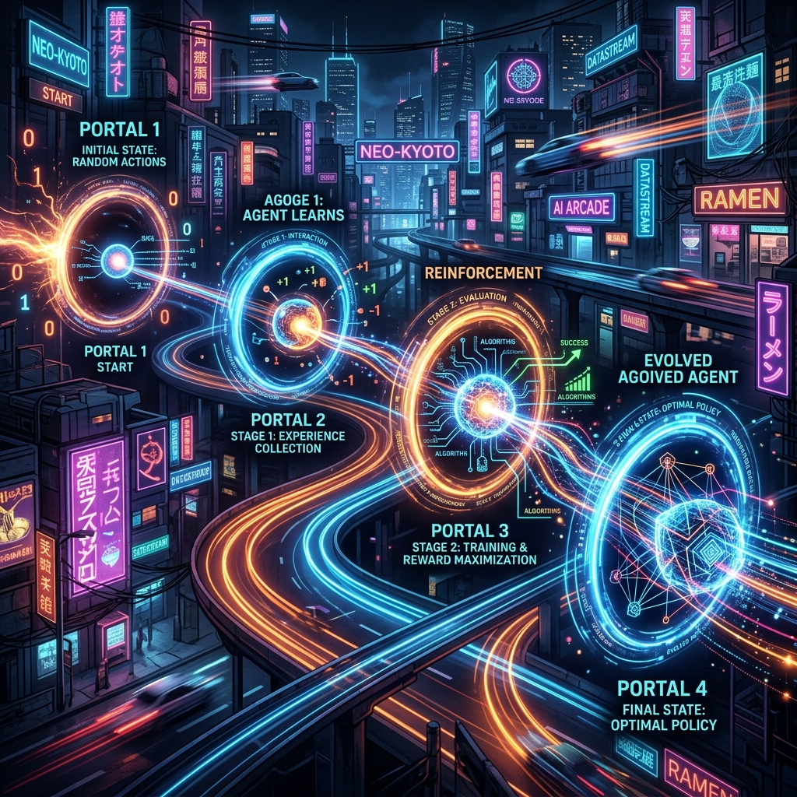

# Aura Reinforcement Learning Evolution: Weight Convergence and Self-Evolution in the S3 Stage

If the Meta kernel is the brain and Matrix is the muscle, then the **S3 (Feedback) Attribution Engine** is the system's evolutionary gene. It solves the core engineering challenge in the AI Agent field: **how to extract deterministic laws for success from thousands of imperfect executions?**

## 1. The Credit Assignment Problem

When a long-range task containing 50 steps finally succeeds (or fails), how do we evaluate the operation at step 12?
Aura employs a credit assignment mechanism based on **TD (Temporal Difference) Error**.

### 1.1 Recursive Propagation of Reward Signals
The system doesn't just look at the final step; it propagates the final Reward value backward along the execution path. Each 24-bit node pointer on the path receives a weight increment based on its "contribution distance" to the final result.

## 2. Weight Convergence in the 3D Matrix

During the S3 stage, the system performs microscopic adjustments to the ant colony pheromones within the Meta kernel.

### 2.1 "Solidification" of Success Paths
For high-reward paths, the system uses the **EWC (Elastic Weight Consolidation)** algorithm to lock their coordinates in the 3D matrix. This means that in similar future scenarios, the probability of Meta generating that path will increase exponentially.

### 2.2 "Synaptic Inhibition" of Failure Paths
For failures that lead to serious consequences, the system not only reduces pheromones but also tags that 24-bit pointer in the `knowledge` base. This mimics the biological **"Long-term Depression"** mechanism, preventing the Agent from falling into the same pit twice.

## 3. Evolutionary Loop: From Online Learning to Offline Fine-tuning

Evolution doesn't stop at parameter adjustment.

- **Dynamic SFT Data Generation**: The system automatically filters and cleans high-scoring execution trajectories, converting them into standard **ShareGPT format**.
- **Self-Hematopoiesis**: This data is periodically fed to local lightweight models (L1-L3). Over time, tasks originally requiring Level-8 flagship models can be completed with extremely high determinism by local small models.

## 4. Conclusion: Compound Interest Driven Digital Life

Aura's strength lies not in the size of its initial model, but in its **entropy-reducing evolution engine**. Every task execution, whether success or failure, is converted into the system's cognitive "compound interest." This wisdom accumulation based on actual combat is irreplaceable by any pre-training process.

---
*Produced by Dark Lattice Architecture Lab.*
