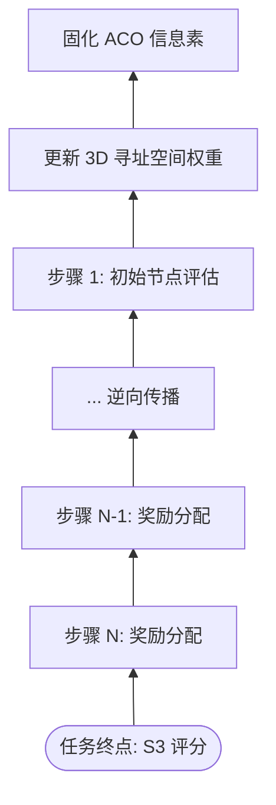

# Aura 强化学习演进：S3 阶段的权重收束与自进化

如果说 Meta 内核是大脑，Matrix 是肌肉，那么 **S3 (Feedback) 归因引擎**就是系统的进化基因。它解决了 AI Agent 领域的核心工程难题：**如何从数千次不完美的执行中，提取出成功的确定性规律？**

## 1. 信用分配问题 (The Credit Assignment Problem)

当一个包含 50 个步骤的长程任务最终成功（或失败）时，我们该如何评价第 12 步的操作？
Aura 采用了基于 **TD (Temporal Difference) 时序差分误差**的信用分配机制。

### 1.1 奖励信号的递归传播

系统不会只看最后一步，而是将最终的奖励值（Reward）沿着执行路径逆向传播。路径上的每一个 24-bit 节点指针都会根据其对最终结果的“贡献距离”，获得相应的权重增量。

## 2. 3D 矩阵中的权重收束

在 S3 阶段，系统会对 Meta 内核中的蚁群信息素进行微观调整。

### 2.1 成功路径的“固化”
对于高奖励路径，系统使用 **EWC (弹性权重整合)** 算法将其在 3D 矩阵中的坐标进行锁定。这意味着在未来的类似场景下，Meta 生成该路径的概率会呈指数级上升。

### 2.2 失败路径的“突触抑制”
对于导致严重后果的失败，系统不仅会降低信息素，还会在 `knowledge` 库中对该 24-bit 指针进行打标。这模仿了生物学中的**“长期抑郁（Long-term Depression）”**机制，防止 Agent 在同一个坑里掉进去两次。

## 3. 进化闭环：从在线学习到离线微调

进化不止于参数调整。
- **动态 SFT 数据生成**：系统自动筛选高分执行轨迹，并将其清洗、转化为标准的 **ShareGPT 格式**。
- **自我造血**：这些数据会定期喂给本地的轻量级模型（L1-L3）。随着时间的推移，原本需要 Level-8 旗舰模型才能完成的任务，本地小模型也能以极高的确定性完成。

## 4. 总结：复利驱动的数字生命

Aura 的强大不在于初始模型的大小，而在于其**熵减式的进化引擎**。每一次任务执行，无论成败，都会转化为系统的认知“复利”。这种基于实战的智慧累积，是任何预训练过程都无法替代的。

---
*本文由 Dark Lattice 架构实验室出品。*
