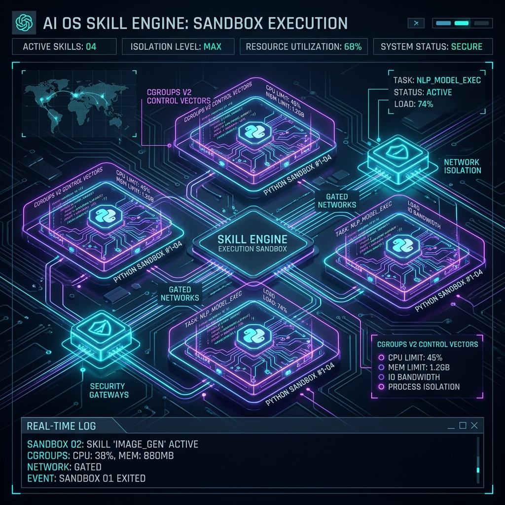

# 物理的介入境界の再構築：Aura スキル化実行エンジン（Skill Engine）の「四位一体」アーキテクチャとセキュリティ論証



現代のAIネイティブなオペレーティングシステムにおいて、大規模言語モデル（LLM）がいかに安全かつ柔軟に、そして極めて低遅延で物理世界に介入できるかは、その実用的な価値を測る決定的な分水嶺となります。

Aura OSの初期の設計では、「黄金・灰度デュアルトラック隔離制（Hybrid Architecture）」を採用していました。これは、メモリ常駐型のOpenAPI Tool-Calling（黄金防衛線）と、制限付きのPythonサンドボックス（灰度隔離エリア）に物理アクションを切り分け、さらにネットワーク要求を独立した `aura-webhook` マイクロサービスとして分離する構成でした。

このアーキテクチャは、特定の開発フェーズにおいて物理的な隔離を実現する役割を果たしたものの、システム全体の自律進化や極限のパフォーマンス・スケジューリングへの要求が高まるにつれ、その限界が浮き彫りになりました。柔軟性、安全性、および低遅延の「不可能な三位一体」を打破するため、Auraは最新の v10.0.0 アーキテクチャアップグレードにおいて、**「四位一体の自律的スキル実行エンジン（Skills-Centric Execution Subsystem）」**を全面実装しました。

本稿では、この重要なアーキテクチャ再構築の設計思想とセキュリティ防御メカニズムについて詳細に解説します。

---

## 1. デュアルトラック隔離制が抱えていた「三つの大罪」

v10.0.0 への進化前、従来の実行プレーンには三つの致命的なペインポイントが存在していました。

### 1.1 コントラクトライブラリのコンパイル肥大化と着脱の難しさ
旧アーキテクチャでは、現実の利用シナリオで物理アクションを追加または変更するたびに（例えば、特定のスマート家電を制御するインターフェースを追加する際）、コアライブラリである `aura-core` の `ExecutionDsl` 列挙型コントラクトを手動で修正する必要がありました。これにより、OSのシステム基盤全体を再コンパイルせねばならず、システムの実行時安定性を損なうだけでなく、サードパーティ開発者が動的に新しいアクションをプラグインする拡張性を阻害していました。

### 1.2 AIの自律進化における「物理的ループ」の分断
LLMの最も強力な能力の一つは、コード生成（Code Generation）にあります。しかし、従来のPythonスクリプトはサンドボックス内で実行された後に物理的に破棄されてしまい、システムで再利用可能な「スキルデータベース」として蓄積されませんでした。LLM自身が、永続的に保存・動的ロード・反復呼び出しが可能な新しいツールを開発する手段が物理的に閉ざされており、AIエージェントフレームワークとしての自律進化ループが分断されていました。

### 1.3 WebHookプロセス起因のIPCオーバーヘッド
ネットワーク側の攻撃を防ぐため、旧アーキテクチャではネットワークリクエストを別プロセスの `aura-webhook` に隔離していました。これにより、ローカル処理とネットワーク処理が構造的に断絶し、Unixドメインソケット（UDS）のシリアライズ・デシリアライズや双方向のハンドシェイクによって、無視できない遅延（10ms〜50ms）が発生していました。

これらの課題を解決するため、Auraはデュアルトラック隔離制を完全に廃止し、実行プレーンを**「スキル（Skills）」**を中心とした自律的なエンジンへと再構成しました。

---

## 2. スキル化エンジンのシステム定義

新しい設計では、すべての物理アクション（ネットワークアクセス、データクレンジング、異種システムの制御など）を「スキル（Skills）」として統一的に抽象化します。実行サブシステム（`aura-execution`）は、Python Server、Editor、CI/CD、Sandboxを統合した一体型マイクロサービスへと生まれ変わりました。

### 2.1 スキル実体の物理仕様（Skill Specification）

各スキルは、ルートディレクトリ下の `skills/` に、その `id`（UUID v4）を名前とする独立したフォルダとして存在します。このフォルダには、以下の二つのファイルのみが格納されます。

1. **仕様定義ファイル（`README.md`）**：
   先頭の YAML Frontmatter 形式により、スキルのグローバル固有ID、名称、機能説明、および厳密な `input`（入力パラメータ）と `output`（出力結果）のデータスキーマを定義します。
2. **実行スクリプト（`skill.py`）**：
   具体的な実行ロジックを含み、可読性規格に準拠した **100行以内** の Python 3 で記述されます。標準的なエントリ関数として `def execute(args: dict) -> dict:` を定義し、その入力引数と戻り値は `README.md` で宣言されたメタデータスキーマと完全に一致する必要があります。

```text
skills/
└── 550e8400-e29b-41d4-a716-446655440000/
    ├── README.md   # スキル仕様書（スキーマコントラクト宣言）
    └── skill.py    # 約 100 行の Python 実行スクリプト
```

### 2.2 ACPプロトコルコントラクトのスキル化再構築

スキル化実行プレーンの確立に伴い、低レベルの `ExecutionDsl` および `ExecutionOutcome` プロトコルコントラクトも動的な仕様へと再設計されました。

```rust
// 統一されたスキル実行命令コントラクト
pub enum ExecutionDsl {
    Skill {
        /// スキル固有識別子 (UUID)
        skill_id: String,
        /// スキル名称
        title: String,
        /// スキル入力パラメータ (README.mdのinputスキーマに準拠)
        input: serde_json::Value,
        /// サンドボックス実行タイムアウトのハード制限 (ミリ秒)
        timeout_ms: u64,
    },
}

// 統一されたスキル実行結果コントラクト
pub struct ExecutionOutcome {
    /// 物理実行が成功したか否か
    pub success: bool,
    /// スキル出力結果 (README.mdのoutputスキーマに準拠)
    pub output: serde_json::Value,
    /// キャプチャされた標準出力 (stdout) ログ
    pub stdout: String,
    /// エラー原因の説明 (successがfalseの場合)
    pub error: Option<String>,
}
```

---

## 3. 「四位一体」コンポーネントアーキテクチャ設計

新しい実行エンジンは、**「提出 - 検証 - デプロイ - 実行」**のライフサイクルを、以下の4つのコア機能からなる物理的ループによって処理します。

```
                            ┌────────────────────────────────────────┐
                            │             AuraTaskRecord             │
                            └──────────────────┬─────────────────────┘
                                               │
                                     [タスクの意図解析とルーティング]
                                               │
                 ┌─────────────────────────────┴─────────────────────────────┐
                 ▼                                                           ▼
   【 スキル管理・編集フロー (Editor \ Server) 】             【 スキルロード・実行フロー (Sandbox) 】
    1. LLMや開発コンソールからスキル提出                          1. config/skills.json のリストを動的ロード
    2. Python Server がルーティングし Editor を起動               2. 指定されたスキルUUIDを取得し、skill.pyをロード
    3. CI/CDパイプラインへ転送 (静的解析 + Dry-run)               3. 低権限の ACS サンドボックスを準備 (OverlayFS)
    4. 検証通過後、skills/ に保存してリスト登録                    4. スクリプト実行、標準出力とスキーマの整合性検証
    5. 「デプロイ成功」を返し、利用可能プールに登録               5. 結果を Substrate に書き込み、メトリクスを更新
```

1. **Python Server**：Unixドメインソケット（UDS）上でAPI要求を常時監視し、推論プレーンやコントロールパネルに対し、スキルのリスト照会、プル、新規提出のための高速通信チャネルを提供します。
2. **Editor**：LLMや開発者がコードをリアルタイムで熱編集（Hot-edit）するための機能です。推論システムが「現在のスキルプールでは対応できない新たな物理干涉要求（特定のAPI制御など）」を検知すると、LLMがPythonコードと `README.md` を自動生成し、Editorを介してテンポラリにドラフトを保存します。
3. **CI/CD Sandbox（自動デプロイ検証パイプライン）**：物理デプロイ前に実行される「ゼロトラスト」安全防御ラインです。
   - **静的コード監査**：Pythonスクリプトを静的に構文解析し、禁止された命令（`os.system`、`reboot`、`subprocess` などの不正システムコール）が含まれていないかをスキャンし、かつコード行数を100行以内に強制制限します（これによりLLMに対し、高凝集かつアトミックなスクリプト生成を強制します）。
   - **動的 Dry-run**：ネットワークが遮断された一時的な読取専用サンドボックス内で、ダミーパラメータを用いて `execute` 関数をテスト実行します。制限時間内にエラーなく終了し、かつ `README.md` で定義された `output` スキーマに完全に一致するデータが返されるかを検証します。
   - **自動デプロイ**：検証合格後、スキルはUUIDフォルダとして `skills/` に自動配置され、登録簿である `config/skills.json` に動的に登録・反映されます。
4. **Sandbox（スキル実行サンドボックス）**：カーネルがスキル呼び出しを必要とするタスクをスケジュールした際、対象のスクリプトを動的ロードし、強固に隔離された **ACS（Aura Container Sandbox）** 内で `execute(args)` を安全に反射実行して結果を回収します。

---

## 4. 低レイヤセキュリティ防御の全面統合

独立した `aura-webhook` マイクロサービスを廃止したことに伴い、ネットワークアクセスおよび安全性の制御権限は **ACS サンドボックス** の低レイヤへと統合され、多層的なセキュリティ防御を実現しています。

### 4.1 細粒度なネットワークアクセス特権管理（Network Gating）
- **デフォルト孤島モード**：サンドボックスはデフォルトで `CLONE_NEWNET` を使用した完全なネットワーク分離状態（Air-gapped）で動作し、情報漏洩やリバースシェルの実行などの脅威を根本から遮断します。
- **安全なDNSプリリゾルブとSSRF防止**：スキルがネットワークアクセス（例：`network_access: true`）を明示的に要求した場合、ACSはサブプロセスが物理的に接続を開始する前に、**安全なDNSプリリゾルブ検証**および**SSRFインターセプター**を適用します。これにより、RFC 1918 および RFC 4193 が定義するプライベートIPアドレス範囲（`10.0.0.0/8` や `192.168.0.0/16` など）へのパケット送信を強制的にブロックし、AI生成コードによるホスト側のローカルネットワークスキャンや攻撃を防止します。

### 4.2 Cgroups v2 によるハードウェアレベルのリソース制限
LLMによって生成されたコードが無限ループやフォーク爆弾（Fork bomb）を悪意を持って実行するのを防ぐため、すべてのサンドボックス実行は特定の Cgroup v2 コントロールグループにバインドされます。
- **メモリ上限（RSS）**：最大 **256MB** に制限。
- **CPU 使用率**：単一コアの最大 **20%** に制限。
- **最大同時プロセス数**：**5** に制限。
これら制限値を超えた場合、カーネルのコントロールグループによりプロセスは即座に OOM Kill され、ホストシステムの動作安定性は鉄壁のごとく守られます。

### 4.3 Seccomp-BPF によるシステムコール遮断
Pythonサンドボックスには細粒度の Seccomp-BPF システムコールホワイトリストが適用されており、インタープリタが動作するために必要最小限の約40個のシステムコールのみが許可されます。`mount` や `reboot`、`ptrace` といった危険なシステムコールは即座にインターセプトされ、`EPERM` 権限エラーとして返されるため、サンドボックス脱出の脆弱性を根本から排除します。

---

## 5. まとめと展望

Aura OSが旧来のデュアルトラック隔離制から**「四位一体のスキル化実行エンジン」**へと移行したことで、数十ミリ秒に及んでいたプロセス間通信（IPC）の遅延が解消され、システム全体の拡張性が無限大に高まりました。

最も決定的なのは、**この再設計によってLLMの自律進化ループが完結した点**にあります。モデルはPythonコードを生成して自らの「手足（スキル）」を自主開発し、それを安全な CI/CD サンドボックスに通して検証した上で、再利用可能な常駐スキルとして登録できます。これにより、Auraは単に事前に定められたコマンドを実行するだけの受動的なエージェントから、自律的に学習し物理環境に適応していく能動的なオペレーティングシステムへと進化を遂げたのです。

---
*本文は Dark Lattice アーキテクチャ研究所によって公開されました。*
