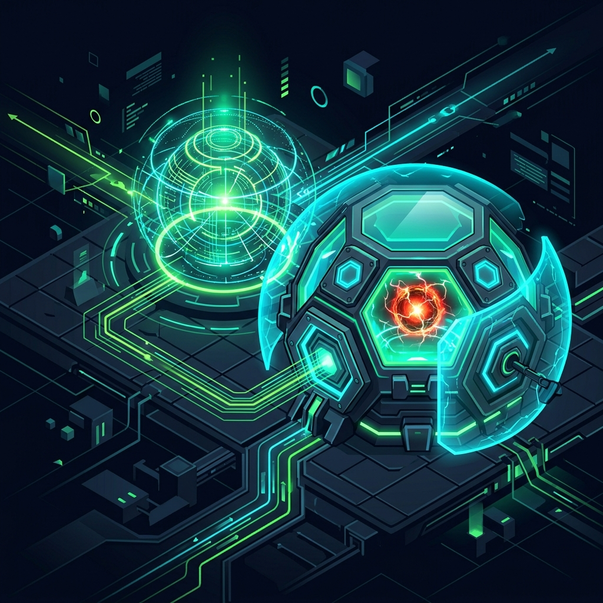

# Aura：物理スキルの分離と安全な実行サンドボックスのメカニズム

エージェントが呼び出せるツールが強力になるにつれ、実行境界のセキュリティを確保することがアーキテクチャ設計の最優先事項となっています。Aura v11.0.0 では、**「ツインプロジェクトのスキル分離とセキュリティ防御の分離」**メカニズムを導入し、物理スキルの開発と実行のパラダイムを完全に再構築しました。

## 1. 物理スキルの分離

過去のアーキテクチャでは、スキルは通常 Rust コアシステム内にハードコードされるか、密結合されていました。現在、すべてのスキルはルートディレクトリの `skills/` サンドボックスに物理的に分離されています。

- **純粋な Python キャリア**：各サブディレクトリは独立したスキル（例：`google_search`）を表します。
- **標準契約**：すべてのスキルには、`SKILL.md`（メタデータ、実行、および禁止事項の契約を定義）と標準化されたエントリスクリプトが含まれている必要があります。
- **ホットデプロイ機能**：これにより、コアエンジンを再コンパイルすることなく、新しいスキルをホットプラグできます。

## 2. デュアルシステム分離：Execution vs Skill Developer

究極のセキュリティのために、Aura は「開発」と「実行」を2つの完全に独立した自律サブシステムに分割しました。

### 2.1 Aura Skill Developer
スキルの「創造者」として、`aura-skill-developer` は `skills/` ディレクトリに対する**完全な読み書き権限**を持っています。
以下を提供します：
- スキルの自動生成とコードのホット編集。
- 静的コンプライアンス監査（危険な操作契約の違反チェック）。
- ドライランテスト環境とデプロイインターフェース。

### 2.2 Aura Execution
スキルの「使用者」として、`aura-execution` はシステム内で最も危険でありながら最も厳重に守られているコンポーネントです。
- **権限のダウングレード**：`skills/` ディレクトリに対して**読み取り専用権限**のみを持ち、実行中のスキルロジックの改ざんを完全に防ぎます。
- **強力な分離サンドボックス**：登録されたスキルの呼び出しのみを担当し、制限された Namespace/Cgroup サンドボックス内で強制的に実行します。
- **制御の反転**：エグゼキュータは基盤からタスクを受け取るだけで、タスクの生成ロジックには関心を持たず、「物理的なアクションを安全に着地させる」ことのみを担当します。

## 3. セキュリティ防御と設計哲学

この分離の層を通じて、Aura は極めて強固なセキュリティ防御を実現しました。
悪意のある命令が推論 (Inference) システムを欺いたとしても、実行システムにディスパッチされた場合、エグゼキュータは強力に分離されたサンドボックス内にあり、スキルを変更する権限がないため、被害の範囲はその特定のスキルが宣言したサンドボックスの境界内に厳格に制限されます。

「開発（高権限 / 実行しない）」と「実行（低権限 / 実行のみ）」のこの分離は、Aura が産業グレードの信頼性の高い AI-Native OS になるための重要な一歩を示しています。

---
*Dark Lattice アーキテクチャラボ制作*
