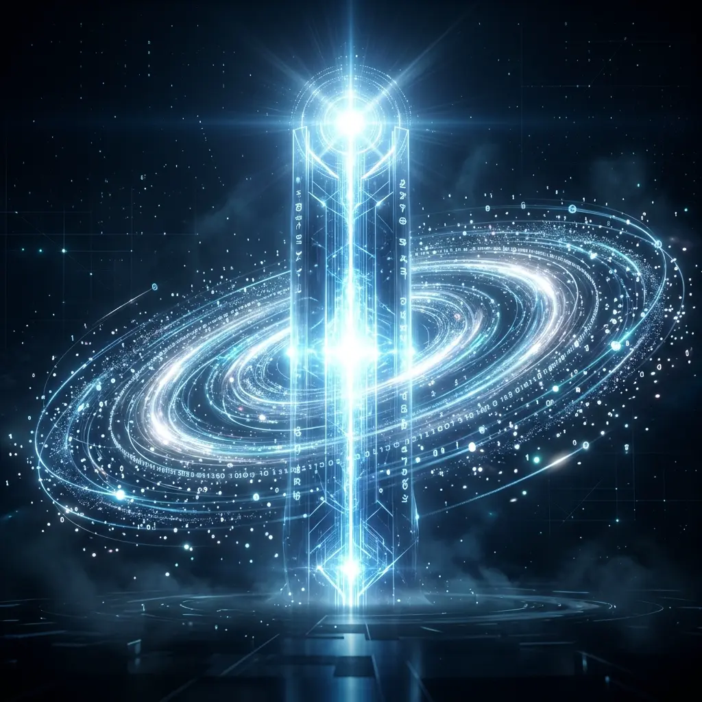

# Aura 真実の源：なぜ SurrealDB が唯一の真実であり、Redis は単なるトリガーなのか

分散型 AI システムのエンジニアリング実践において、開発者が陥りがちな致命的な間違いは「ステート管理の混乱」です。メモリキャッシュを状態マシンとして扱ったり、脆弱なメッセージミドルウェアに依存してコアとなるビジネスロジックを保存しようとしたりすることです。Aura は、**真実の源の分離（Source of Truth Separation）**によって、システムの堅牢性の底線を確立しました。

## 1. アーキテクチャの哲学：ステートこそが真実である

私たちは、システム運用中のすべての情報を、互いに干渉しない 2 つの平面に分割しています。**事実平面（Fact Plane）**と**シグナル平面（Signal Plane）**です。

### 1.1 事実平面 - SurrealDB
Aura において、**SurrealDB** に書き込まれたデータのみが「真実（Truth）」とみなされます。
- **取り消し不可能な状態スナップショット**：Meta のあらゆる編成ステップ、Matrix のあらゆる実行産物は、生成後の最初の 1 ミリ秒以内に永続化されます。
- **ACID 保証**：複数のエージェントが知識グラフを並行して変更する場合でも、私たちは SurrealDB の強い整合性トランザクションに依拠して「認知的衝突」を防ぎます。

### 1.2 シグナル平面 - Redis
Aura における **Redis** はデータベースではなく、**「神経突触シグナル」**です。
- **産物トリガー**：Matrix がタスクを完了した後にシグナルを送信し、Meta のリスナーコルーチンが呼び起こされます。
- **ストリーミングバッファ**：生成中のテキストストリームを極めて高速に転送するために使用されます。
- **破棄戦略**：シグナル平面はいつでもクラッシュする可能性があると想定しています。

## 2. 災害復旧：100% のステート再構成

この設計の核心的な利点は、**究極の耐障害性**にあります。

仮に、システム全体の Redis クラスタと実行中のすべての Matrix コンテナがこの瞬間に強制終了されたとしましょう。
すべての「事実」（どこまで実行したか、中間結果は何か、次の 3D 座標は何か）はすでに SurrealDB に安全に保管されているため、Meta カーネルは再起動後の最初のステップとして**「ステート再構成」**を実行します。
1. データベースから最後のスナップショットを読み取る。
2. Redis のトリガーシグナルを再構成する。
3. Matrix インスタンスを再呼び出しする。

全プロセスはユーザーにとって透過的であり、システムはあたかも「不死」であるかのような回復力を示します。

## 3. 結論

真実の源の分離は、Aura が工業グレードの生産性へと向かうための重要な一歩です。それは、脆弱な AI 推論プロセスを、厳格な分散ストレージプロトコルの下に包み込みました。Aura の世界において、**速度は Redis のものですが、魂は SurrealDB のものです。**

---
*Dark Lattice 構造研究所 出品*
