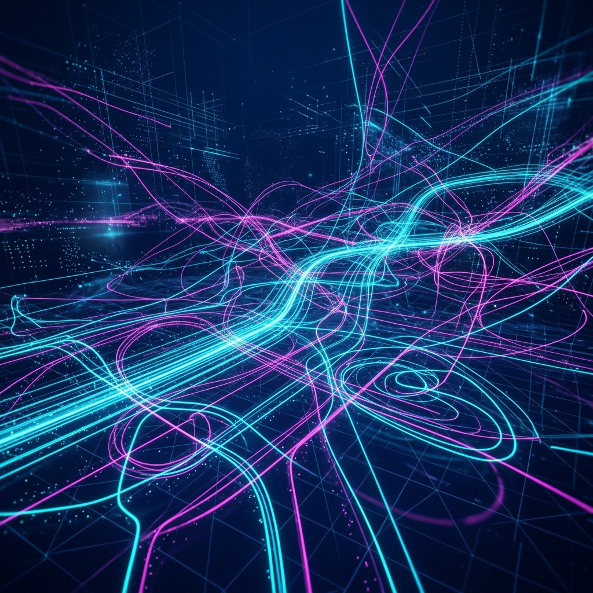

# Aura 轨迹导流：从执行拓扑到自进化数据集的自动转换

在 AI 领域，最好的数据不是从互联网爬取的，而是 Agent 在真实生产环境中产生的高质量执行轨迹。Aura 的**轨迹导流（Trajectory Streaming）**机制，旨在将这些碎片化的执行记录提炼为系统的自进化动力。

## 1. 轨迹即思维：数据捕获的广度

每当一个长程任务在 Aura 中成功终结，系统都会启动一次“思维复盘”。

### 1.1 全维度拓扑记录
我们捕获的不只是对话，而是完整的**执行图谱**：
- **Prompt 输入与 Context 注入**。
- **Meta 的 ACO 路径选择概率**。
- **Matrix 的 WASM 执行日志与 Product 产物**。
- **最终的用户满意度评分**。

## 2. 轨迹清洗与提炼 (Data Distillation)

并非所有的执行记录都值得学习。系统通过一套严格的过滤算法（Distiller）来筛选数据：
- **CoT（思维链）完整性校验**：剔除逻辑跳跃过大或存在异常补偿的轨迹。
- **信息量评分**：基于信息熵丢弃那些过于简单（重复性）的任务。
- **对比学习标注**：自动生成“正例路径”与“反例路径”的对比对，这对于强化学习（RLHF/DPO）至关重要。

## 3. 自动化的 SFT 数据工场

筛选后的数据会被自动转化为标准的 **ShareGPT** 或 **Alpaca** 格式。这使得 Aura 能够实现**“白天工作，晚上进化”**：
- 任务执行时，系统作为执行者产生数据。
- 闲暇时，系统作为老师，利用这些数据对本地模型进行微调。

## 4. 总结：打破“能力上限”

轨迹导流让 Aura 的能力不再受限于基础模型的预训练水平。通过不断消化自己的成功经验，Aura 能够针对特定用户的业务场景，自发生长出超越原始模型能力的垂直专长。

---
*本文由 Dark Lattice 架构实验室出品。*
