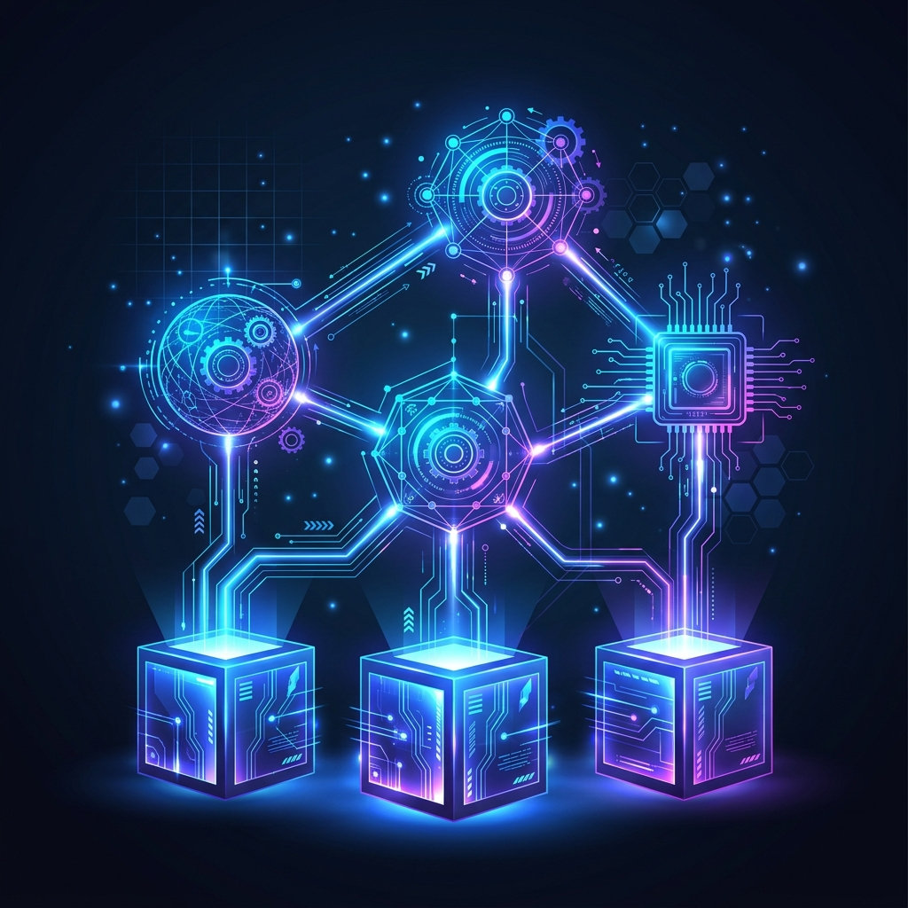

# Aura v11.0.0 Core Architecture: Three Foundations and Four Autonomous Systems

After multiple iterations, Aura has ushered in a major refactoring with version v11.0.0 (Systematic Architecture Edition). We have officially deprecated the traditional layered architecture and the early symmetric system model, shifting to a purer, functionally decoupled **"3 Foundations + 4 Autonomous Systems"** architectural paradigm.

## 1. Core Vision: AI-Native OS

Aura's goal is not to be a simple instruction-response machine, but to build a high-performance, multi-dimensional **AI Agent Operating System (AI-Native OS)** based on Rust.
It aims to achieve a closed loop of **cognition, execution, and evolution** through algorithm-driven autonomous systems. In Aura, system behavior is driven by the Variational Free Energy (VFE) minimization principle for self-optimization.

## 2. Three Foundations

The three foundations form the solid bedrock of Aura, undertaking the roles of the system's logical genes, physical entity, and control hub respectively:

1. **Aura Core (Logical Foundation)**:
   The "genes" of the system. It contains the system-wide contracts, the ACP v5.0 binary protocol, and core algorithm sets (e.g., forgetting algorithms, resonance models). It defines the data exchange standards for the entire system.

2. **Aura Substrate (Physical Foundation)**:
   The "physical support" of the system. It provides a high-performance binary storage engine and integrates local model (LLM/STT) inference backends, responsible for the underlying vector and structured data persistence.

3. **Aura OS (System Kernel)**:
   The "control hub" of the system. Responsible for system bootstrapping, process supervision, message routing based on the ACP protocol, and full-link security auditing. It acts like the Kernel of a traditional operating system, coordinating all upper-layer systems.

## 3. Four Autonomous Systems

Above the foundations, Aura runs four core autonomous systems. They collaborate via a microservices architecture, communicating asynchronously through the ACP bus:

1. **Interaction System**:
   Perception and awakening. Responsible for intent sampling, intent filtering driven by the **Values Model (Awakening Algorithm)**, and providing omnichannel visual and voice feedback to the user.

2. **Inference System**:
   Logic and planning. Generates causal path evolution, task flows, and module routing scheduling based on the **Worldview Model (Knowledge Acquisition Algorithm)**. It is the brain of the system, deciding "what to do".

3. **Execution System**:
   Physical action landing. Responsible for calling registered physical skills in a strictly isolated, controlled security sandbox.

4. **Evolution System**:
   Evaluation and self-evolution. Based on the **Lifeview Model (Evolutionary Algorithm)**, it evaluates the effects after task execution, handles knowledge consolidation (EWC), and performs closed-loop optimization of algorithm parameters.

## 4. Core Design Principles

- **Algorithm-Driven**: All system behaviors must be driven by quantifiable algorithms defined by `aura-core`, eliminating arbitrary "hard-coded" behaviors.
- **Binary Communication**: The entire system strictly uses the **ACP v5.0** binary zero-copy protocol, ensuring high performance and low latency for cross-component communication.
- **Causal Consistency**: All task flows must possess a traceable `trace_id` and causal clock sequence, ensuring the execution paths are absolutely reproducible and auditable.

---
*Produced by Dark Lattice Architecture Lab.*
