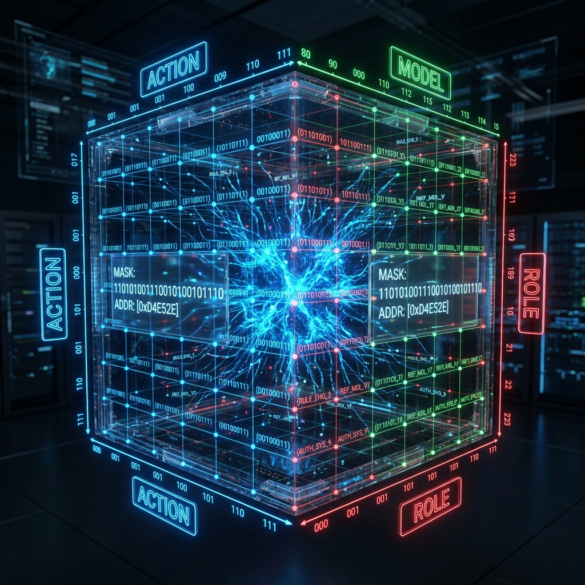

# Aura 3D Binary Addressing: Absolute Cybernetics under 24-bit Masking

In Aura's design philosophy, **"Address is Property."** To achieve extreme scheduling performance, we have completely abandoned string-based or complex object-based indexing, building a brand-new **3D Binary Addressing System**.

## 1. Dimensional Definition: The 24-bit Trinity

We collapse the entire decision space of the system into a 24-bit composite pointer. Each pointer consists of three 8-bit dimensions, forming a perfect 3D matrix space:

$$\text{Pointer} = \underbrace{A(8\text{bit})}_{\text{Action}} \;\big|\; \underbrace{M(8\text{bit})}_{\text{Model}} \;\big|\; \underbrace{R(8\text{bit})}_{\text{Role}}$$

- **Action (8-bit)**: **"What to do."** Defines 256 atomic action types, from code modification and knowledge retrieval to user interaction. Each action corresponds to a unique WASM skill entry point.
- **Model (8-bit)**: **"Who does it."** Classifies all LLMs into performance tiers. From local 1.5B lightweight models to remote flagship models, achieving dynamic routing between resource cost and execution capability.
- **Role (8-bit)**: **"How to do it (Personality)."** Defines the Agent's personality bias. 0x00 represents extreme conservatism (hallucination prevention priority), while 0xFF represents extreme aggression (associative exploration priority).

## 2. Peak Performance: O(1) Addressing and Memory Locking

The core value of this addressing system lies in its deep integration with the Rust low-level.

- **Bit-Shift Packing**: The three dimensions are merged into a single integer via simple bitwise operations.
- **256MB Resident Table**: We pre-allocate and lock (mlock) an index table in memory covering the entire 24-bit space. This means the time complexity for the Matrix kernel to locate any execution node is a constant $O(1)$, with zero retrieval overhead.

## 3. Architectural Significance: From "Random Walk" to "Coordinate Positioning"

In older Agent designs, what to do next often depended on the model's fuzzy output. Under Aura 3D Addressing, the instructions given by the Meta kernel are **fixed 3D coordinates**.

This shift makes the system's state space fully observable and predictable. By monitoring the heat map of these three dimensions, we can instantly tell if the system is "overly aggressive" or "model overloaded."

## 4. Conclusion

3D Binary Addressing is the technical foundation that allows Aura to operate as an industrial-grade AI agent. It transforms fuzzy semantic decisions into precise numerical addressing, providing the underlying mathematical language for subsequent curiosity sampling and ant colony algorithms.

---
*Produced by Dark Lattice Architecture Lab.*
