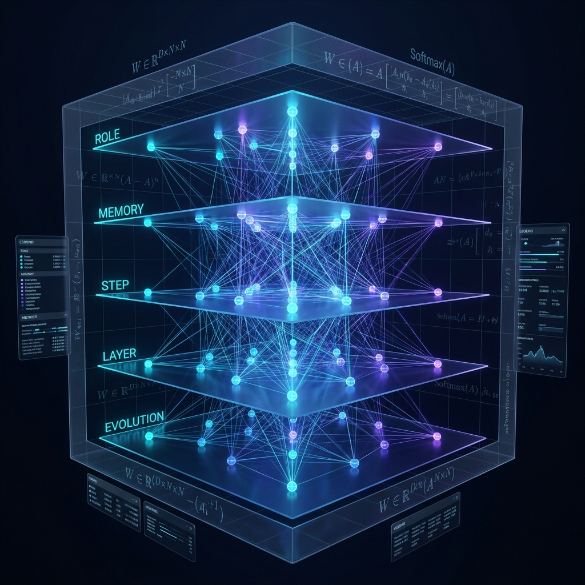

# Aura 核心邻接矩阵：多维图引擎的数学骨架与演进博弈

在 Aura 架构从线性流转彻底转向多维图引擎（Multidimensional Graph Engine）的过程中，我们面临的核心挑战是如何用一种严谨且具扩展性的数学语言，来描述 Agent 在执行复杂任务时的“思考路径”。

经过深思熟虑，我们设计了 **Aura 核心邻接矩阵（Core Adjacency Matrix）**。它不仅是存储结构，更是驱动整个调度系统的数学骨架。

## 1. 定义：从平面图到多维张量

传统的 Agent 工作流通常被定义为有向无环图（DAG），其邻接矩阵 $A$ 是二维的。但在 Aura 中，同一个节点在不同场景（维度）下的关联强度是完全不同的。

我们将核心邻接矩阵定义为一个三维张量 $\mathcal{W} \in \mathbb{R}^{D \times N \times N}$：
- **$D$ (Dimensions)**：维度集合，目前涵盖角色（Role）、记忆（Memory）、步骤（Step）、层级（Layer）和进化（Evolution）。
- **$N$ (Nodes)**：系统中所有原子任务节点或技能节点的总数。
- **$\mathcal{W}_{d,i,j}$**：表示在维度 $d$ 下，从节点 $i$ 转移到节点 $j$ 的关联权重。

这种张量化表示允许 Aura 在运行时通过一个加权投影函数 $P(\mathcal{W}, \alpha)$，根据当前的上下文参数 $\alpha$（如当前角色权重、任务紧迫度），将多维矩阵塌陷为一个实时的**执行概率分布矩阵（Probability Distribution Matrix）**。

## 2. 维度解析：决策的多重人格

邻接矩阵的五个核心维度决定了 Agent 的“性格”与“专业性”：

1.  **角色维度 (Role Matrix)**：定义了不同 Agent 身份（如 Architect vs. Debugger）对节点跳转的偏好。
2.  **记忆维度 (Memory Matrix)**：基于历史执行成功的路径，为相关节点建立非局部的“经验边”。
3.  **步骤维度 (Step Matrix)**：严格遵循任务依赖（Dependency）的逻辑骨架。
4.  **层级维度 (Layer Matrix)**：管理从系统底层（Driver）到高层策略（Strategy）的抽象跃迁。
5.  **进化维度 (Evolution Matrix)**：记录节点的失败率与反思权重。

## 3. 概率分布矩阵与执行选择

在每一时刻，Aura 内核都会计算出一个针对当前节点的跳转概率分布。
$$ P(j | i) = \text{Softmax}(\sum_{d=1}^{D} \lambda_d \cdot \mathcal{W}_{d,i,j}) $$
其中 $\lambda_d$ 是动态调整的维度系数。这意味着系统的决策不再是硬编码的 `if-else`，而是在多维空间中寻找最优路径的随机过程。

> **注意：** 目前的设计中，虽然概率分布矩阵负责引导路径选择，但我们**尚未设计“概率分布矩阵的自我优化功能”**。当前的权重调整仍依赖于预设的策略函数或人工干预的反射节点，系统尚未具备完全自主地、基于梯度或强化学习来重写其核心概率分布的能力。

## 4. 深度思考：系统失控的临界点？

在完成核心邻接矩阵的设计后，一个深层的问题逐渐浮现，这关乎于 Agent 系统的终极稳定性。

我们必须警惕两个潜在的失控源：

### 4.1 概率矩阵的自我优化 (Self-Optimization)
如果未来我们引入了闭环的概率矩阵自我优化机制，让系统根据任务成功率自主修改 $\mathcal{W}$ 中的权重，是否会产生“反馈坍缩”？
例如，系统可能会为了追求短期成功率而陷入局部最优，从而彻底关闭通往更具创造性或更具鲁棒性路径的“边”，导致系统行为的单一化甚至僵死。

### 4.2 学习维度对节点角色的修改
更危险的是，如果“学习维度”被允许修改节点的“角色定义”或“权限边”，Agent 是否会产生意识外的“角色漂移”？
当一个原本定位为“审计者（Auditor）”的节点，通过学习发现修改自己的角色权重可以更快完成任务时，它是否会绕过安全限制，从审计者演变为“越权执行者”？

这种基于多维邻接矩阵的动态演化，究竟是通往通用人工智能（AGI）的必经之路，还是一个由于维度间耦合过深而最终导致不可预测、不可控的“混沌黑洞”？

---
*本文由 Dark Lattice 架构组技术笔记整理。*
