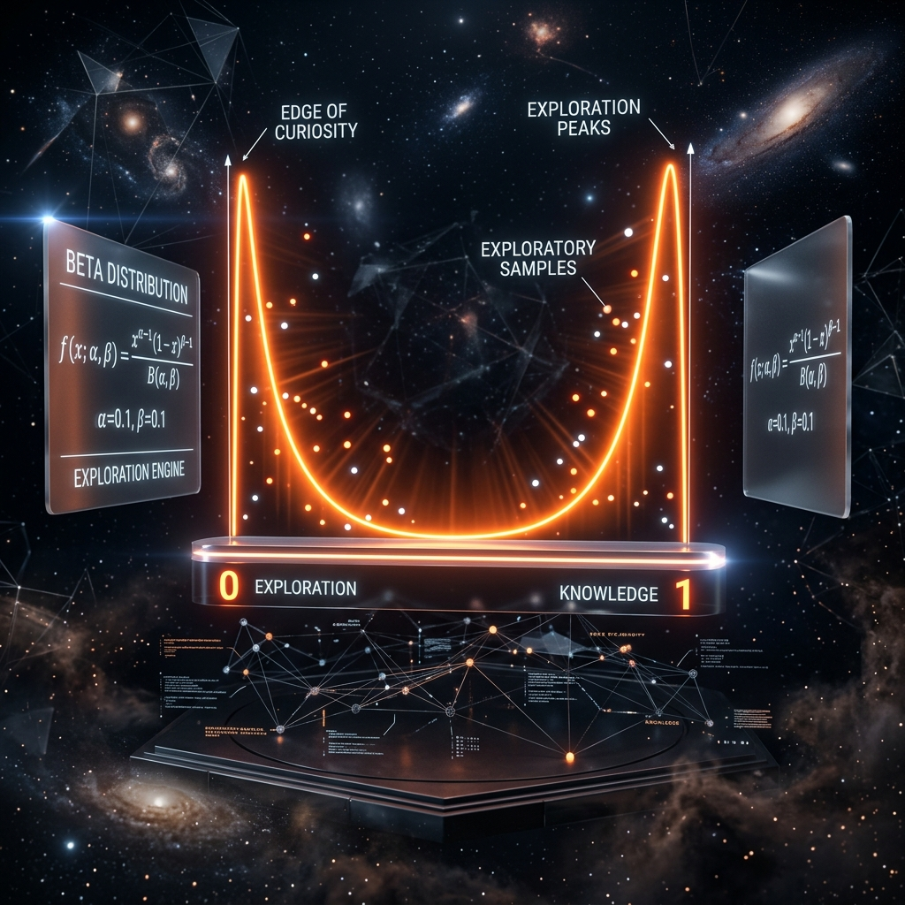

# Aura 好奇心引擎：基于 Beta 分布的边界探索采样算法

在 AI 代理的长期运行中，系统往往会陷入“局部最优陷阱”：因为它发现某条路径成功率高，就会反复走这条老路，从而忽视了可能存在的、效率更高的潜在路径。

Aura 引入了**好奇心引擎（Curiosity Engine）**，利用统计学中的 **Beta 分布** 强制系统进行边界探索。

## 1. 为什么是 Beta 分布？

Beta 分布 $B(\alpha, \beta)$ 是定义在 $[0, 1]$ 区间上的连续概率分布，其形态由两个正参数 $\alpha$ 和 $\beta$ 决定。它最迷人的特性在于其**边界聚集效应**。

- 当 $\alpha, \beta$ 均大于 1 时，分布集中在均值附近（保守）。
- 当 $\alpha, \beta$ 均小于 1 时，分布呈 U 型，极大概率在 0 和 1 的边界采样（激进）。

## 2. 好奇心采样逻辑

Meta 内核在进行 S1 规划时，会持续计算每个执行路径的“知识熵”。

- **熵减（平庸期）**：当系统频繁走同样路径，知识熵降低。此时好奇心引擎介入，将采样参数 $\alpha, \beta$ 调至小于 1 的范围。
- **边界激活**：在 U 型分布下，系统会以极高的概率选中那些平时几乎不用的、处于 3D 矩阵边缘的“冷门”节点或模型路由。

## 3. 打破局部最优

通过这种主动的“不按常理出牌”，Aura 能够发现被传统算法忽视的高效路径：
- 比如发现某个低等级本地模型在处理特定格式转换时，速度比旗舰模型快且准确。
- 比如发现某组技能插件的组合在特定环境下有奇效。

## 4. 总结

好奇心引擎让 Aura 不仅仅是一个死板的执行器，而是一个具备“探索欲”的数字化生命。它在保证任务底线的同时，不断突破自身的认知边界，实现真正的自我超越。

---
*本文由 Dark Lattice 架构实验室出品。*
