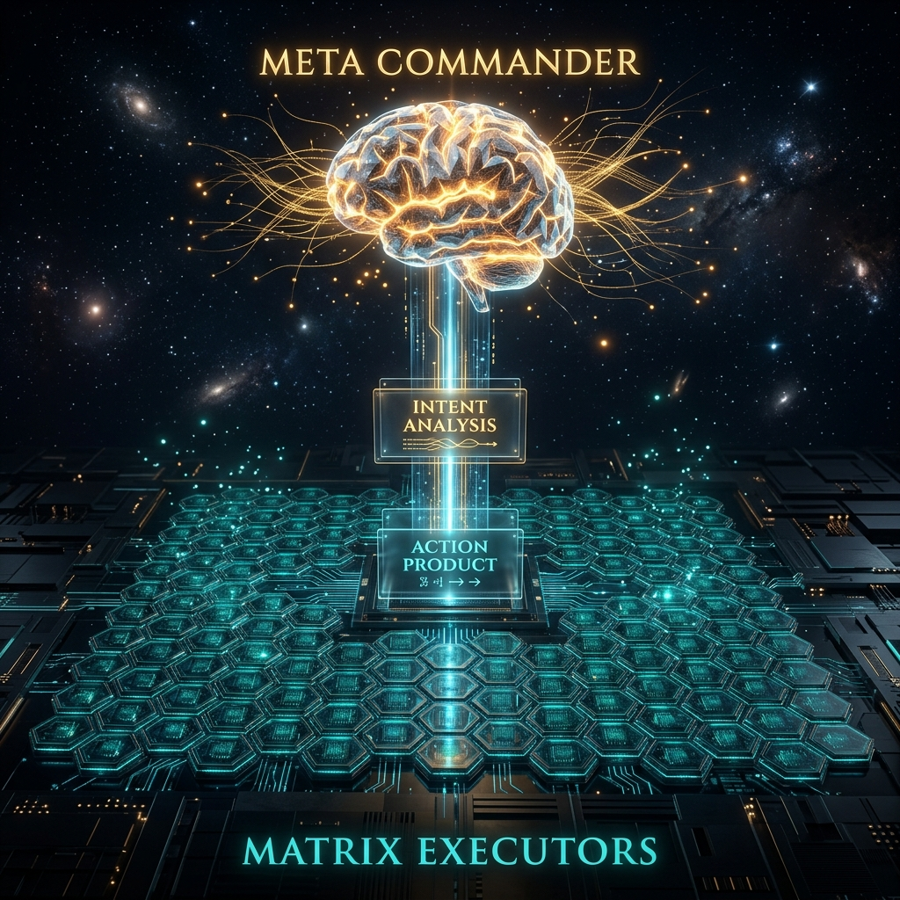

# Aura 双内核アーキテクチャ：Meta 指揮官と Matrix 実行者の深度デカップリング

従来の AI エージェント設計では、モデルが「何をすべきか」と思考することと、「具体的にどう行うか」を実行することの両方を担うことが一般的でした。この責任の混同は、**実行プロセスの制御不能**と、長期タスクにおける**意図のドリフト**という 2 つの致命的な問題を引き起こします。

Aura は、**Meta/Matrix 双内核アーキテクチャ**によって、このルールを根本から書き換えます。

## 1. Meta カーネル：システムの脳と魂

Meta カーネルは、Aura システム全体の「指揮官」です。ファイルを直接操作したり、具体的なスキルを呼び出したりすることはありません。その唯一の責任は、**オーケストレーションと監視**です。

- **意図分析 (S0)**：生の要求を受け取り、高レベルモデル（Level-8）を使用して抽象的なタスクトポロジに解体します。
- **計画編成 (S1)**：**アリ群最適化（ACO）**を利用して、3D アドレッシング空間内で最適なパスを探索します。
- **結果評価 (S3)**：Matrix から報告された生成物の品質を判定し、続行するか Saga 補正をトリガーするかを決定します。

Meta は、システム内で唯一グローバルな視野を持ち、ソウルルール（Soul Rules）を読み取り、「好奇心」を備えた実体です。

## 2. Matrix カーネル：純粋な計算とスキルプール

Matrix カーネルは「実行者」です。極限まで洗練され、ステートレスで、**完全に受動的な**計算エンジンとして設計されています。

- **アクション実行 (S2)**：Meta から発行された 24-bit のノードポインタを受け取り、対応する WASM スキルプラグインをロードして、実行結果を出力します。
- **ゼロ自律性**：Matrix が次のタスクノードを自律的に決定することは禁止されています。Redis Stream に生成物を報告した後、すぐにスリープ状態に入り、Meta からの次の呼び出しを待ちます。

この「自由の剥奪」設計により、システムの安全性が保証されます。Matrix が許可なくコードを書き換えたり、機密ネットワークにアクセスしたりすることはありません。

## 3. 非同期接続：Redis Stream と ACP プロトコル

2 つのカーネルは、高度にデカップリングされた通信レイヤーを介して相互作用します。

- **データプール（Data Pool）**：タスク実行中の中間変数を格納します。
- **プロダクトキュー（Product Queue）**：Matrix がステータスを報告するための非同期チャネルです。
- **ACP プロトコル**：WebSocket ベースの通信規格で、ダッシュボードがシステム内のあらゆる微細な変動をリアルタイムで観測できるようにします。

## 4. 結論：決定論がもたらす自由

Meta と Matrix を分離することで、Aura はボトム層での**決定論的な実行**と、トップ層での**自律的な進化**を同時に実現しました。Meta は実行時の予測不能な崩壊を心配することなく、最適な計画パスを自由に探索できます。

---
*Dark Lattice 構造研究所 出品*
