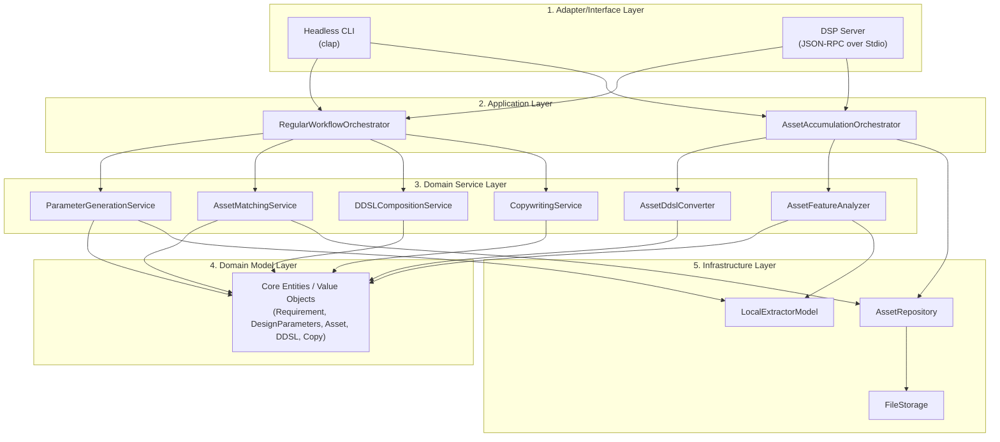
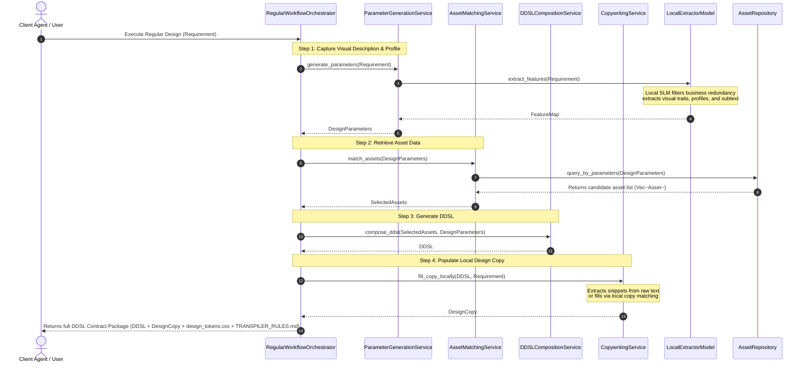
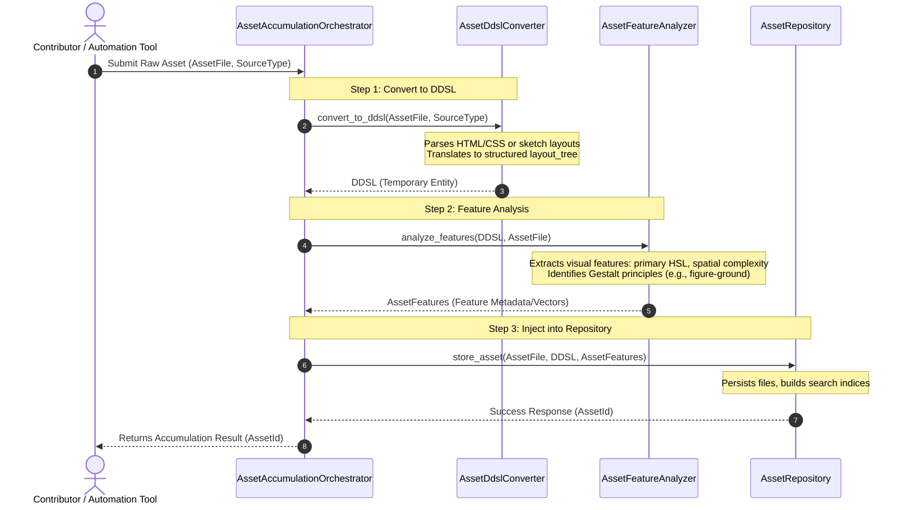

# gestalt-resonator Architecture Design

This system serves as a "Design Middleware" for Agent collaboration, aiming to connect requirement definitions with high-fidelity code. This document details the system's layered architecture, core module design, and the runtime data flows for the regular design workflow and the asset accumulation workflow.

---

## 1. System Architecture

The system adopts a typical **Layered Architecture**, divided from top to bottom into: Adapter Layer, Application Layer, Domain Service Layer, Domain Model Layer (Core), and Infrastructure Layer. This layering ensures that both the CLI driver and the JSON-RPC dual-channel driver can share the same core business logic, and facilitates future expansion of new asset repository media or local extraction algorithms.

### 1.1 Layer Responsibilities

*   **Adapter Layer**
    *   **Headless CLI**: Provides non-interactive command-line tools, supporting CI/CD integration and direct Agent invocation via Subprocesses.
    *   **DSP Server**: Based on the Language Server Protocol (LSP) concept, it provides JSON-RPC over Stdio service, suitable for long-lived interactive connections during an Agent's lifecycle, supporting streaming responses.
*   **Application Layer**
    *   **RegularWorkflowOrchestrator**: Responsible for receiving requirements and orchestrating steps like feature extraction, asset matching, DDSL composition, local copy filling, and context output to finally generate the delivery package.
    *   **AssetAccumulationOrchestrator**: Responsible for receiving external design assets and orchestrating steps like DDSL conversion, feature extraction, and persistent storage.
*   **Domain Service Layer**
    *   Highly cohesive, stateless business logic units that encapsulate calculations and conversion logic based on Gestalt psychology and design composition theory.
*   **Domain Model Layer**
    *   The core of the system, containing entities, value objects, and aggregates rich with business behavior, unaffected by external frameworks or databases.
*   **Infrastructure Layer**
    *   Provides concrete technical implementations. Uses `LocalExtractorModel` to load pre-trained lightweight classification models locally to filter irrelevant business text and extract visual descriptions and psychological profiles; handles asset repository I/O operations via metadata storage.

---

## 2. Workflow Runtime Sequences

### 2.1 Regular Workflow

The Regular Workflow is a fully offline, millisecond-level interactive design flow. Its primary responsibility is to start from a "Requirement Definition", automatically filter business redundancies, extract effective visual features and psychological profiles, and assemble them into a high-fidelity DDSL.

#### Key Steps Details:
1.  **Step 1: Requirement Filtering & Parameter Generation**: Receives product requirements and filters over 90% of irrelevant business logic text, precisely extracting visual descriptions (e.g., ample whitespace), target audience psychological profiles (e.g., geek), and subtext to generate control parameters (`DesignParameters`).
2.  **Step 2: Asset Retrieval & Matching**: Uses the `AssetMatchingService` to match local asset components that best align with Gestalt rules based on the extracted feature parameters.
3.  **Step 3: DDSL Assembly**: Assembles a schema-compliant DDSL topological tree according to Gestalt proximity and closure geometric rules.
4.  **Step 4: Local Copy Filling**: The `CopywritingService` directly filters and intercepts visual-related copy from the `Requirement` or populates it via local configuration rules, avoiding any network requests for ultra-fast response.

---

## 2.2 Asset Accumulation Workflow

The Asset Accumulation Workflow is responsible for absorbing existing excellent designs or components (raw asset files), reverse-parsing them into standard DDSL, analyzing their aesthetic and Gestalt features, and ultimately persisting them as searchable system assets.

#### Key Steps Details:
1.  **Step 1: Reverse Parsing and Transpilation**: The `AssetDdslConverter` supports multiple input sources (e.g., HTML pages, Figma diagrams), extracts the hierarchy, and generates the corresponding `layout_tree` according to the semantics of `ddsl.schema.json` (transpiling Div/Span to Container/Component/Text nodes).
2.  **Step 2: Gestalt Feature Analysis**: The `AssetFeatureAnalyzer` analyzes the transpired structure and raw visual resources. Using local feature classification algorithms, it extracts the Gestalt principles where the asset excels, tags visual features (primary HSL, Spacings density), annotates applicable Gestalt principles, and extracts an aesthetic fingerprint.
3.  **Step 3: Storage and Indexing**: Saves the raw asset, DDSL expression, and aesthetic features (including multi-dimensional tags and feature vectors) together. Builds indices for these feature fields in the asset repository so they can be precisely queried by parameters in Step 2 of the Regular Workflow.
