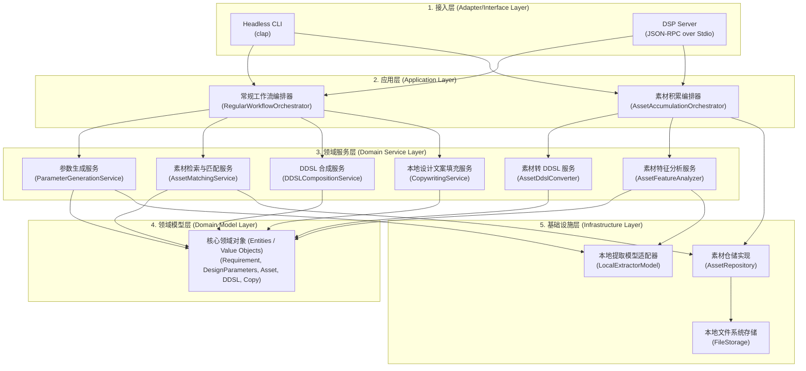
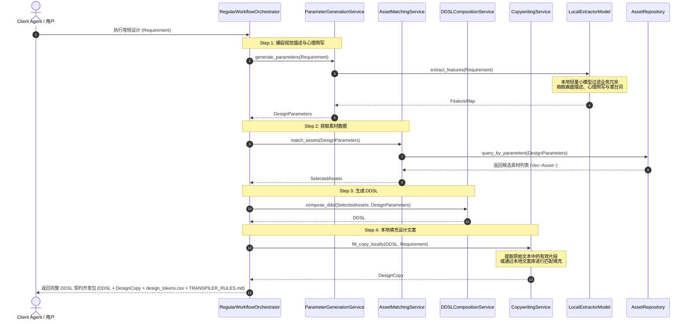
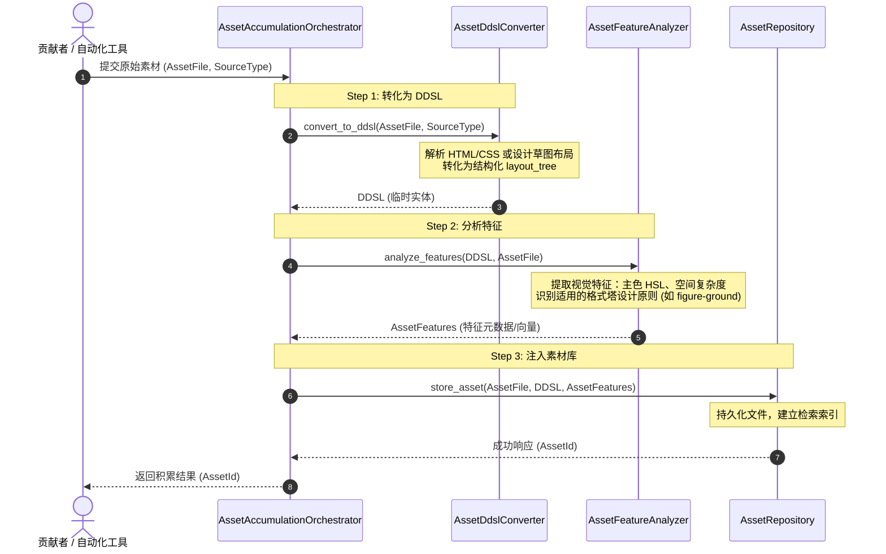

# gestalt-resonator 系统架构设计 (Architecture Design)

本系统是作为 Agent 协同的“设计中间件”，旨在连接要件定义与高保真代码。本文档详细阐述了系统的分层架构、核心模块设计以及常规设计工作流与素材积累工作流的运行时数据流向。

---

## 1. 整体架构 (System Architecture)

系统采用典型的**分层架构 (Layered Architecture)**，由上至下划分为：接入层、应用编排层、领域服务层、领域模型层（核心）和基础设施层。这种分层确保了 CLI 驱动与 JSON-RPC 双通道驱动能共享相同的核心业务逻辑，且便于未来拓展新的素材库介质或本地提取算法。

### 1.1 分层职责说明

*   **接入层 (Adapter Layer)**
    *   **Headless CLI**：提供非交互式命令行工具，支持 CI/CD 集成以及 Agent 通过 Subprocess 直接调用。
    *   **DSP Server**：基于 LSP (Language Server Protocol) 的理念，提供 JSON-RPC over Stdio 服务，适合在 Agent 运行周期内进行长连接交互，支持流式响应。
*   **应用层 (Application Layer)**
    *   **常规工作流编排器 (RegularWorkflowOrchestrator)**：负责接收要件，串联特征提取、素材匹配、DDSL 合成、本地文案填充与上下文输出等步骤，最终输出对应的交付物包。
    *   **素材积累编排器 (AssetAccumulationOrchestrator)**：负责接收外部设计素材，串联 DDSL 转换、特征提取、持久化入库等步骤。
*   **领域服务层 (Domain Service Layer)**
    *   高度内聚的无状态业务逻辑单元，封装了格式塔心理学、设计构成理论等计算与转换逻辑。
*   **领域模型层 (Domain Model Layer)**
    *   系统的核心，包含富含业务行为的实体、值对象和聚合根，不受外界框架或数据库的影响。
*   **基础设施层 (Infrastructure Layer)**
    *   提供具体的技术实现。通过 `LocalExtractorModel` 本地加载训练好的轻量级分类模型，过滤无关业务文本，执行视觉描述与心理侧写的实体抽取；同时通过元数据仓储进行素材库的读写。

---

## 2. 核心工作流运行时时序 (Workflow Runtime Sequences)

### 2.1 常规工作流 (Regular Workflow)

常规工作流为全离线、毫秒级交互设计流。其主要职责是：从输入的“要件定义”出发，自动过滤业务冗余并提取有效画面特征与用户心理侧写，组装为高保真 DDSL。

#### 关键步骤细节说明：
1.  **Step 1：要件过滤与关键参数生成**：接收产品要件并过滤 90% 以上无关的业务逻辑文本，精准提取视觉描述（如大留白）、目标人群心理侧写（如极客）及潜台词，生成控制参数 `DesignParameters`。
2.  **Step 2：素材检索与匹配**：利用 `AssetMatchingService` 基于提取的特征参数匹配最符合格式塔规则的本地素材组件。
3.  **Step 3：DDSL 组装**：按格式塔接近性、闭合性等几何规则合成符合 Schema 的 DDSL 拓扑树。
4.  **Step 4：本地文案填充**：`CopywritingService` 直接过滤并截取 `Requirement` 中的画面展示相关文案，或通过本地配置规则库装配，避免引入任何网络请求，实现超快响应。

---

## 2.2 素材积累工作流 (Asset Accumulation Workflow)

素材积累工作流的职责是：吸收现有的优秀设计或组件（原始素材文件），逆向解析为标准 DDSL，并分析其美学与格式塔特征，最终将其沉淀为可被检索的系统素材。

#### 关键步骤细节说明：
1.  **Step 1：逆向解析转译**：`AssetDdslConverter` 支持多种输入源（如 HTML 页面、Figma 原理图等），它提取出层次结构，并按照 `ddsl.schema.json` 的语义生成对应的 `layout_tree`（将 Div/Span 转译为 Container/Component/Text 节点）。
2.  **Step 2：格式塔特征分析**：`AssetFeatureAnalyzer` 对转译出来的结构和原始视觉资源进行分析。结合本地特征分类算法提取该素材在哪些格式塔原则上表现优异，标注视觉特征（主色 HSL、Spacings 密度）以及适用的格式塔原则，提取美学指纹。
3.  **Step 3：入库与建索引**：将原始素材、DDSL 表达形式、美学特征（包括多维特征标签与特征向量）一并保存。在素材库中对这些特征字段建立索引，以便在常规工作流的 Step 2 中被参数精准检索匹配。
