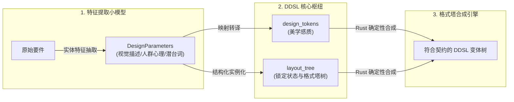

---

> [!NOTE]
> この記事の本文は現在翻訳中です。以下は原文です。


# DDSL 语法设计规约 (DDSL Specification)

DDSL (Design Domain Specific Language) 是专为 AI Agent 协同开发设计的画面设计语义图谱契约规范。它以严格的 JSON 结构，解耦了界面的“美学感质（Tokens）”、“空间拓扑（Layout Tree）”与“动态交互（State Machine）”。本文档对 DDSL 契约中的每项语法字段及其格式塔心理学设计含义进行深度阐述。


## 1. DDSL 的物理可编译性与数学可计算性规约 (DDSL Compilability & Computability Specification)

DDSL 绝非仅用于静态描述的非结构化 Schema，在交互设计转译系统中，它必须满足以下两个硬性的物理与数学科学条件，从而在设计迭代中起到至关重要的桥梁和约束作用：

### 1.1 物理可编译性 (Compilability: Downstream Artifacts Compilation)

DDSL 契约必须能够通过编译器（Transpiler）无损地转译为标准的、可直接在浏览器中渲染执行的画面资源包：
1. **目标产物映射结构**：
   DDSL 文件被编译后的目标输出是一套符合现代前端工程规范的物理资源文件：
   - `index.html`（DOM 结构及层级拓扑）
   - `index.css`（基于 Design Tokens 变量的主题与排版样式）
   - `index.js`（基于状态机的行为交互逻辑与动效）
   - 依赖的媒体资源包（如渲染所需的 SVG 矢量图或图片资源）。
2. **DOM 拓扑的确定性映射**：
   - `layout_tree` 中的每个元素在编译时都有确定的 HTML5 DOM 映射：
     - `Container` $\rightarrow$ `<div class="gestalt-container">` 或 `<section>`
     - `Component` $\rightarrow$ `<div class="gestalt-component">`（用于模块化封装）
     - `Text` $\rightarrow$ `<span>` 或 `<p>`
     - `Button` $\rightarrow$ `<button>`
     - `Input` $\rightarrow$ `<input>`
     - `Image` $\rightarrow$ ``
   - 各节点的 `id` 直接映射为输出代码中的 CSS 类名和 DOM 选择器，确保代码的可解析性和无冲突。
3. **美学感质的样式编译**：
   - `design_tokens.colors` 会被直接编译为全局的 CSS 变量：
     ```css
     :root {
       --color-primary: hsl(220, 70%, 50%);
       --color-background: hsl(210, 15%, 95%);
     }
     ```
   - 所有的间距阶梯映射为 CSS Spacing Utility，由转译器直接输出对应的间距 class 类定义。

### 1.2 数学可计算性 (Computability: Quantifiable Generative Calculation)

DDSL 契约必须在设计和演进过程中能够通过纯粹的数值代数和几何公式量化获取，确保没有任何启发式的随机猜测和多义性：
1. **间距接近性的级数公式化**：
   DDSL 的间距尺度不是凭感觉硬编码的，而是基于格式塔**接近性 (Proximity) 原则**的缩放函数计算出来的：
   $$S_i = \text{base} \times \text{scale}_i$$
   其中，基准间距 `base` 和比例阶梯 `scale`（如 `[0.25, 0.5, 1, 2]`）经过纯代数计算为精确的物理值（如 `2px`, `4px`, `8px`, `16px`），构成布局树间排版间距的数学依据。
2. **美学色彩调和的代数计算**：
   色彩主题在 HSL 空间内必须是多维代数式计算获取的：
   - 例如，警示色 `color.alert` 的色相必须通过对主色 `primary` 在色环上的夹角计算得出（如互补色相调和）：
     $$H_{\text{alert}} = (H_{\text{primary}} + 180^\circ) \bmod 360^\circ$$
   - 相似色（Analogous Colors）或分裂互补色（Split-Complementary Colors）的色值同样由代数公式映射生成。这允许特征提取小模型提取的扁平色彩意图，通过数学规则直接量化为可执行的 HSL 设计 Token。
3. **锁定区边界条件的计算约束**：
   当用户在谱系图中对某个 DDSL 节点进行局部锁定（`locked: true`）时，该子树对应的物理尺寸、间距和色彩被当作**常数边界条件 (Boundary Conditions)** 锁死。
   合成引擎在重新进行参数微调和几何计算时，对未锁定区域应用数学优化公式，通过约束求解（Constraint Solving）计算得出在这一边界条件下的最佳排版布局，确保局部调整后的整体美学一致性。

---

## 2. 核心 Schema 结构概览

一份标准的 DDSL 契约文件（如 `layout.ddsl.json`）由以下四大顶级根字段组成：

```json
{
  "project_name": "项目名称",
  "version": "契约版本号",
  "design_tokens": { /* 全局设计变量（美学感质） */ },
  "layout_tree": { /* 格式塔布局拓扑树 */ },
  "behavioral_state_machine": { /* 交互状态机与动效映射 */ }
}
```

---

## 3. 语法字段详解

### 3.1 根级元数据 (Root Metadata)

*   **`project_name`** (string, 必填)  
    *   **含义**：当前设计的项目名称。转译器用此字段生成代码工程的命名空间或项目根目录。
*   **`version`** (string, 必填)  
    *   **含义**：当前 DDSL 契约的版本号，用以做兼容性校验与增量转译追踪。

---

### 3.2 全局设计变量 (`design_tokens`)

该模块定义了全局的视觉系统要素（色彩与尺寸比例），承载了界面的全局美学感质。

```json
"design_tokens": {
  "colors": {
    "primary": {
      "value": "hsl(220, 70%, 50%)",
      "_agent_rule": "禁止更改此颜色亮度以保证对比度"
    }
  },
  "spacing": {
    "base": 8,
    "scale": [0.25, 0.5, 1, 1.5, 2, 4]
  }
}
```

*   **`colors`** (object, 必填)  
    *   **含义**：全局色彩主题定义。强烈推荐使用 HSL（色相、饱和度、亮度）定义。
    *   **子属性**：
        *   `value` (string, 必填)：具体的 CSS 颜色值。
        *   `_agent_rule` (string, 选填)：**编码禁令**。面向开发 Agent 的硬性色彩要求，防止 Agent 在实现该颜色时发生偏差（例如警告 Agent 禁止随意修改此色彩的明度，以保障 WCAG AAA 级无障碍对比度）。
*   **`spacing`** (object, 必填)  
    *   **含义**：全局间距尺度因子，映射格式塔的**接近性 (Proximity) 原则**。
    *   **子属性**：
        *   `base` (number, 必填)：基准间距大小（像素值，如 `8`）。
        *   `scale` (array of numbers, 选填)：间距缩放倍数阶梯（如 `[0.25, 0.5, 1, 1.5, 2, 4]`），对应实际生成中 `2px`, `4px`, `8px`, `12px`, `16px`, `32px` 的间距约束。

---

### 3.3 格式塔布局拓扑树 (`layout_tree`)

这是 DDSL 的核心，采用嵌套树状结构描述界面元素的空间拓扑和组织逻辑，彻底规避了以物理坐标或绝对尺寸定位导致的布局脆弱性。

```json
"layout_tree": {
  "id": "root_viewport",
  "type": "Container",
  "gestalt_principle": "figure-ground",
  "_agent_guidelines": {
    "intent": "主视窗区域，需要突出的主卡片浮动在灰色背景上",
    "do_not_do": ["禁止使用 border 划定边缘"],
    "recommended": ["使用 CSS box-shadow 软阴影实现视差深度"]
  },
  "children": []
}
```

*   **`id`** (string, 必填)  
    *   **含义**：节点唯一标识符。此 ID 将直接映射为生成代码中的 CSS 类名、组件变量名或 E2E QA 测试用例中的元素锚点选择器。
*   **`type`** (string, 必填)  
    *   **含义**：节点基础的界面类型元定义。
    *   **可选值**：
        *   `Container`：容器节点，相当于 HTML 中的 Div/Section，通常用于包裹其他节点。
        *   `Component`：逻辑组件，代表一个独立的、复用的 UI 单元。
        *   `Text`、`Button`、`Input`、`Image`：原子级交互与展示元素。
*   **`gestalt_principle`** (string, 选填)  
    *   **含义**：此节点在视觉排版中应用的主要**格式塔心理学原则**。指导转译器在排版时赋予的几何规则。
    *   **可选值**：
        *   `proximity` (接近性)：子节点间距紧凑，以物理距离的临近唤起群组知觉。
        *   `similarity` (相似性)：子节点拥有高度一致的形状或色相，唤起同类知觉。
        *   `figure-ground` (主体-背景)：节点相对父级拥有强对比度（如卡片阴影或异色背景），使该节点脱颖而出。
        *   `common-fate` (共同命运)：关联子节点共同拥有一套协同交互轨迹（如展开时的协同侧滑）。
        *   `continuity` (连续性)：元素沿着一条可见或隐含的对齐网格线（Grid Line）排列，引导视觉流动。
        *   `closure` (闭合性)：运用柔性对齐与虚留白完成分组，避免使用物理细框线将界面肢解。
*   **`_agent_guidelines`** (object, 选填)  
    *   **含义**：专为 Client Agent 准备的即时行动提示约束，由系统根据格式塔规则和上下文自动注入。
    *   **子属性**：
        *   `intent` (string)：此处的视觉和交互设计意图，帮助 Agent 建立设计心智模型。
        *   `do_not_do` (array of strings)：**编码禁令**。硬性禁止的样式实现方式（如：`["border: 1px solid"]`）。
        *   `recommended` (array of strings)：推荐使用的 CSS 布局技巧（如：`["use flexbox", "gap: var(--space-scale-2)"]`）。
*   **`children`** (array of DDSLSchema, 选填)  
    *   **含义**：子节点列表，构成递归树结构。

---

### 3.4 交互状态机 (`behavioral_state_machine`)

描述系统在不同运行交互状态下，视觉特征和动效的协同控制映射。

```json
"behavioral_state_machine": {
  "states": {
    "error_alerting": {
      "description": "发生接口超时或校验失败的状态",
      "visual_effects": ["common-fate:shake", "color:alert"]
    }
  }
}
```

*   **`states`** (object, 选填)  
    *   **含义**：界面支持的所有业务状态集合。键名为状态 ID。
    *   **子属性**：
        *   `description` (string)：此状态下的业务场景描述。
        *   `visual_effects` (array of strings)：在此状态激活时，应触发的**格式塔动效/视觉干预**（例如使用共同命运原则的“抖动 `common-fate:shake`”，使当前错误提示组产生协同抖动，抓取用户视线；或变更主题色为 `color:alert`）。

---

## 4. DDSL 在特征提取模型与设计过程中的枢纽作用 (DDSL as a Bridge: Parameter Mapping & State Anchoring)

DDSL 不仅是一个面向下游 Agent 转译的规范格式，**更是特征提取小模型与格式塔确定性合成引擎在设计迭代过程中的核心连接枢纽**。它将感性的设计诉求参数化，并为非线性的状态演进提供了物理锚定。



### 4.1 模型设计参数在 DDSL 中的映射机制 (Mapping Model Parameters to DDSL Fields)

特征提取小模型从用户要件中抽取的扁平特征（`DesignParameters`），在 DDSL 中被结构化实例化为具体的几何和样式约束：
1. **画面（视觉）描述 $\rightarrow$ `design_tokens` & `spacing`**：
   例如，小模型提取出视觉描述“高留白、冷调”，这会被 DDSL 的 `design_tokens.spacing` 间距尺度阶梯（增大 base）和 `colors` 调色板（注入冷色相 HSL 范围）直接承载。
2. **目标人群心理侧写 $\rightarrow$ `_agent_guidelines`**：
   例如，提取出心理侧写“面向极客，需要效率与科技感”，这会被转换为下游转译 Agent 的开发约束与设计指导，限制 Agent 必须采用高密度的 Flex/Grid 布局，并禁止冗余的装饰性边线。
3. **要件设计潜台词 $\rightarrow$ `gestalt_principle` & 树拓扑**：
   例如，提取出潜台词“重点突出当前警告”，这会指导 `layout_tree` 在对应的警告组件节点上配置 `gestalt_principle: "figure-ground"`（主体-背景强对比），从而在合成时匹配高阴影或警示色素材。

### 4.2 环路工程 (Loop Engineering) 中的设计状态锚定 (State Anchoring & Lock State)

在设计状态图谱的分支演进与收敛迭代中，DDSL 节点上的 `_lock_state` 扮演了关键的**模型边界约束**作用：
* **局部参数固化**：当用户在设计图中锁定（`locked: true`）了某一布局分支（如头部导航栏），对应的 DDSL 子树的拓扑结构与 Token 便被固化。
* **压缩模型搜索空间**：在下一轮“发散”探索中，本地提取小模型和合成引擎接收已锁定的 DDSL 作为增量输入。**模型在提取特征参数时，将直接屏蔽已锁定节点所对应的属性范围**，只在未锁定的自由节点维度上进行微调与参数发散。这极大压缩了推理空间，确保了迭代收敛的确定性。

### 4.3 数据飞轮的特征载体 (The Carrier of Trace Data Flywheel)

每个通过 `design_qa_checklist.json` 自动回归校验、并最终被用户采纳的 DDSL 契约，本质上是一个**包含完美标注的特征样本 (Ground Truth Pair)**：
- 它完整记录了：`[输入原始文本]` $\rightarrow$ `[有效抽取特征参数]` $\rightarrow$ `[锁定节点拓扑与状态机]`。
- 这批高价值的交互 Trace 自动回写至 Google Drive 后，为本地小模型的增量 SFT 微调提供了不间断的数据集，支撑模型持续自我进化。

---

## 5. 完整契约包 JSON 示例

以下是一个标准的 DDSL 契约实例，展示了一个包含数据看板网格的界面设计定义：

```json
{
  "project_name": "GestaltDashboard",
  "version": "1.0.0",
  "design_tokens": {
    "colors": {
      "primary": {
        "value": "hsl(215, 60%, 45%)",
        "_agent_rule": "必须用于高对比度交互元素，保证阅读可见度"
      },
      "background": {
        "value": "hsl(210, 15%, 95%)"
      }
    },
    "spacing": {
      "base": 8,
      "scale": [0.5, 1, 2, 3]
    }
  },
  "layout_tree": {
    "id": "main_layout",
    "type": "Container",
    "gestalt_principle": "figure-ground",
    "_agent_guidelines": {
      "intent": "灰色低饱和底色上漂浮白色卡片组件，形成立体主体关系",
      "do_not_do": ["禁止在卡片外包围物理实边线"],
      "recommended": ["使用 box-shadow 软留白区分网格"]
    },
    "children": [
      {
        "id": "dashboard_grid",
        "type": "Container",
        "gestalt_principle": "proximity",
        "_agent_guidelines": {
          "intent": "通过紧凑的间距将多个数据卡片在物理上归纳为一体",
          "recommended": ["使用 CSS Grid", "gap: var(--space-scale-2)"]
        },
        "children": [
          {
            "id": "kpi_card_sales",
            "type": "Component",
            "gestalt_principle": "similarity",
            "_agent_guidelines": {
              "intent": "保证看板内所有 KPI 卡片的色彩比例、边角弧度和内边距高度一致，强化同类知觉"
            }
          },
          {
            "id": "kpi_card_traffic",
            "type": "Component",
            "gestalt_principle": "similarity"
          }
        ]
      }
    ]
  },
  "behavioral_state_machine": {
    "states": {
      "syncing": {
        "description": "后台数据正在流式同步",
        "visual_effects": ["common-fate:pulse"]
      }
    }
  }
}
```
