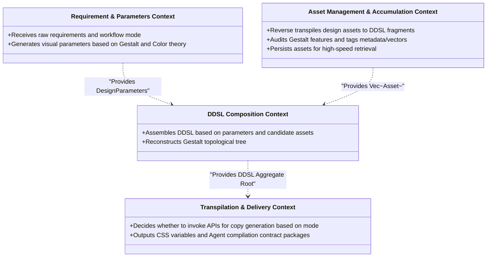

# gestalt-resonator Domain Design

This system is built on Gestalt psychology, design composition theory, and software engineering models to create a cross-platform interface design synthesis and transpilation system. To guarantee high cohesion and maintainability of business logic, the system strictly adheres to **Domain-Driven Design (DDD)** principles. This document details the system's bounded contexts, context maps, core entities, value objects, and key domain services.

---

## 1. Bounded Contexts & Context Map

The entire system is partitioned into four bounded contexts, each with distinct responsibilities, interacting through clear contracts:

### 1.1 Context Collaboration Relationships
*   **Requirement Context** acts upstream to the **DDSL Composition Context**. Its output, `DesignParameters` (e.g., HSL palettes and Spacing scales), is the constraint premise for composing DDSL.
*   **Asset Management Context** provides retrieval services for the **DDSL Composition Context**, which requests `Asset` lists matching feature parameters.
*   **DDSL Composition Context** outputs the complete `DDSL` aggregate root.
*   **Delivery Context** consumes the `DDSL` aggregate root, combines it with the `WorkflowMode`, decides on the copywriting mechanism, and packages the final contract.

---

## 2. Core Domain Models

According to DDD specifications, objects within each bounded context are categorized as **Aggregate Roots**, **Entities**, and **Value Objects**.

### 2.1 Requirement & Parameters Context

*   **Requirement (Aggregate Root)**: Represents the user's input design demand. Explicitly contains the `WorkflowMode`.
*   **WorkflowMode (Value Object)**:
    *   `Production`: Uses built-in API Tokens to request third-party models (Gemini) for copy.
    *   `Reasoning`: Bypasses external LLMs, outputting reasoning context for the receiving Client Agent to infer independently.
*   **DesignParameters (Aggregate Root)**: Mathematical constraints derived from core aesthetics and technical rules.
*   **SpacingBase (Value Object)**: Specifies base spacing (e.g., 8px) and responsive Gestalt proximity scaling factors.
*   **ColorPalette (Value Object)**: Contains primary, secondary, and background colors to prevent conflicts.

---

## 2.2 Asset Management & Accumulation Context

*   **Asset (Aggregate Root)**: The core unit in the asset repository, containing raw file paths, corresponding DDSL semantic fragments, and Gestalt audit features.
*   **AssetFeatures (Value Object)**: Describes the visual and psychological attributes, supporting multi-modal vector retrieval and tag matching.
*   **GestaltPrinciple (Enum/Value Object)**: Maps the six major Gestalt principles. For example, high-contrast card layouts are automatically tagged `FigureGround`.

---

## 2.3 DDSL Composition Context

*   **DDSL (Aggregate Root)**: Strictly corresponds to the core model of `ddsl.schema.json`. Represents a complete visual and behavioral description contract of an interface.
*   **LayoutNode (Entity)**: Forms the interface's topological tree. Each node identifies its primary Gestalt principle (e.g., `proximity`) and contains specific code generation specifications (`AgentGuidelines`) transmitted to the Client Agent.

---

## 2.4 Transpilation & Delivery Context

*   **DesignCopy (Aggregate Root)**: Maps DDSL node IDs to specific, auto-generated product copy. Generated via API token only in **Production Mode**.
*   **ReasoningContext (Value Object)**: Contains intent descriptions and constraint prompts directed at the client's local LLM to help it perform local copywriting inference. Generated and delivered only in **Reasoning Mode**.
*   **DesignContractPackage (Value Object / DTO)**: The complete package delivered to the external Client Agent for transpilation. Its internal `DeliveryCopyPackage` loads corresponding delivery contents (generated copy or reasoning context) based on the current workflow mode.

---

## 3. Core Domain Services & Rules

Domain services encapsulate core aesthetic calculations and conversion algorithms unsuitable for single entities or value objects.

### 3.1 ParameterGenerationService
Reads `Requirement` and computes it into `DesignParameters` using Gestalt and composition theories.
*   `fn generate_parameters(req: &Requirement) -> DesignParameters`

### 3.2 AssetFeatureAnalyzer
During asset accumulation, audits reverse-generated DDSL for visual features and psychological patterns.
*   `fn analyze_features(ddsl: &DDSL, file_path: &str) -> AssetFeatures`

### 3.3 DDSLCompositionService
During the regular workflow, assembles retrieved asset fragments into a Gestalt-unified DDSL.
*   `fn compose_ddsl(assets: Vec<Asset>, params: DesignParameters) -> DDSL`

### 3.4 CopywritingService
Invoked in Step 4 of the regular workflow. It adopts entirely different behavioral logic based on the workflow mode.
*   `fn generate_delivery_copy(ddsl: &DDSL, mode: &WorkflowMode) -> DeliveryCopyPackage`
*   **Dual-Mode Execution Rules**:
    *   **Production Mode**: Invokes the `GeminiClient` using the system's **built-in API token**. Sends node intents (`_agent_guidelines.intent`) and global UI context (HSL colors, business scenarios) to Gemini. Replaces placeholder copy (e.g., `header_title`) with generated copy, wrapped as `Option::Some(DesignCopy)`.
    *   **Reasoning Mode**: **Initiates zero external API network requests**. Traverses the DDSL tree, formatting node intents, positioning, and constraints into a `ReasoningContext`. This includes inference rules (e.g., "Generate professional text under 10 words based on this node's figure-ground trait on a dashboard"), injected as `Option::Some(ReasoningContext)` for the client to infer locally.
