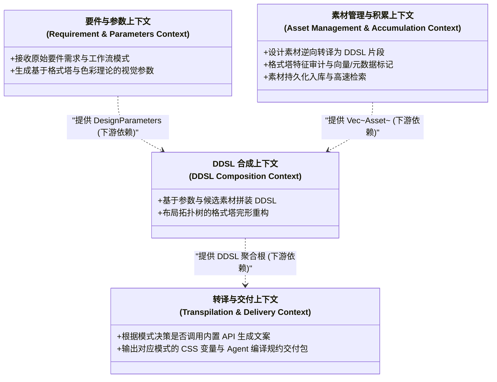
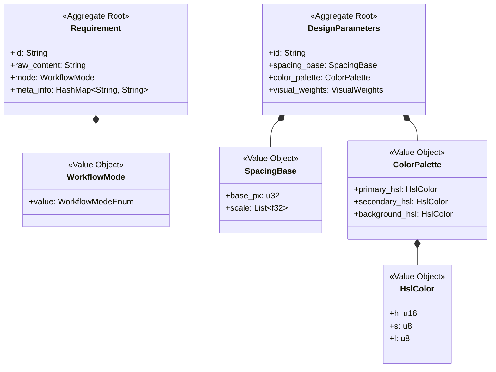
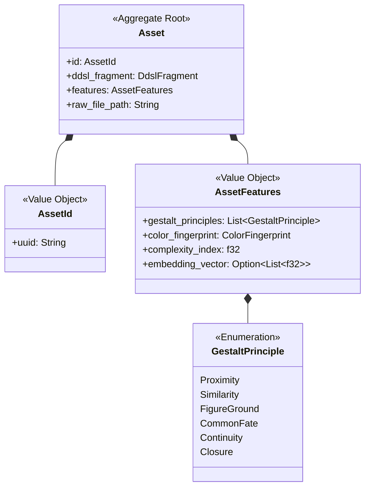
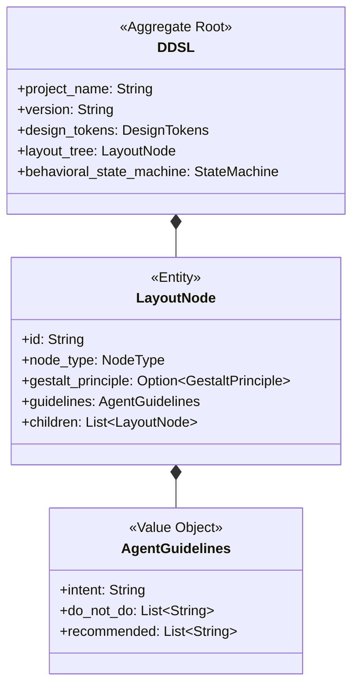
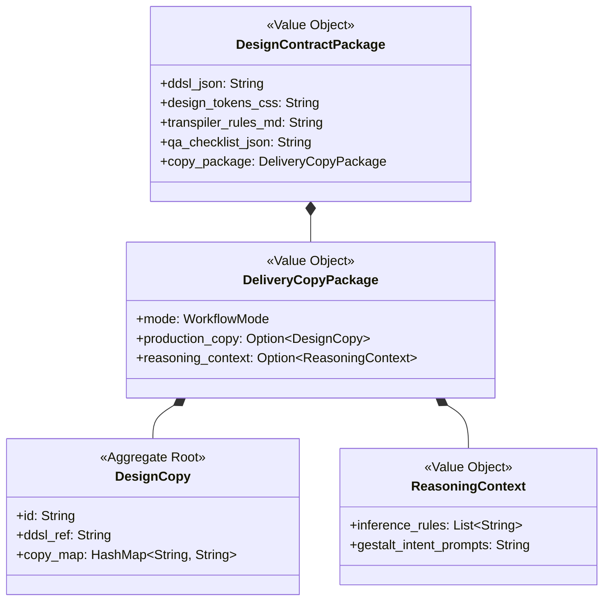

# gestalt-resonator 领域设计规范 (Domain Design)

本系统是基于格式塔心理学、设计构成理论与软件工程模型建立的跨平台画面设计合成与转译系统。为保证业务逻辑的高度内聚与可维护性，系统严格遵循**领域驱动设计 (DDD)** 思想。本文档详细定义了系统的限界上下文、上下文映射、核心实体与值对象、以及关键领域服务。

---

## 1. 限界上下文与上下文映射 (Bounded Contexts & Context Map)

整个系统划分为四个限界上下文，它们各司其职，并通过清晰的契约进行交互：

### 1.1 上下文协作关系描述
*   **要件与参数上下文** 对 **DDSL 合成上下文** 表现为上游。它产出的 `DesignParameters`（如 HSL 调色板和 Spacing 阶梯）是合成 DDSL 的约束前提。
*   **素材管理与积累上下文** 为 **DDSL 合成上下文** 提供检索服务。合成上下文通过参数向素材上下文请求符合特征要求的 `Asset` 列表。
*   **DDSL 合成上下文** 输出完整的 `DDSL` 聚合根。
*   **转译与交付上下文** 消费 `DDSL` 聚合根，并结合最初输入的常规工作流模式 (`WorkflowMode`)，决策采用何种文案处理机制，并打包输出最终契约。

---

## 2. 核心领域模型 (Domain Models)

根据 DDD 规范，我们将各限界上下文中的对象划分为**聚合根 (Aggregate Root)**、**实体 (Entity)** 和 **值对象 (Value Object)**。

### 2.1 要件与参数上下文 (Requirement & Parameters)

*   **Requirement (要件定义 - 聚合根)**：表示用户输入的设计诉求。本聚合根显式包含用户指定的工作流运行模式 `WorkflowMode`。
*   **WorkflowMode (工作流运行模式 - 值对象)**：
    *   `Production`（正常/生产模式）：使用内置 API Token 请求三方模型（Gemini）获取文案。
    *   `Reasoning`（推理模式）：不执行外部大模型请求，输出推理上下文由接收方（Client Agent）自主推理。
*   **DesignParameters (设计关键参数 - 聚合根)**：由核心美学与技术规则推导出的数学约束。
*   **SpacingBase (间距尺度 - 值对象)**：指定基准间距（如 8px）以及响应式格式塔“接近性”缩放因子阶梯（如 `[0.25, 0.5, 1, 1.5, 2, 4]`）。
*   **ColorPalette (色彩调色板 - 值对象)**：包含主色、辅助色及背景色，防止色彩冲突。

---

## 2.2 素材管理与积累上下文 (Asset Management & Accumulation)

*   **Asset (素材 - 聚合根)**：素材库中的核心单元，包含原始设计或代码文件路径、其对应的部分 DDSL 语义片段以及格式塔审计特征。
*   **AssetFeatures (素材特征 - 值对象)**：描述素材在视觉与心理学层面的属性，支持多模态向量检索和标签匹配。
*   **GestaltPrinciple (格式塔原则 - 枚举/值对象)**：映射格式塔六大原则。例如，高对比度的卡片布局自动标注 `FigureGround`。

---

## 2.3 DDSL 合成上下文 (DDSL Composition)

*   **DDSL (设计图谱 - 聚合根)**：严格对应 `ddsl.schema.json` 的核心模型。代表一份完整界面的视觉和行为描述契约。
*   **LayoutNode (布局节点 - 实体)**：形成界面的拓扑树。每个节点都需要标识其主要应用的格式塔原则（如 `proximity`），并包含专门传导给 Client Agent 的代码生成规约 `AgentGuidelines`。

---

## 2.4 转译与交付上下文 (Transpilation & Delivery)

*   **DesignCopy (设计文案 - 聚合根)**：将 DDSL 的节点 ID 映射到具体的、自动生成的产品文案。只在**生产模式 (Production Mode)**下由内置 Token 调用 API 生成。
*   **ReasoningContext (推理上下文 - 值对象)**：包含为了帮助客户端大模型在本地进行自主设计文案推演而导出的意图描述和约束提示词。只在**推理模式 (Reasoning Mode)**下生成并交付。
*   **DesignContractPackage (交付契约包 - 值对象/传输对象)**：交付给外部 Client Agent 执行转译时的完整包，其内部的 `DeliveryCopyPackage` 会根据所处的工作流模式装载对应的交付内容（生成好的文案或供推理的上下文）。

---

## 3. 核心领域服务与业务规则 (Domain Services & Rules)

领域服务封装了不适合放在单一实体或值对象中的核心美学计算与转换算法。

### 3.1 关键参数生成服务 (ParameterGenerationService)

该服务读取 `Requirement`，并通过格式塔与构成理论将其计算为 `DesignParameters`。
*   **业务逻辑方法**：`fn generate_parameters(req: &Requirement) -> DesignParameters`

### 3.2 格式塔特征审计服务 (AssetFeatureAnalyzer)

在素材积累流程中，对逆向生成的 DDSL 进行视觉特征与心理学模式审计。
*   **业务逻辑方法**：`fn analyze_features(ddsl: &DDSL, file_path: &str) -> AssetFeatures`

### 3.3 布局合成编排服务 (DDSLCompositionService)

在常规设计流程中，将检索出来的多个素材片段（`Vec<Asset>`）合成为一个符合格式塔整体感的 DDSL。
*   **业务逻辑方法**：`fn compose_ddsl(assets: Vec<Asset>, params: DesignParameters) -> DDSL`

### 3.4 设计文案与推理服务 (CopywritingService)

该服务在常规工作流常规设计的最后一步（Step 4）被调用，依赖于不同的工作流模式，采取截然不同的行为逻辑。
*   **业务逻辑方法**：`fn generate_delivery_copy(ddsl: &DDSL, mode: &WorkflowMode) -> DeliveryCopyPackage`
*   **双轨业务规则 (Dual-Mode Execution Rules)**：
    *   **生产模式 (Production Mode) 下的 API 生成规则**：
        *   调用基础设施层的 `GeminiClient`，该 Client 会读取系统**内置的 Gemini API Token**。
        *   将 DDSL 的节点意图（`_agent_guidelines.intent`）及整体界面上下文（如 HSL 配色和业务场景）作为 Prompt 载荷发送至 Gemini。
        *   接收 Gemini 的响应，将各个节点关联的占位文案（如 `header_title`）替换为生成的真实设计文案，并封装为 `DesignCopy` 实体的 `Option::Some(DesignCopy)` 注入到包中。
    *   **推理模式 (Reasoning Mode) 下的上下文导出规则**：
        *   **不发起任何外部 API 网络请求**，防止消耗内置 Token 额度。
        *   遍历 DDSL 拓扑树，将所有节点的意图描述（`intent`）、页面定位以及格式塔约束进行格式化整理。
        *   生成一套针对客户端本地大模型的 `ReasoningContext`，包含推理规则（如“请基于该节点的 figure-ground 特征和仪表盘定位，自主生成 10 个字以内的专业文本”），并作为 `Option::Some(ReasoningContext)` 注入包中，交给客户端自己进行本地推理。
