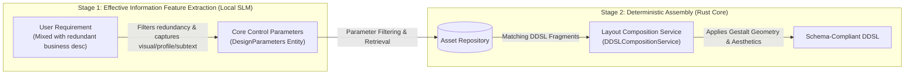
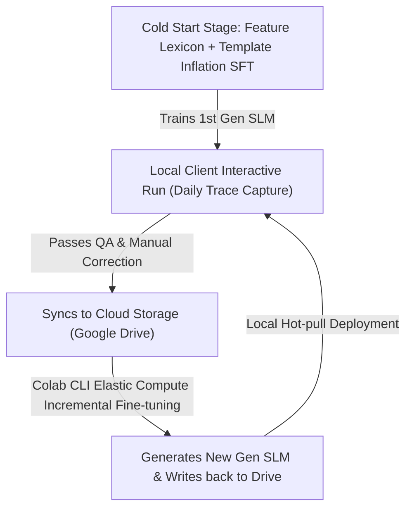

# DDSL Generation Tech Selection Research

This document records the technology selection arguments on how to efficiently and highly deterministically achieve the transpilation from a "Raw User Requirement" to a "Design Domain Specific Language (DDSL) Contract" in the system's regular workflow.

---

## 1. Background and Technical Pain Points

The primary step of the system's regular design workflow is parsing user input. The input "Requirement" is typically unstructured natural language heavily laden with redundant technical and business logic descriptions, whereas the output "DDSL" is a strictly nested, attribute-constrained JSON graph based on [ddsl.schema.json](file:///home/nick/workspaces/gestalt-resonator/schema/ddsl.schema.json).

During this process, two core design pain points are encountered:
1. **Business Information Redundancy and Extraction Distortion**: Raw requirements contain massive amounts of text entirely unrelated to visual design, such as interface protocols, business formulas, and database fields. Traditional full-semantic analysis models attempt to "understand the entire text," leading not only to wasted compute power but also high susceptibility to interference from irrelevant business logic.
2. **Structural Compliance Guarantee**: How to guarantee that the transpired multi-layered nested Layout Tree is 100% compliant with the DDSL contract specification, preventing structural damage or logical deadlocks caused by model hallucinations.

To break through these pain points, we redefined the system's objective for requirement parsing: **We do not need to analyze complex business semantics; rather, we should focus on filtering out irrelevant business descriptions and directly extracting the following three types of effective design feature information**:
- **Visual Description** (e.g., "ample whitespace, grid skeleton, cool color tone");
- **Target Audience Psychological Profile** (e.g., "executive clients, requires dignity and restraint");
- **Design Subtext of the Requirement** (e.g., "emphasizing the urgency of the data" implies "a strong contrast principle should be applied to the components in this area").

---

## 2. Technical Route Comparison Analysis

Addressing this feature extraction and transpilation challenge, the system evaluated the pros and cons of the following two technical routes:

### Option A: Relying on General Semantic Models for Full Semantic Extraction
Introducing a massive general semantic understanding model to attempt global analysis of the user's colloquial requirement input and generate the DDSL end-to-end directly.

*   **Disadvantages**:
    *   **Redundant Information Interference**: Because the general model tries to process every sentence, it is extremely prone to misjudging technical descriptions (e.g., "supports RPC protocol") as visual elements.
    *   **Structural Uncertainty**: When a large model directly generates deeply nested JSON, even with format constraints, it is extremely difficult to guarantee 100% topological logic compliance at the semantic level, easily causing logical deadlocks.
    *   **High Response Latency**: The inference time for network requests or local large-parameter models usually exceeds seconds, destroying the high-frequency interactive experience of Loop Engineering.

### Option B: Local Lightweight Feature Extraction Small Model (Token Classifier / SLM)
Collecting parallel dictionaries and design corpora to fine-tune a local lightweight small model or extraction algorithm focused on the three types of design feature extraction (visual description, psychological profile, subtext).

*   **Advantages**:
    *   **Absolute Focus and Determinism**: Filters out 90% of redundant business descriptions and only outputs design parameters. After overfitting or fine-tuning on specific Schema formats, the structural compliance rate approaches 100%.
    *   **Ultra-Low Inference Latency**: With an extremely small parameter count, it can run on a local CPU in milliseconds, perfectly fitting the lightweight, zero-latency experience of high-frequency interactions and offline CLI/DSP Server.
*   **Challenges and Countermeasures**:
    *   **Corpus Cold Start Bottleneck**: Since such alignment datasets do not exist in the market, we will completely solve the cold start difficulty through **Design Feature Template Data Inflation Technology** (using preset keywords for visual descriptions, audience profiles, etc., via template synthesis algorithms to instantly inflate and generate hundreds of thousands of noisy data pairs locally), without relying on any Large Language Model distillation.

---

## 3. Recommended Solution: Hybrid Two-Stage Architecture

Synthesizing the above arguments, we adopt a hybrid architecture of **"Local Lightweight Small Model for Core Feature Parameter Extraction + Local Rust Deterministic Algorithm for DDSL Composition"**.

### 3.1 Stage Responsibility Division

1.  **Stage 1 (Local Extraction Small Model)**: The small model acts as a lightweight feature filter. It is solely responsible for capturing design-related visual vocabulary, specific user group mindsets, and requirement subtext, mapping them into a set of flat, minimalist control parameters (`DesignParameters`).
2.  **Stage 2 (Local Rust Engine)**: The system passes `DesignParameters` into the `AssetMatchingService` via structured algorithms locally to match asset fragments, and calls `DDSLCompositionService` to perform tree topology restructuring according to deterministic Gestalt aesthetic proportions (proximity, common fate, closure, etc.), ensuring 100% structural compliance and safety.

---

## 4. System Evolution and Iteration Path

We achieve incremental model evolution and seamless updates through the following closed-loop iteration mechanism:

1.  **Template Data Inflation (Bootstrap SFT)**: In the initial stage, tens of thousands of data pairs are instantly generated locally through a mixture of a local feature lexicon and design interference templates, completing the cold start fine-tuning of the small model.
2.  **Interactive Trace Capture**: During regular interaction runs, the system intercepts and records the user's input requirement text alongside the final satisfactory design state parameters (user's lock and modification traces), forming a real interactive sample set.
3.  **Cloud Elastic Fine-tuning**: Data is synchronized to Google Drive, and Colab CLI is used to dynamically request computing power for incremental SFT fine-tuning.
4.  **Local Hot-pull Updates**: Upon detecting a model update, the local client automatically downloads the latest model weights for an in-memory hot swap.

---

## 5. Points for Further Discussion

> [!IMPORTANT]
> The team can conduct more in-depth evaluations on the following directions in future technical meetings:
> 1.  **Feature Classifier Architecture Selection**: In the Stage 1 local small model implementation, should we use a small-parameter Decoder-architecture micro LLM for entity extraction, or directly adopt a lightweight and efficient classical NLP Named Entity Recognition (NER) or Token sequence labeling classifier?
> 2.  **Limits of the Gestalt Geometry Computation Engine**: How complex a responsive layout can the local geometric alignment algorithm (e.g., Spacing adaptation) support? When is it necessary to introduce neural networks to assist in local typesetting tweaks?
