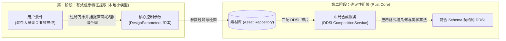
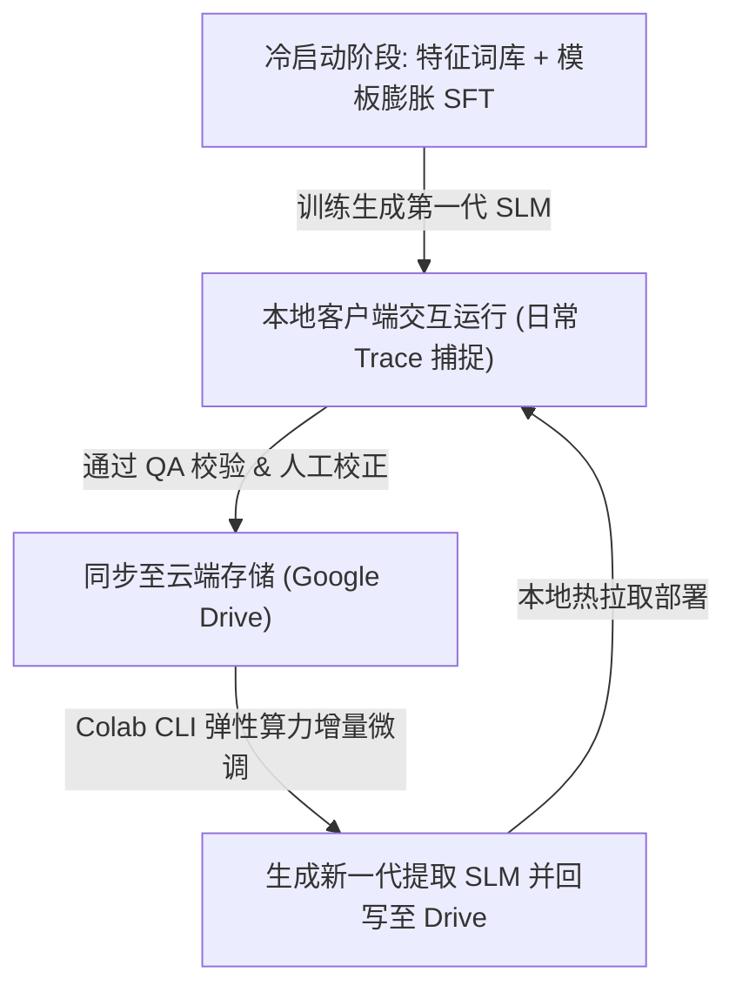

# DDSL 生成技术方案课题研究 (DDSL Generation Tech Selection Research)

本篇文档记录了关于系统常规工作流中，如何高效、高确定性地实现从“原始用户要件 (Requirement)”到“设计领域专用语言契约 (DDSL)”转译的技术方案选型论证。

---

## 1. 背景与技术痛点

系统常规设计工作流的首要步骤是解析用户输入。输入的“要件”通常是包含了大量冗余技术与业务逻辑描述的非结构化自然语言，而输出的“DDSL”则是基于 [ddsl.schema.json](file:///home/nick/workspaces/gestalt-resonator/schema/ddsl.schema.json) 的、具有严格嵌套层级、属性类型约束的 JSON 图谱。

在此过程中，面临两个核心设计痛点：
1. **业务信息冗余与信息提取失真**：原始要件中包含大量如接口协议、业务公式、数据库字段等与视觉设计完全无关的文本。传统的全语义分析模型试图“理解整篇文本”，不仅造成算力浪费，极易受到无关业务逻辑的干扰。
2. **结构合规保障**：如何保证转译出的多层嵌套树状布局（Layout Tree）百分之百符合 DDSL 的契约规范，防止幻觉引发的结构破损或逻辑死锁。

为了突破这两个痛点，我们重新界定了系统对要件的解析目标：**我们不需要分析复杂的业务语义，而是应当专注于过滤无关的业务描述，直接提取以下三类有效的设计特征信息**：
- **画面（视觉）描述**（如“大留白、网格骨骼、冷色调”）；
- **目标人群的心理侧写**（如“高管客户，需要端庄、克制”）；
- **要件的设计潜台词**（如“强调数据的紧急性”暗含“需要对该区域组件应用强对比原则”）。

---

## 2. 技术路线对比分析

针对此特征提取与转译课题，系统评估了以下两条技术路线的优劣势：

### 方案 A：依赖通用语义模型进行全语义提取
引入庞大的通用语义理解模型，试图全局分析用户输入的口语化要件，并端到端直接生成 DDSL。

*   **劣势**：
    *   **冗余信息干扰**：由于通用模型试图处理每一句话，极其容易将技术描述（如“支持 RPC 协议”）误判为视觉元素。
    *   **结构不确定性**：在大模型直接生成深层嵌套 JSON 时，哪怕使用了格式约束，也极难在语义层面百分之百保证拓扑逻辑合规，容易造成逻辑死锁。
    *   **响应延迟高**：网络请求或本地大参数量模型的推理耗时通常在秒级以上，破坏了 Loop Engineering 的高频交互体验。

### 方案 B：本地轻量级特征提取小模型 (Token Classifier / SLM)
收集平行词典与设计语料，在本地微调一个专注于上述三类设计特征提取（画面描述、心理侧写、潜台词）的轻量级小模型或抽取算法。

*   **优势**：
    *   **绝对聚焦与确定性**：过滤了 90% 的冗余业务描述，只输出设计参数。经过特定 Schema 格式的过拟合或微调后，结构合规率能达到近乎 100%。
    *   **超低推理延迟**：参数量极小，可在本地 CPU 毫秒级运行，完全契合高频交互和离线 CLI 与 DSP Server 的轻量无延迟体验。
*   **挑战与应对**：
    *   **语料冷启动瓶颈**：由于市面不存在此类对齐数据集，我们将通过**设计特征模板数据膨胀技术**（利用画面描述、人群侧写等预置关键词，通过模板合成算法在本地秒级膨胀生成数十万条带有噪声的数据对）来彻底解决冷启动难题，无需依赖任何大语言模型蒸馏。

---

## 3. 推荐解决方案：混合两阶段架构 (Hybrid Two-Stage Architecture)

综合上述论证，我们采用 **“本地轻量小模型提取核心特征参数 + 本地 Rust 确定性算法负责 DDSL 合成”** 的混合架构。

### 3.1 阶段职责划分

1.  **第一阶段（本地提取小模型）**：小模型作为轻量级特征过滤器。它只负责抓取设计相关的视觉词汇、特定用户群体心智侧写及要件潜台词，并将它们映射为一组扁平的、极简的控制参数（`DesignParameters`）。
2.  **第二阶段（本地 Rust 引擎）**：系统在本地通过结构化算法将 `DesignParameters` 传入 `AssetMatchingService` 匹配素材片段，并调用 `DDSLCompositionService` 按照确定性的格式塔美学比例（接近性、共同命运、闭合性等）进行树状拓扑重组，保障结构百分之百合规安全。

---

## 4. 系统的演进与迭代路径 (Evolutionary Path)

我们通过以下闭环迭代机制，实现模型的增量演进和无缝更新：

1.  **模板数据膨胀 (Bootstrap SFT)**：初始阶段通过本地特征词库与设计干扰模板混合，在本地瞬间生成数万条数据对，完成小模型的冷启动微调。
2.  **交互 Trace 捕获**：在常规运行交互中，拦截并记录用户输入的要件文本与最终满意的设计状态参数（用户锁定和修改的痕迹），形成真实的交互样本集。
3.  **云端弹性微调**：数据同步至 Google Drive，使用 Colab CLI 动态申请算力进行增量 SFT 微调。
4.  **本地热拉取更新**：本地客户端监测到模型更新后，自动下载最新模型权重进行内存热替换。

---

## 5. 后续研讨议题 (Points for Further Discussion)

> [!IMPORTANT]
> 团队在之后的技术会议中可针对以下方向进行更深入的评估：
> 1.  **特征分类器架构选型**：在第一阶段本地小模型实现中，是采用小参数量的 Decoder 架构微型大模型进行实体提取，还是直接采用轻量高效的经典 NLP 命名实体识别 (NER) 或 Token 序列标注分类器？
> 2.  **格式塔几何计算引擎的极限**：本地几何对齐算法（如 Spacing 适配）能支撑多复杂的响应式布局？何时需要引入神经网络辅助局部排版微调？
